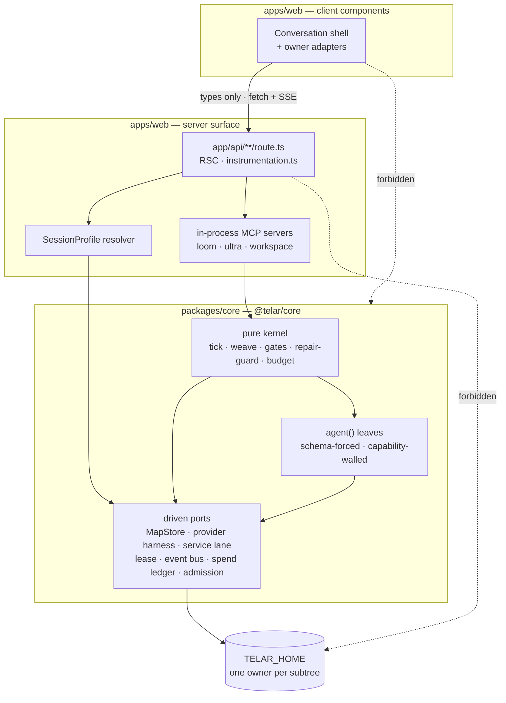
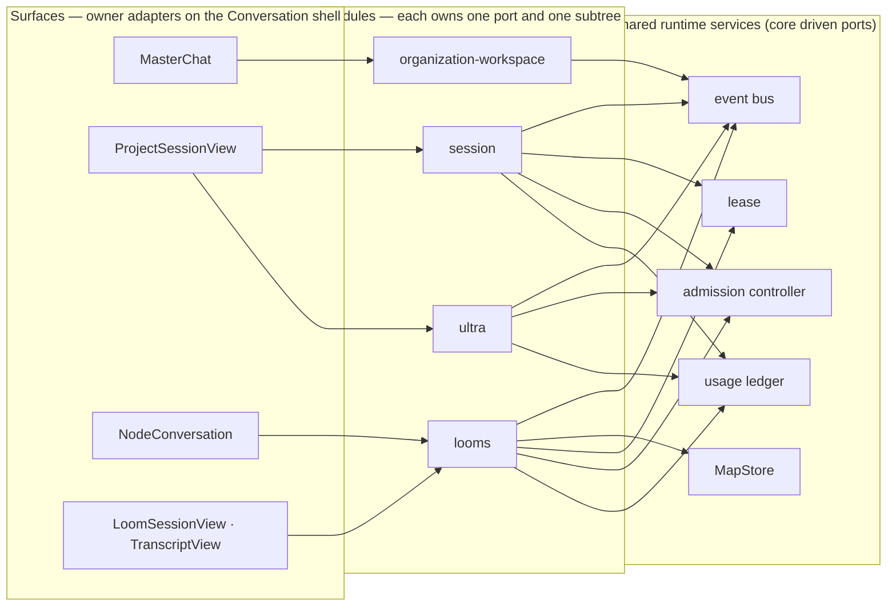
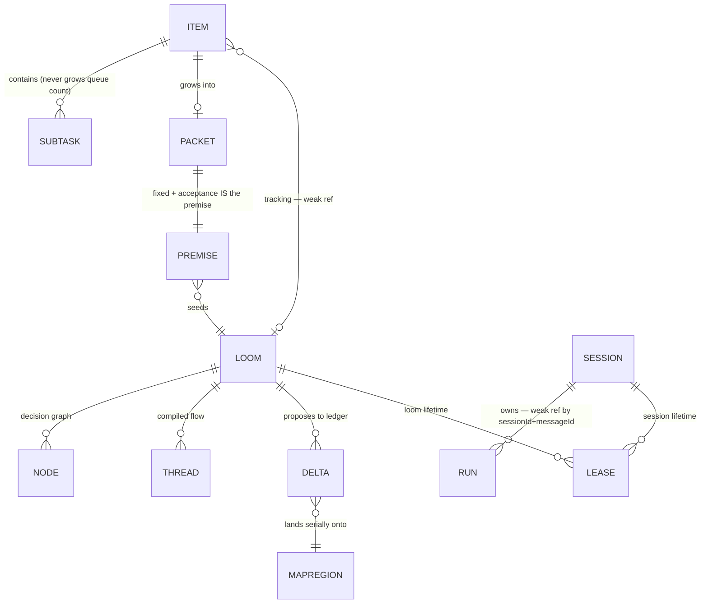

# Architecture Spine — telar

Prefixes: **LR** = SPEC-loom-redesign · **OW** = SPEC-organization-workspace · **UW** = SPEC-ultra-workflows.

## Design Paradigm

Three laws, one per layer. When a case is not covered below, reason from these.

**1. Control — functional core, imperative shell.**
Core decisions (`tick`, `weave`, `gates`, `repair-guard`, `budget`) are pure functions over integers, sets and injected clocks. Effects live at the edges. Non-determinism — clocks, randomness, model calls — exists only in `agent()` leaves.

**2. Boundaries — ports & adapters.**
Every cross-module crossing is a typed port. Driving ports: in-process MCP servers, route handlers, `instrumentation.ts`. Driven ports: MapStore, provider harness, service lane, lease, event bus, spend ledger. No module reaches into another module's store.

**3. State — log + lazy projection, where declared.**
Holds for: the ultra journal, the drift ledger, evidence, the spend ledger. Does **not** hold for: workspace packets, lane files, manifests — those are single-owner documents. AD-6 draws the line; it is not a judgement call at the call site.

Layer map: `packages/core/src/` = laws 1 and 3 plus driven ports · `apps/web/app/api/**/route.ts` + `lib/*-mcp.ts` = driving ports · `apps/web/components/` = presentation only.

## Invariants & Rules

### Dependency direction



Arrows point the only direction dependency may flow. The two dotted edges are prohibitions, not weak links: client components take **types only** from `@telar/core`, and no route handler touches `TELAR_HOME` by path — it goes through a driven port.

### AD-1 — Human-Accept Moat `[ADOPTED]`

- **Binds:** all
- **Prevents:** an agent issuing its own completion; a fleet advancing work with no human in the loop
- **Rule:** `ready → done` is human-only. There is no agent-callable accept tool on any MCP surface, and none is ever added. Enforced twice: by construction in `packages/core` (`looms.ts`, `tick.ts`) and at the tool layer by the chat route's `PreToolUse` hook, in every SDK permission mode.

### AD-2 — Verifier capability wall `[ADOPTED]`

- **Binds:** LR CAP-4, CAP-13, CAP-16, CAP-20
- **Prevents:** a passing verdict being self-issuable by the thing under test
- **Rule:** `verifier.ts`, `verify-thread.ts`, `critic.ts`, `panel.ts` and every loom-altitude lab agent are granted no write or edit tools. The wall extends to new verification surfaces; it is never relaxed.

### AD-3 — Core is server-side only `[ADOPTED]`

- **Binds:** all
- **Prevents:** `fs` / `child_process` / the Agent SDK reaching the client bundle
- **Rule:** client components import **types only** from `@telar/core`. Runtime core code lives only in Route Handlers, Server Components and `instrumentation.ts`. Server Components reading the on-disk registry set `export const dynamic = "force-dynamic"`.

### AD-4 — Map writes are propose-then-land `[ADOPTED]`

- **Binds:** LR CAP-3, CAP-21, CAP-22
- **Prevents:** concurrent looms corrupting shared project knowledge; file locks starving an hours-long fleet
- **Rule:** lockless protocol — pin the map's content hash at prep, emit proposal deltas to the ledger, land serially at accept, rebase-adapt when head moved, surface semantic contradictions to the human. A loom's pin never moves for its lifetime. Intake diffs against main/default-branch head, never a worktree copy. Only human-meaningful markdown lands in-repo; machine artifacts stay in `TELAR_HOME`.

### AD-5 — One owner per `TELAR_HOME` subtree

- **Binds:** all
- **Prevents:** three features inventing three layouts, and a fourth reaching in by path because it is all one process
- **Rule:** each top-level subtree has exactly one owning module — `projects/<id>/looms/<loom-id>/` → looms, `workspace/` → organization-workspace, `ultra/<runId>/` → ultra, `sessions/<sessionId>/` → session. No module reads or writes another's subtree by path; access is through the owning module's port. The legacy flat `~/.telar/looms/<id>/` tree is read-only until drained. `sessions/<sessionId>/` holds session-scoped **runtime** state (leases, ephemera); it does **not** replace the existing chat store (`chats.json` via `apps/web/lib/store.ts`), which keeps its own root-level home. State belonging to no module — the usage ledger, the event bus — is governed by AD-20, not by this rule.

### AD-6 — Persisted format follows artifact class

- **Binds:** all
- **Prevents:** a fourth module inventing a fourth serialization answer; law 3 being applied where it does not hold
- **Rule:** human-editable → YAML (`lanes.yaml`, `packet.yaml`) · machine single-doc → JSON (`manifest.json`, `decision-graph.json`) · append-only stream → NDJSON (`journal.jsonl`, `events.ndjson`, spend ledger). NDJSON stores are the log-and-projection class; the others are single-owner documents. All writes are atomic (`.tmp` → `fs.renameSync`). zod schemas for persisted entities are owned by `@telar/core` and never redefined in `apps/web`.

### AD-7 — Schema evolution: tolerant readers, version the unregenerable

- **Binds:** all persisted state
- **Prevents:** losing unrecoverable human input to a breaking change, while not paying migration ceremony on state a loom can rebuild
- **Rule:** readers tolerate unknown and missing fields (zod defaults). Regenerable stores — living-map regions, projections, evidence views — are rebuilt by a reconciliation loom, never migrated. A schema-version field and a real migrate-on-read go **only** on stores holding unrecoverable human input, `workspace/packets/<id>/packet.yaml` above all (it holds `raw` verbatim, never overwritten).

### AD-8 — Cross-tree references are weak

- **Binds:** OW CAP-11 (`item.tracking`), UW CAP-5 (`sessionId` + `messageId`), LR CAP-1 (premise ← packet)
- **Prevents:** inbound-dependency webs and cascade deletes that law 2 forbids; stale denormalized snapshots
- **Rule:** a stored cross-module reference is an id plus enough denormalized label to render without a lookup. Live resolution goes through the owning module's port, never a path read. A dangling reference renders as a tombstone and never throws.

### AD-9 — Session config is a resolved profile, not a branch

- **Binds:** all session surfaces
- **Prevents:** three features accreting conditional branches in one 103KB handler
- **Rule:** a typed `SessionProfile` — `{cwd, guardrails, settingSources, mcpServers[], toolPolicy, requiredCapabilities, systemPromptAppendix}` — is resolved before the route body. Project session, master session, loom-node session and steerer are profiles. A new surface adds a profile; it does not add an `if`. OW's project-less master is a profile supplying `cwd: TELAR_HOME/workspace/home` and `settingSources: []`, not a special case in the handler.

### AD-10 — The moat sits outside the profile

- **Binds:** AD-1, AD-9
- **Prevents:** the moat degrading from structural to configurable; a mis-authored profile silently omitting it
- **Rule:** the `PreToolUse` guardrail is wired into the pipeline outside the profile and runs for every session regardless of profile. `toolPolicy` is **intersect-only** — it may deny more, never grant more — enforced by its type, which carries deny lists and allow-narrowing only. No profile field can re-enable an accept path.

### AD-11 — Missing harness capability fails closed

- **Binds:** OW CAP-1, CAP-12 (Codex MCP gap); all provider-backed surfaces
- **Prevents:** a Codex-backed master coming up with no workspace MCP and answering "where did I stop" from nothing
- **Rule:** a profile declares `requiredCapabilities`; the provider port publishes what it supports; an unmet requirement is a hard error **before the stream opens**, matching the route's existing pre-SSE 400. No silent degradation, ever.

### AD-12 — The Conversation shell contract is frozen

- **Binds:** LR CAP-24, OW CAP-1, CAP-3, UW CAP-2
- **Prevents:** a three-way merge conflict on `session-view.tsx`; a sixth hand-built copy of the chat surface
- **Rule:** the shell exposes exactly four slots — transcript (rendered through an item-kind registry), composer, right rail, header — configured by props, never by inheritance. It owns scrolling, auto-follow and streaming affordances. It owns **no data fetching and no session semantics**. Data, capabilities, MCP wiring and permission modes are owner-adapter concerns (`ProjectSessionView`, `MasterChat`, `NodeConversation`, `LoomSessionView`, `TranscriptView`). One slot, many rails: subagent rail, Desk, chat-history rail and evidence rail are the same slot. A registered kind's renderer is a **pure function of `(item payload, shell-provided view state)`** and reads nothing from ambient context — so any transcript can render any kind, and `TranscriptView` (which provides no context) renders all of them.

### AD-13 — Transcript item kinds are module-namespaced

- **Binds:** AD-12
- **Prevents:** three features registering a colliding bare kind id in one shared registry
- **Rule:** registered kinds carry their owning module — `ultra:run-anchor`, `loom:gate-card`, `workspace:receipt`. A surface registers custom kinds rather than forking the shell.

### AD-14 — One event bus, every event carries a delivery class

- **Binds:** UW CAP-1, CAP-6, OW CAP-1, LR CAP-15
- **Prevents:** UW's "unprompted assistant turn" and OW's "never initiates contact" being resolved differently by each builder
- **Rule:** a single typed in-process publish path in core; adapters subscribe (SSE tails, the session-wake injector, the dock aggregator). Every event declares a required class: **agent-facing** may synthesize an assistant turn; **human-facing** renders on a surface the user arrives at and never pushes. The class is a required field, not a convention.

### AD-15 — Restart doctrine: reconcile on read, resume explicitly

- **Binds:** all in-flight work
- **Prevents:** a fifth restart behaviour; auto-resumption advancing work with no human in the loop
- **Rule:** no in-process work survives a server restart and nothing auto-restarts. On next read a store reconciles a stale `running` into a terminal-but-resumable state and offers Resume. A stale lease can at worst produce a false-positive `failed`, never an auto-`done`. Because this guarantees reconciliation and never rollback, any operation that mutates the repo or the map — landing, folding, delta application — must be **idempotent and resumable from its own journal**, safe to re-enter after a crash mid-sequence.

### AD-16 — One lease primitive, two lifetimes

- **Binds:** LR CAP-11, CAP-12; UW manifest `sessionId` link
- **Prevents:** two stale-reclaim implementations drifting — the path by which a false `done` gets issued
- **Rule:** one lease record (`{pid, token, ts}`, atomic temp+rename, heartbeat, stale-reclaim), generalized from `runner/lease.ts`, serves both lifetimes. Loom-owned leases live under the per-loom root and die at land; session-owned leases live under `sessions/<sessionId>/` and die at session close. Shape and reclaim semantics are identical.

### AD-17 — One admission controller with per-class shares

- **Binds:** LR CAP-9, CAP-11, CAP-13, CAP-23; UW CAP-2
- **Prevents:** "7+ concurrent looms is the norm" colliding invisibly with a hardcoded `MAX_CONCURRENT = 4`; a build fan-out starving verification — the loom system's own diagnosed failure reproduced by the scheduler
- **Rule:** the process-wide gate becomes a typed admission controller with classes `loom-build`, `loom-verify`, `ultra`, `other`, each holding a weighted share and an entitlement floor under one configurable ceiling (`TELAR_MAX_AGENTS`, default 4 — unchanged from the historical value, so adopting the controller is not itself a throughput change). Verification holds **precedence, not a held-open slot**: new arrivals never barge a queue, and a freed slot goes to entitled waiters in class-priority order before any borrower — so a verify waits at most one in-flight call, never a whole fan-out, and no slot idles while work is queued. `Charter.budget.maxAgents` is a per-loom clamp **within** its class, not a competing ceiling; `fanoutClamp` accepts `processCeiling` so a charter cannot report a fan-out the process will not admit. Admission governs **`agent()` concurrency only**. Long-lived processes — labs, declared services, borrowed infra — take no admission slot; they are governed by the lease (AD-16) and the per-repo worktree mutex. **Interactive chat sessions are out of band by design**: they call the SDK's `query()` directly from the chat route and never enter `agent()`, so a fleet can never make the cockpit wait — there is no `interactive-session` class and no reserved slot for one.

### AD-18 — One append-only spend ledger — the one that already exists

- **Binds:** UW CAP-5; LR charter budgets; session usage display
- **Prevents:** three counters that can disagree; the USD-vs-tokens cost-language split being re-solved per feature; a *fourth* ledger being introduced by the very rule meant to stop the third
- **Rule:** the ledger is the existing `usage.ndjson` (`logUsage()` / `UsageEntry` in `apps/web/lib/store.ts`), **extended** with owner attribution — owner-kind and owner-id alongside the existing `account`, `model`, `sessionId` and `costUsd`. No new spend file is created. The session's per-turn usage display, ultra's manifest `spend` and the charter's budget-left are **projections** over that one log. Cost language (USD on Claude, tokens on Codex) is a rendering concern of the projection. The story implementing this must first fix `store.ts:8`, which hardcodes `~/.telar` instead of honoring `TELAR_HOME` — otherwise dev runs write spend into production state.

### AD-19 — Load-bearing invariants are executable

- **Binds:** AD-1, AD-2, AD-3, AD-5, AD-20
- **Prevents:** a non-negotiable rule that nothing re-checks quietly becoming false
- **Rule:** each of the above is an assertion in `bun test`, run in the manual pre-commit trio (`bun test`, `bun run lint`, `bunx tsc --noEmit`). At minimum: no MCP surface exposes an accept tool; the verifier stack is granted no write tools; no module reads another module's `TELAR_HOME` subtree by path; client components import no core runtime; no module writes a shared runtime service's state directly.

### AD-20 — Shared runtime services are the sole writer of their own state

- **Binds:** AD-14 (event bus), AD-17 (admission), AD-18 (usage ledger), AD-16 (lease)
- **Prevents:** two modules each appending their own record shape to a root-level file while both technically honour AD-5, which assigns owners to *subtrees* and so never reaches state that belongs to no module
- **Rule:** state that belongs to no module — the usage ledger, bus subscriptions, admission accounting — is owned by its core service and written **only** through that service's port. No module opens those files. AD-5 governs subtrees; this governs everything else.

### AD-21 — Published event names are part of a module's port contract

- **Binds:** AD-14; OW CAP-11, UW CAP-1, CAP-6, LR CAP-15, CAP-18
- **Prevents:** a module renaming an event during unrelated work and silently breaking a subscriber — e.g. a queue row that never leaves the list because `loom:landed` became `loom:consolidated`
- **Rule:** a module's published event names and payload shapes are as binding as its tool signatures: declared, versioned with the module, and changed only as a deliberate contract change. Cross-module subscription is permitted **only** to declared events. Undeclared events are internal and nobody may subscribe to them.

## Consistency Conventions

| Concern | Convention |
| --- | --- |
| Naming — entities | `Item` / `Packet` / `Lane` (workspace) · `Loom` / `Thread` / `Node` (looms) · `Run` / `Agent ordinal` (ultra) · `Session` is a harness run with an owner, cwd and lifetime; `Conversation` is the UI concept and never a domain word |
| Naming — files | modules as `lib/<module>-mcp.ts` for driving ports; core ports as `packages/core/src/<port>.ts`; owner adapters as `components/<surface>/<Name>View.tsx` |
| Naming — events | `<module>:<past-tense-fact>` (`ultra:run-completed`, `loom:node-blocked`) plus the required delivery class |
| Ids | opaque strings, module-scoped, never parsed for meaning; cross-module refs carry the id plus a render label (AD-8) |
| Dates | epoch ms in persisted state; formatting is a rendering concern. Deadlines are coarse human labels (`"Fri"`), never schedule entries |
| Errors | fail closed and fail early — before a stream opens where possible (AD-11). A dangling cross-module ref is a tombstone, not an error |
| State mutation | atomic write only (`.tmp` → `renameSync`); a module mutates only its own subtree; shared project knowledge mutates only via propose-then-land (AD-4) |
| Client state | no global store. `useState`/`useEffect` + `fetch` against the app's own API; refetch on mount, on `window "telar:refresh"`, and on a poll interval while something runs. UI-only prefs in `lib/ui-prefs.ts` never write engine state |
| Streaming | hand-rolled SSE — `POST` returns a raw `ReadableStream` of `event:`/`data:` frames consumed via `lib/sse.ts consumeSSE()`; `GET` tails use native `EventSource`. No `useChat`, no `EventSource` polyfill |
| Status vocabulary | `components/looms/status.tsx` — `Tone = done \| attention \| danger \| active \| muted` via `statusVisual()` / `StatusBadge`. Colour is a quiet state signal, never a highlighter |
| Agent output awaiting a human | marked `proposal: true` — the prepare-never-commit law made visible |
| Logging & diagnosis | files remember; there is no log service. A module's durable trace is its own NDJSON stream under its subtree (`events.ndjson`, `agents/<ordinal>.ndjson`, session logs), readable with `tail`/`jq` at 1am with the app down. Console output is for development only and is never the record. Progress-liveness (LR CAP-15) reads these streams rather than a separate telemetry path |
| Secrets | `credentials.json` chmod `0600`, re-chmod on every write; never logged, never surfaced. No global `ANTHROPIC_API_KEY` — auth is the multi-provider account system |
| Config | `TELAR_HOME` is the only state root. No `engines` pin. Every command runs inside a workspace dir |

## Stack

| Name | Version |
| --- | --- |
| Bun (workspaces, runtime, test runner) | `bun.lock` lockfileVersion 1 — mutate only via `bun install` / `bun add` |
| TypeScript — `packages/core` | `^6.0.3` (ESM, no build step, `exports["."] → ./src/index.ts`) |
| TypeScript — `apps/web` | `^5` (deliberately not unified with core) |
| Next.js | `^16.3.0-canary.80` — App Router; read `node_modules/next/dist/docs/` before writing framework code |
| React | `19.2.4` |
| Tailwind | v4 |
| shadcn on `@base-ui/react` | `^4.13.0` / `^1.6.0` |
| Vercel `ai` · `streamdown` | `^7.0.17` · `^2.5.0` |
| `zod` · `yaml` | `^4.4.3` · `^2.9.0` |
| `@anthropic-ai/claude-agent-sdk` | `^0.3.204` |
| Electron · electron-builder | `^43.1.1` · `^26.15.3` (mac/arm64 only) |

## Structural Seed

### Module and store ownership



### State root

```text
TELAR_HOME/                      # ~/.telar · ~/.telar-dev for the web dev script
  accounts.json                  # secret-free; mutate via upsert/remove/setDefault
  credentials.json               # 0600, tokens, never hand-edited or logged
  chats.json                     # EXISTING chat store (store.ts) — not moved
  usage.ndjson                   # EXISTING ledger; extended with owner attribution (AD-18)
  plan-usage.json                # EXISTING plan snapshot, projected from usage.ndjson
  projects/<id>/
    looms/<loom-id>/             # OWNER: looms — canonical per-loom root
      decision-graph.json
      flow/*.json
      evidence/
      services/<name>.json       # lease records (AD-16)
  workspace/                     # OWNER: organization-workspace
    home/                        # master session cwd — empty, holds no store files
    lanes.yaml                   # lane definitions + ordered [item-id] stacks
    packets/<item-id>/
      packet.yaml                # versioned + migrate-on-read (AD-7)
      <attachments>
  ultra/<runId>/                 # OWNER: ultra
    manifest.json · journal.jsonl · events.ndjson · agents/<ordinal>.ndjson · script.js
  sessions/<sessionId>/          # OWNER: session (new)
    services/<name>.json         # lease records (AD-16)
  looms/<id>/                    # LEGACY — read-only until drained
```

The living map is **not** here by default: it is fine-grained markdown regions in-repo, behind the MapStore adapter, whose backend is a per-project dial (personal repos → in-repo, work repos → home).

### Cross-module entity references



### Operational envelope

Single-user, local-first, no auth by design, no remote infrastructure. Two runtimes over the same code: the Next dev server (`TELAR_HOME` defaults to `~/.telar-dev` for isolation) and the packaged Electron desktop app (mac/arm64, shipped only from a pristine **origin** snapshot via `scripts/build-desktop.sh`, whose `--smoke` gate is fail-closed and must print `SMOKE_OK`). External dependencies are the model providers reached through the multi-provider account system — never a single global API key. There is no CI; AD-19's assertions run in the manual pre-commit trio.

## Capability → Architecture Map

| Capability / Area | Lives in | Governed by |
| --- | --- | --- |
| LR CAP-1 birth · CAP-14 pause/park/resume | looms module + session-profile resolver | AD-9, AD-8, AD-15 |
| LR CAP-2 decision graph · CAP-9 flow compile | `packages/core` kernel; DAG is data, executed deterministically | law 1, AD-17 |
| LR CAP-3 living map · CAP-21 write-back · CAP-22 MapStore | MapStore driven port | AD-4, AD-7 |
| LR CAP-4 readiness node · CAP-13 two-altitude verification · CAP-16 evidence · CAP-20 vision critic | verification stack in core | AD-2, AD-6 |
| LR CAP-5 gate · CAP-6 approval-gated advance · CAP-17 delivery card · CAP-18 accept-then-land · CAP-19 boomerang | looms module + `ApprovalCard` item kind | AD-1, AD-10, AD-13 |
| LR CAP-7 methodology as data · CAP-8 role wall | MapStore region declaration; core role config | AD-4, AD-2 |
| LR CAP-10 branch/worktree isolation | `vcs.ts` worktree mutex | AD-5, AD-15 |
| LR CAP-11 declared services · CAP-12 borrowed infra | service-lane + lease driven ports | AD-16, AD-5, AD-17 |
| LR CAP-15 progress liveness | event bus (agent-facing class) | AD-14, AD-21, AD-15 |
| LR CAP-23 fleet triage · CAP-24 cockpit | `LoomSessionView` owner adapter | AD-12, AD-13, AD-14 |
| OW CAP-1 master chat · CAP-9 ephemeral experts · CAP-10 bed mode | `MasterChat` adapter + master `SessionProfile` | AD-9, AD-11, AD-14 |
| OW CAP-2 receipt · CAP-3 desk rail | `MasterChat` + right-rail slot | AD-12, AD-13 |
| OW CAP-4 lanes · CAP-5 item spectrum · CAP-7 deadlines · CAP-8 expectation gap | `workspace/` store + workspace MCP port | AD-5, AD-6, AD-7 |
| OW CAP-6 packet ripening | `packet.yaml` (versioned) | AD-7, AD-6 |
| OW CAP-11 loom/session handoff · CAP-12 Telar-wide substrate · CAP-13 external sources | workspace MCP driving port | AD-5, AD-8, AD-11 |
| UW CAP-1 completion wake | event bus, agent-facing class → session-wake injector | AD-14, AD-21 |
| UW CAP-2 real session UI · CAP-4 composer chip | `ProjectSessionView` + `ultra:run-anchor` kind + rail section | AD-12, AD-13 |
| UW CAP-3 authoring-reference skill file | shipped with the tool; injected via profile `systemPromptAppendix` | AD-9 |
| UW CAP-5 cost rollup | projection over `usage.ndjson` | AD-18, AD-20 |
| UW CAP-6 dock signal | event bus, human-facing class → dock aggregator | AD-14, AD-21 |

## Deferred

- **Epic-0 sequencing detail.** The Conversation carve-out and production `session-view.tsx` migration is one story; its internal step order belongs to that story, not here. The contract it must satisfy is AD-12.
- **Admission-controller weights and ceiling.** AD-17 fixes the shape; the ceiling stays at the historical 4 and the weights (3/2/2/1) are a starting point. Tuning belongs to a real fleet, not a cold-start call — raise with `TELAR_MAX_AGENTS`. Specified for build in `SPEC-runtime-foundations` CAP-4 / `admission.md`.
- **Class tagging for the build fan-out.** `executor.ts`'s five `agent()` call sites are expected to default to `other` — safe (lowest weight, no precedence) but it means build work does not compete as `loom-build`. Tagging them needs each site read in a 155KB file, and a mis-tag silently changes scheduling, so it belongs to the executor's own story.
- **Wiring `processCeiling` into the live clamps.** AD-17 requires `fanoutClamp` to accept the term; `tick.ts` and `executor.ts` passing it is separate, because doing so changes scheduler output and wants its own test sweep.
- **Event catalogue.** AD-14 fixes the bus and the required delivery class; AD-21 makes published names binding. Which concrete events each module declares is owned by that module's epic.
- **Bus durability.** Whether bus events are persisted, and if so under whose subtree, is undecided. AD-14 fixes only in-process delivery; today every durable trace is already a module-owned NDJSON stream, so nothing is blocked on this.
- **Living-map region set beyond v1.** Regions are declared by the loaded methodology (LR CAP-7), so the catalogue is data, not architecture. v1 ships the BMAD-derived set.
- **`SessionProfile` field set beyond the named core.** AD-9 fixes the resolved-before-the-body shape and the intersect-only `toolPolicy`. Additional fields are added by the surface that needs them.
- **Supervisor re-adoption of in-flight work on boot.** Rejected for now (AD-15). Revisit if dev-server reloads are measurably losing expensive loom builds.
- **CI.** Declined as scope beyond these three SPECs; AD-19's assertions run manually. Revisit when a second contributor appears.
- **Desktop-specific runtime divergence.** The packaged Electron app and the dev server run the same code today. If they diverge (fs-watch semantics, process lifetime), that becomes an AD rather than a per-module workaround.
