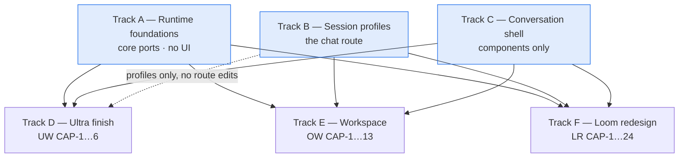
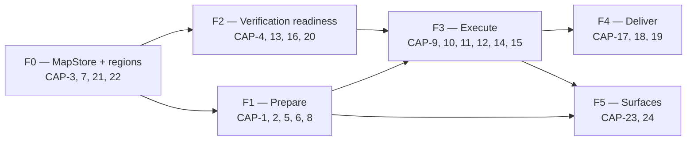

# Work Split — how 43 capabilities divide into buildable tracks

Companion to `ARCHITECTURE-SPINE.md`. What can be built at the same time, what each track is allowed to touch, and where the real serialization is.

Prefixes: **LR** = loom-redesign · **OW** = organization-workspace · **UW** = ultra-workflows.

## The shape

**A, B and C run concurrently from day one** — they touch disjoint file sets (core ports / the chat route / components). They are the whole critical path. Everything downstream is then genuinely parallel, which is the entire point of the four ADs that cost the most to agree on.

## Track ownership — what each track may touch

The rule that makes parallelism safe: a track's write set is disjoint from every other track's. Where two tracks need the same surface, one owns it and the other extends it through a registered seam.

| Track | Owns (may write) | Extends via seam (never edits) | Blocked by |
| --- | --- | --- | --- |
| **A — Runtime foundations** | `packages/core/src/` — event bus, admission controller, lease, MapStore port, usage-ledger port, `store.ts` `TELAR_HOME` fix | — | nothing |
| **B — Session profiles** | `apps/web/app/api/chat/route.ts`, the profile resolver, Codex MCP injection | — | nothing |
| **C — Conversation shell** | `apps/web/components/conversation/**`, `session-view.tsx` carve-out + migration | — | nothing |
| **D — Ultra finish** | `apps/web/lib/ultra-mcp.ts`, ultra owner-adapter pieces, `ultra/` subtree | a `SessionProfile`; item kind `ultra:run-anchor`; a rail section; declared events | A, C |
| **E — Workspace** | `workspace/` subtree, workspace MCP server, `MasterChat` adapter | a `SessionProfile` (project-less master); item kind `workspace:receipt`; the Desk rail; declared events | A, B, C |
| **F — Loom redesign** | `looms/` subtree, loom core modules, `NodeConversation` / `LoomSessionView` adapters | `SessionProfile`s (node, steerer); item kinds `loom:*`; declared events | A, B, C |

Read that middle column as the payoff of AD-9, AD-12, AD-13 and AD-21: **D, E and F never edit the chat route, never edit the shell, and never edit each other.** They add profiles, register kinds, and declare events.

## Track A — Runtime foundations (do this first, it unblocks everything)

Smallest track, largest leverage. No UI, no feature behaviour. Now specced as its own package: **`_bmad-output/specs/spec-runtime-foundations/`** (`SPEC.md` + `admission.md` + `brownfield.md` + `stories.yaml`).

| Unit | Delivers | Spec | AD |
| --- | --- | --- | --- |
| A1 | `store.ts` honors `TELAR_HOME` | CAP-1, story 1 | AD-18 — **do this before A2** |
| A2 | usage ledger extended with owner attribution; rollups become projections | CAP-2, story 2 | AD-18, AD-20 |
| A3 | typed event bus, required delivery class, declared-event contract | CAP-3, story 4 | AD-14, AD-21 |
| A4 | admission controller with weighted classes and precedence | CAP-4, story 3 | AD-17 |
| A5 | lease primitive generalized; `sessions/<id>/` tree created | CAP-5, story 5 | AD-16, AD-5 |
| A6 | executable invariant assertions in `bun test` | CAP-6, story 6 | AD-19 |

A1 is genuinely first: building the spend ledger on a store that ignores `TELAR_HOME` would write dev spend into production state.

## Track F — the loom redesign, internally

24 capabilities is too big for one epic. It splits along the three acts, and the sub-tracks are largely parallel once F's own foundation (map + storage) lands.

F2 and F1 are concurrent after F0. F5 can start against fixtures as soon as F1's shapes exist.

## Where the real serialization is

Only four places. Everything else is parallel.

1. **A1 → A2.** The `TELAR_HOME` fix precedes anything writing the ledger.
2. **A3 → D, E, F.** Nobody declares events before the bus and the declared-event registry exist.
3. **C's contract → D, E, F.** The contract is frozen *in the spine* (AD-12), so downstream starts immediately against fixtures in the demo gallery; only final wiring waits on C's migration landing.
4. **F0 → the rest of F.** The map is the loom redesign's own substrate.

## Parallel-agent guidance

If this is built by concurrent agents rather than sequentially:

- **A, B, C are three agents from day one.** Disjoint write sets, no coordination needed.
- **D, E, F fan out to as many agents as their sub-tracks allow** once A3 and the frozen shell contract exist. F alone supports 3–4 concurrent agents after F0.
- **Nobody gets write access to another track's owned column.** A change needed in someone else's file is a request to that track, not an edit — this is AD-5 and AD-9 applied to source files rather than to `TELAR_HOME`.
- **Ceiling reminder:** the fleet building this is subject to AD-17's admission controller once it exists. Until then the hardcoded `MAX_CONCURRENT = 4` applies, so more than ~4 model-calling agents will queue rather than run.

## Sequencing the whole thing

| Phase | Runs | Gate to the next |
| --- | --- | --- |
| 1 | A, B, C concurrently | A3 + A5 merged; shell contract proven in demo gallery |
| 2 | D and E concurrently; F0 starts | A6 assertions green |
| 3 | F1 + F2 concurrently | readiness gate demonstrable end-to-end |
| 4 | F3, then F4; F5 alongside | accept → land working on a real repo |

D (ultra) is deliberately in phase 2 and small — it is the cheapest way to prove the event bus, the shell contract, the profile resolver and the usage ledger all work together before F's 24 capabilities depend on them.
