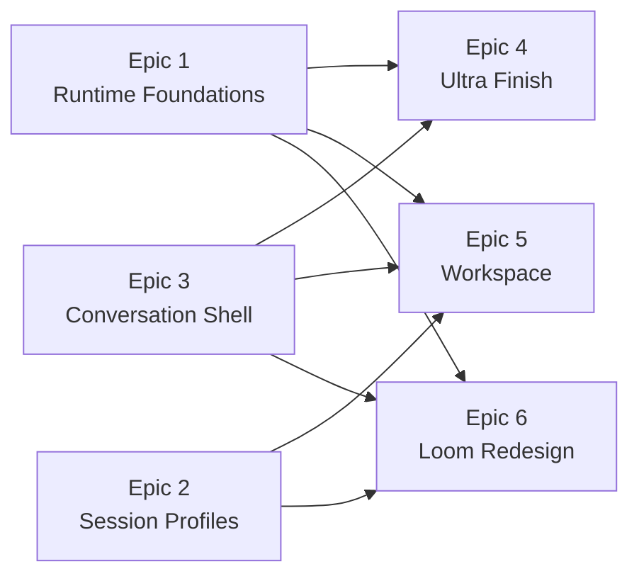

# telar - Epic Breakdown

## Overview

This document provides the complete epic and story breakdown for telar, decomposing the requirements from the PRD, UX Design if it exists, and Architecture requirements into implementable stories.

**Planning model.** There is no single `PRD.md`. Four SPEC kernels play the PRD role, each declaring itself *"the complete, preservation-validated contract for what to build, test, and validate."* Architecture is the 2026-07-24 spine (AD-1 … AD-21) plus `WORK-SPLIT.md`, whose Tracks A–F are the de-facto epic layer. UX is distributed across four contractual companions rather than a standalone document. This is a **brownfield** initiative: looms, Ultra's engine, the chat route and the session monolith all run in production today.

## Planning Decisions (owner rulings, 2026-07-25)

These govern every epic and story below and supersede parts of the 2026-07-24 readiness report.

1. **Ultracode is the execution mode.** Each story is implemented by one long multi-agent orchestration run, not a single-agent session. Stories are therefore authored **coarser** than the existing 53-story breakdown. This makes readiness finding **EQ-4** ("split the five epic-sized stories") obsolete rather than unresolved.
2. **Story granularity = one `WORK-SPLIT` sub-track per story**, targeting ~16–20 stories total (from 53). Track F's F0–F5 become six stories; Track E's 13 become ~5; Track D's 7 become ~2; Track A's 9 become ~3; Tracks B and C one each.
3. **Acceptance criteria are Given/When/Then**, derived from each SPEC's `success:` clause, plus a named **dev-server proof** line per story. This exists because the ultracode verify fan-out needs falsifiable targets — readiness finding **EQ-6** found a cluster of criteria that cannot gate anything.
4. **This document is the source of truth** for epics and stories. The four `stories.yaml` files are superseded and retained for traceability; their `invoke_dev_with` briefings are carried forward here, not discarded.
5. **Substrate tracks ship without a user-visible surface.** Tracks A, B and C deliver no dev-server-visible increment; the first visible delivery is Track D. This is readiness finding **EQ-2** accepted as a known risk by explicit owner ruling rather than mitigated.
6. **Model policy for ultracode runs:** never Fable. Opus for substantial build and judge/verify agents; sonnet/haiku for mechanical steps. Any per-item fan-out carries a hard agent cap.

## Requirements Inventory

### Functional Requirements

Prefixes: **RF** = runtime-foundations · **LR** = loom-redesign · **OW** = organization-workspace · **UW** = ultra-workflows. Numbering follows each SPEC's own CAP ids, so `FR-LR-9` *is* LR CAP-9. This preserves the readiness report's traceability baseline.

#### SPEC-runtime-foundations (7)

- **FR-RF-1:** `TELAR_HOME` is honored by every persisted store, so pointing it at a throwaway directory genuinely isolates a dev run. `apps/web/lib/store.ts` resolves its directory the same way `manifest.ts`, `looms.ts`, `session-log.ts`, `permissions.ts` and `vcs.ts` already do. No behavior change when the variable is unset.
- **FR-RF-2:** One attributed spend ledger. `UsageEntry` carries owner-kind + owner-id alongside the existing `account`, `model`, `sessionId`, `costUsd`. **No new ledger file.** The session's per-turn usage display, Ultra's manifest `spend` and a charter's budget-left all become projections over `usage.ndjson`. Readers tolerate records written before the field existed.
- **FR-RF-3:** A typed in-process event bus where every event carries a **required** delivery class — `agent-facing` (may synthesize an assistant turn) or `human-facing` (renders on arrival, never pushes). Published event names and payload shapes are a declared contract; cross-module subscription is permitted only to declared events.
- **FR-RF-4:** Admission control for `agent()` concurrency — one configurable ceiling (`TELAR_MAX_AGENTS`, default 4), classes `loom-build` / `loom-verify` / `ultra` / `other` with weights and floors, verification holding **precedence rather than a held-open slot**, no barging, a work-conserving borrow pass, and a pure policy half. `fanoutClamp` gains an optional `processCeiling` term.
- **FR-RF-5:** One lease primitive serving two lifetimes. `runner/lease.ts`'s record (`{pid, token, ts}`, atomic temp+rename, heartbeat, stale-reclaim) generalizes to serve loom-owned and session-owned processes. `TELAR_HOME/sessions/<sessionId>/` is created for session-scoped **runtime** state only — it does not absorb `chats.json`.
- **FR-RF-6:** Load-bearing invariants are executable as `bun test` assertions: no MCP surface exposes an accept tool; the verifier stack is granted no write or edit tools; no module reads another module's `TELAR_HOME` subtree by path; client components import no core runtime; no module writes a shared runtime service's state directly. Each fails loudly naming the invariant it defends.
- **FR-RF-7:** Session config is a resolved profile, not a branch. A typed `SessionProfile` `{cwd, guardrails, settingSources, mcpServers[], toolPolicy, requiredCapabilities, systemPromptAppendix}` resolves **before the route body**; project, project-less master, loom-node and steerer sessions are all profiles with no session-kind conditional left in the handler.

#### SPEC-loom-redesign (24)

*Act 1 — Prepare*

- **FR-LR-1:** Loom birth and detach. A session hands over premise (a list of N≥1 intents) plus optional context and nothing more; the loom detaches, leaving exactly a detach marker and a one-line mono receipt. Below the simple-task boundary no loom exists. The workspace batch-weave and packet-handover paths produce the identical receipt.
- **FR-LR-2:** Decision graph. Preparation is a branching DAG of real sessions converging into the gate; every node is a session that actually ran or was explicitly skipped, never decoration. Node shape is agent-chosen.
- **FR-LR-3:** Living map and lazy intake diff. Every project carries fine-grained region files that intake diffs against at main/default-branch head; a region with no drift spawns no node. A loom's pin does not move for its lifetime.
- **FR-LR-4:** Verification-readiness node and recipe. Before any build spend, a node boots declared services, probes readiness, and either emits a reusable recipe or fails closed with the reason. Degraded modes are declared and surfaced before the gate.
- **FR-LR-5:** Readiness gate. One entrance moat offering Accept, Modify on the go, and Deny → straight to development. Unprovables show first; the degraded-mode acknowledgement gates Accept.
- **FR-LR-6:** Approval-gated advance. `advance_node`, `weave_batch` and the ack-gated Accept are one protocol — proposal → explicit human approval → effect. No code path advances a node on the agent's own authority.
- **FR-LR-7:** Methodology as data. Seats, artifacts and map regions are declared data, not engine code. v1 ships exactly one built-in BMAD-derived methodology expressed through that mechanism.
- **FR-LR-8:** Orchestrator ownership and the role wall. After the gate the orchestrator owns created-to-delivered; conductors hold no write or edit tools and carry a distinct UI role.

*Act 2 — Execute*

- **FR-LR-9:** Flow compile. A thread's main agent authors a schema-validated DAG of parallel lanes, dependency edges and per-node context manifests, then executes it deterministically. Parallelism is a planning output of interference analysis, not a constant.
- **FR-LR-10:** Branch and worktree isolation. Branch-per-loom and worktree-per-loom are mandatory; the user's primary checkout is never touched. Thread worktrees reap at land; dependencies arrive by APFS copy-on-write clone rather than N installs.
- **FR-LR-11:** Declared services and supervisor-owned labs. Agents declare services via `ensure_service(name)`; the supervisor spawns, owns, probes, restarts on death and tears down under a per-owner lease. Orphans are impossible by construction.
- **FR-LR-12:** Borrowed heavy infra. Per-service scope `project | loom | ephemeral`, refcounted project stacks, a fleet heavy-infra semaphore, and data isolation by tenant-db or mutex-plus-reset from a migration-hash-keyed template.
- **FR-LR-13:** Two-altitude verification. Thread-altitude is serviceless, streaming, parallel and always-on, its rungs doubling as the progress heartbeat; loom-altitude stands up the lab with live Playwright behind a per-repo mutex.
- **FR-LR-14:** Pause, park and resume. A loom parks on usage or credit exhaustion or on user command and resumes without re-running completed work, possibly under a different account or provider.
- **FR-LR-15:** Progress liveness and dire-razor escalation. The supervisor watches process liveness; the orchestrator watches progress liveness. A flatline escalates as dire even when every process is green. Push fires only when the loom has no viable path to advance without the human.

*Act 3 — Judge*

- **FR-LR-16:** Evidence subsystem serving three consumers — accept proof, stall-detection proof-of-life, and courtroom forensics. Provenance-stamped ledger, cited narrative (uncited claims render unverified), full attempt history with flaky flags, lab grade and reality manifest.
- **FR-LR-17:** Delivery card. A shelf row skimmable across 7+ looms (claim, proof strip, risk flags, release grade, verdict in place); the open card leads with the live product on its frozen final-verify lane, courtroom below the glass.
- **FR-LR-18:** Accept-then-land with a landing queue. Accept queues a serial landing that rebases onto moved main and re-verifies the same contract at release grade before merging, one at a time.
- **FR-LR-19:** Boomerang. Rejection resumes the same loom with branch, worktree and recipe intact. No rejected loom is destroyed by the rejection.
- **FR-LR-20:** Vision critic. An advisory seat judges a delivery against the map's objective and form regions; its verdict renders in the courtroom and never gates or bypasses Accept.
- **FR-LR-21:** Map write-back. Pin at prep, propose deltas to a ledger, land serially at accept, mandatory rebase-adapt when head moved, semantic contradictions surfaced side-by-side for the human. Another loom's open proposals are reachable but never injected.
- **FR-LR-22:** MapStore and the artifact split. Loom-run artifacts live under `TELAR_HOME/projects/<id>/looms/<loom-id>/`; project knowledge lives in-repo by default as per-region markdown. One interface, two backends, a per-project dial reversible by migration command.

*Surfaces*

- **FR-LR-23:** Home / fleet triage. Needs-you top-left splitting into a compressed delivery shelf and verbatim parked questions; running rows with act chip and evidence age; done-today receipt, hot projects with map drift, landing-queue strip. A **graft** onto the existing dashboard.
- **FR-LR-24:** Loom cockpit. Persistent Prepare/Execute/Judge act tabs with park and kill; sealed prep DAG as a frozen receipt; pinned conductor over grouped thread rows; thread drill with streaming per-agent transcripts; WINDOW/LAB/CHATS header trio.

#### SPEC-organization-workspace (13)

- **FR-OW-1:** Project-less master chat that answers "where did I stop" with a four-band briefing sourced from durable on-disk state. The surface never initiates contact.
- **FR-OW-2:** Brain dump → receipt. One unstructured multi-project dump yields a receipt accounting for exactly N (`5 in → 4 filed, 1 question`), each unplaceable fragment quoted verbatim rather than guessed.
- **FR-OW-3:** Desk rail. Agent-created items land on a persistent right rail, are edited in place by talking about them, and dismissing drains to the queue. No path deletes an item.
- **FR-OW-4:** Queue with dynamic lanes. Every item as a dense grouped list, lanes as user-defined data with per-lane counts and coarse windows; a master-proposed split takes effect only after explicit human approval. Order is stack position.
- **FR-OW-5:** Item spectrum with sub-tasks inside. Sub-tasks live inside their parent and never grow the queue count; only a human may promote one out to standing alone.
- **FR-OW-6:** Work packet ripening. A raw fragment matures into an execution-ready briefing — raw kept verbatim beside the expert-written fixed brief plus acceptance criteria, attachments, and a timeline attributing every change.
- **FR-OW-7:** Deadlines as data with a self-deadline witness. External and self deadlines are structurally distinct; self ones carry a durable slip count and surface in the briefing as keep / move / drop.
- **FR-OW-8:** Expectation gap detection. Commitments mined from the user's own captures produce a gap line when their moment passes with nothing captured. Gap detection never creates an item.
- **FR-OW-9:** Ephemeral per-project experts, spawned per call and rehydrated from an on-disk digest, producing project-correct interpretation and an advisory session-or-loom triage verdict. No expert process persists between calls.
- **FR-OW-10:** Bed mode. An unattended overnight organization pass within a fixed four-action scope, reporting as a bounded digest with **zero** started and zero completed, every artifact marked a proposal.
- **FR-OW-11:** Loom and session handoff. A ripened packet or a selected batch hands to execution; both emit the universal detach receipt. Batched rows stay in the queue marked as tracking, leaving only when the loom lands **and** the human accepts.
- **FR-OW-12:** Tasks as a Telar-wide substrate. Any session anywhere can read its project's slice, create items and modify them through the in-process workspace MCP server, with provenance recording which surface did it.
- **FR-OW-13:** External sources as reference. A workspace-scoped roster of external MCP servers the master reads live, stating plainly that results are not tracked in Telar. An external record becomes an item only on explicit human say-so.

#### SPEC-ultra-workflows (6)

- **FR-UW-1:** Completion wake. A detached run reaching any terminal state wakes the session's main agent — an idle session produces an unprompted summarizing assistant turn; mid-conversation the outcome lands in context on the next turn. `ultra_status` polling stays as fallback.
- **FR-UW-2:** Real session UI. A fixed-height run anchor in the transcript, a Workflows section in the existing sub-agent rail, and Stop/Resume, live over the existing `/api/ultra` SSE — in the real session surface, not the demo gallery.
- **FR-UW-3:** Authoring-reference skill file shipped with the tool and injected for Claude sessions, covering the injected surface API, the explicit-model rule, the quality patterns and one worked example.
- **FR-UW-4:** Composer Ultra chip that arms Ultra for a single message via the `ultra: true` annotation. Arming only — no ceiling editor, no submenu.
- **FR-UW-5:** Session-cost rollup. A run's live spend attributes to its owning chat message and folds into the session's per-turn usage display, in the session's cost language.
- **FR-UW-6:** Dock run signal. A session with live runs shows run status (name · state · spend) in its dock bubble from anywhere in the app; tapping re-focuses the run.

### NonFunctional Requirements

#### Cross-cutting — `project-context.md` and the architecture spine (16)

- **NFR-X-1 (Human-Accept Moat):** `ready → done` is human-only. There is no agent-callable accept tool on any MCP surface and none is ever added. Enforced twice — by construction in `packages/core` and at the tool layer by the chat route's `PreToolUse` hook, in every SDK permission mode. *(AD-1)*
- **NFR-X-2 (Verifier capability wall):** `verifier.ts`, `verify-thread.ts`, `critic.ts`, `panel.ts` and every loom-altitude lab agent are granted no write or edit tools. The wall extends to new verification surfaces and is never relaxed. *(AD-2)*
- **NFR-X-3 (Client-bundle rule):** `@telar/core` is server-side only. Client components import **types only**; runtime core code lives in Route Handlers, Server Components and `instrumentation.ts`. Server Components reading the on-disk registry set `export const dynamic = "force-dynamic"`. *(AD-3)*
- **NFR-X-4 (Store ownership):** One owner per `TELAR_HOME` subtree; no module reads or writes another's subtree by path. Shared state belonging to no module — usage ledger, bus subscriptions, admission accounting — is written only through its owning core service. *(AD-5, AD-20)*
- **NFR-X-5 (Persisted format follows artifact class):** human-editable → YAML; machine single-doc → JSON; append-only stream → NDJSON. All writes atomic (`.tmp` → `fs.renameSync`). zod schemas for persisted entities are owned by `@telar/core` and never redefined in `apps/web`. *(AD-6)*
- **NFR-X-6 (Schema evolution):** Tolerant readers (unknown and missing fields absorbed by zod defaults). Regenerable stores are rebuilt, never migrated; a schema-version field and migrate-on-read go only on stores holding unrecoverable human input — `packet.yaml` above all. *(AD-7)*
- **NFR-X-7 (Weak cross-tree references):** A stored cross-module reference is an id plus enough denormalized label to render without a lookup. Live resolution goes through the owning module's port. A dangling reference renders as a tombstone and never throws. *(AD-8)*
- **NFR-X-8 (Moat outside the profile):** The `PreToolUse` guardrail is wired into the pipeline outside the `SessionProfile` and runs for every session regardless of profile. `toolPolicy` is **intersect-only**, enforced by its type — it may deny more, never grant more. *(AD-10)*
- **NFR-X-9 (Fail closed, fail early):** An unmet `requiredCapability` is a hard error **before the stream opens**, matching the route's existing pre-SSE 400. No silent degradation. *(AD-11)*
- **NFR-X-10 (Frozen Conversation shell contract):** Exactly four slots — transcript through an item-kind registry, composer, right rail, header — configured by props, never inheritance. The shell owns scrolling, auto-follow and streaming; it owns **no data fetching and no session semantics**. A registered kind's renderer is a **pure function of `(item payload, shell-provided view state)`** and reads nothing from ambient context. *(AD-12)*
- **NFR-X-11 (Namespaced item kinds):** Registered kinds carry their owning module — `ultra:run-anchor`, `loom:gate-card`, `workspace:receipt`. A surface registers custom kinds rather than forking the shell. *(AD-13)*
- **NFR-X-12 (Restart doctrine):** No in-process work survives a server restart and nothing auto-restarts. A store reconciles a stale `running` into a terminal-but-resumable state on next read and offers Resume. Consequently any operation mutating the repo or the map must be **idempotent and resumable from its own journal**. *(AD-15)*
- **NFR-X-13 (Published events are contract):** A module's published event names and payload shapes are as binding as its tool signatures — declared, versioned with the module, changed only deliberately. Undeclared events are internal and nobody may subscribe. *(AD-21)*
- **NFR-X-14 (Executable invariants):** AD-1, AD-2, AD-3, AD-5 and AD-20 are assertions in `bun test`, run in the manual pre-commit trio. *(AD-19)*
- **NFR-X-15 (Client state and streaming):** No global client-state library. `useState`/`useEffect` + `fetch` against the app's own API; refetch on mount, on `window "telar:refresh"`, and on a poll interval while something runs. Hand-rolled SSE — `POST` returns a raw `ReadableStream` consumed via `lib/sse.ts consumeSSE()`; `GET` tails use native `EventSource`. No `useChat`, no `EventSource` polyfill. UI-only prefs in `lib/ui-prefs.ts` never write engine state.
- **NFR-X-16 (Toolchain and secrets):** Bun only; `bun.lock` mutated only via `bun install`/`bun add`. TypeScript is deliberately not version-unified (core `^6.0.3`, web `^5`). Next 16 canary — read `node_modules/next/dist/docs/` before writing framework code. All server surface is `app/api/**/route.ts` — no `pages/api`, no Server Actions, no `middleware.ts`. `credentials.json` stays chmod `0600`, re-chmod on every write, never logged or surfaced; no global `ANTHROPIC_API_KEY`. `bun test` is the only test tooling; **no CI** — `bun test`, `bun run lint`, `bunx tsc --noEmit` run manually.

#### SPEC-runtime-foundations (9)

- **NFR-RF-1:** Reuse, never rebuild — the usage ledger, lease primitive, atomic-write idiom and `TELAR_HOME` resolution expression all already exist. Copy the settled expression; do not invent a variant.
- **NFR-RF-2:** **CAP-1 precedes CAP-2, non-negotiably.** Extending the usage ledger while its store ignores `TELAR_HOME` would write dev spend into production state.
- **NFR-RF-3:** The lease primitive and `TELAR_HOME/sessions/<sessionId>/` are built **exactly once**, under FR-RF-5. Every consumer composes over it and re-implements no stale-reclaim.
- **NFR-RF-4:** One route, one resolver, one guardrail. Separate routes per session kind are rejected — a moat enforced in three places has three chances to be forgotten.
- **NFR-RF-5:** Nothing in this SPEC is user-visible. A capability here that starts growing a surface has escaped its package.
- **NFR-RF-6:** The admission policy half is **pure** — entitlement and the admit/deny decision take policy and occupancy as arguments, with no I/O, clock, or implicit module state.
- **NFR-RF-7:** Admission governs `agent()` concurrency only. Interactive chat sessions are out of band by design; long-lived processes take no slot; Ultra's run-local cap of 3 stays as a separate per-run limit.
- **NFR-RF-8:** Admission adoption is **not a throughput change** — the ceiling default stays at the historical 4, and `ultra-runner.test.ts`'s `peak === 4` must pass unchanged.
- **NFR-RF-9:** `fanoutClamp`'s `processCeiling` term must be **optional**, preserving the existing `pool → budget` tie-break order so every current call site keeps byte-identical behavior until deliberately migrated.

#### SPEC-loom-redesign (27)

- **NFR-LR-1:** The four structural walls are the constitution and never bend — verifiers cannot write, conductors cannot code, agents cannot accept, nobody writes the map silently.
- **NFR-LR-2:** **ONE design for looms at any size.** No small/medium/large UI split. Ceremony scales; branch, evidence and human-accept walls hold at every weight — even a one-stitch loom gets a worktree and a screenshot.
- **NFR-LR-3:** The decision graph always exists and is **never** rendered inside the originating session's UI.
- **NFR-LR-4:** **No file locks anywhere on the map.** Proposals are the only write path and serial landing the only commit path.
- **NFR-LR-5:** Only human-meaningful markdown lands in-repo, one file per map region. Machine artifacts always stay in `TELAR_HOME`.
- **NFR-LR-6:** A methodology declares the catalog, never the graph — it states what artifacts and regions *may* exist; drift alone decides which nodes run.
- **NFR-LR-7:** Methodologies never declare *how* anything is written; the propose → serial-land protocol sits below the methodology layer and is unreachable from it.
- **NFR-LR-8:** The region set is per-project. Changing methodology is a reconciliation-loom rebuild of a regenerable projection, never a schema migration.
- **NFR-LR-9:** Hand-edits to in-repo map files are allowed and treated as **good**; the lazy intake diff absorbs them as drift.
- **NFR-LR-10:** One loom verification per repo at a time (per-repo verification mutex). Surface evidence events count under it.
- **NFR-LR-11:** Trust wall — sessions may adopt a user-hand-started foreign stack; **looms never may.** Evidence comes only from telar-owned labs.
- **NFR-LR-12:** Data class `production` means refuse surface-verify, fail closed.
- **NFR-LR-13:** Carried files have lab-checkout lifetime — planted at mode `0600`, scrubbed at teardown, never copied into evidence, the map, or a transcript. A worktree that held carry files and cannot be removed raises a dire escalation naming the path.
- **NFR-LR-14:** Evidence inherits its recipe's data class. `shared-dev` is flagged on the reality manifest and never lands in-repo. Evidence is reaped with its loom.
- **NFR-LR-15:** Degradation is a prep-time concern, surfaced before the gate, never mid-run.
- **NFR-LR-16:** Children escalate to mediation, never straight to humans. Pushes are awareness-only — nothing is resolvable from a phone.
- **NFR-LR-17:** One window per loom, never per thread. Heavy infra is one stack at a time, never N; for heavy projects the window is borrowed on demand.
- **NFR-LR-18:** Live-window concurrency per project is a function of the recipe's `isolation` parameter, not a fixed number. A request beyond what isolation permits **queues and names its holder** — it never displaces a live window or a running verify.
- **NFR-LR-19:** The lane owns the server. Project-owned e2e suites reuse it via `PORT` + `reuseExistingServer` rather than launching a nested `webServer`.
- **NFR-LR-20:** The recipe is a map region that compiles to `servers.yaml` plus prepare/carry/verify sections — the region is source of truth, the compiled files are what the lane consumes.
- **NFR-LR-21:** v1 serializes fleet access to stock or colliding ports rather than rewriting committed port config.
- **NFR-LR-22:** Evidence must cite artifacts; uncited claims render as unverified. Every verify attempt stays on the history; flaky boots and tests are flagged, never silently retried into invisibility.
- **NFR-LR-23:** Landings verify at dev grade for speed; the accept-gating ALL-verify and the post-accept landing re-verify run at **release grade**.
- **NFR-LR-24:** **Tone law** — no suggestion-text or doctrine captions anywhere in the UI. Surfaces show state and data only.
- **NFR-LR-25:** New conversational surfaces are born on the extracted `Conversation` shell. The `session-view.tsx` carve-out cuts at the render seam only.
- **NFR-LR-26:** One fractal pattern runs everywhere — declare → validate → execute deterministically → reconcile lazily.
- **NFR-LR-27:** The user's primary checkout is sacred. Branch-per-loom is constitutional; stacked looms declare the relationship explicitly and land after their base.

#### SPEC-organization-workspace (20)

- **NFR-OW-1:** **Pull, never push.** No surface in this module notifies, pings, badges, or interrupts — including for deadlines that have passed.
- **NFR-OW-2:** **Prepare, never commit.** Agents may file, draft, ripen, propose and sync *inbound*; they never start work, complete work, or write outward to a foreign system.
- **NFR-OW-3:** **Compress, never multiply.** Item count grows only when reality grows. Agents may fan out inside a packet, never at the queue level.
- **NFR-OW-4:** Capture raw, understand later. Capture is zero-ceremony; understanding is a deferred enrichment pass. Ambiguity is resolved in the next chat, never by a ping.
- **NFR-OW-5:** Experts write, master reads. Experts produce durable on-disk digests; the master is a thin reader. State lives on disk, not in the conversation.
- **NFR-OW-6:** Foreign structures stay foreign. Native projects: Telar is source of truth. Mirrored projects: Telar holds a view with pointers back.
- **NFR-OW-7:** The master is a full harness session resolved as a `SessionProfile`, with `cwd = TELAR_HOME/workspace/home` — never the store root, so `lanes.yaml` and `packets/` stay outside its path-based write boundary. **Never `/Users/facundo` as cwd.**
- **NFR-OW-8:** Codex reaches workspace tools via per-invocation config injection; `runCodexTurn` has no MCP plumbing today and closing that gap is in scope for a Codex-backed master.
- **NFR-OW-9:** Sub-agent scope is inverted here — the master has no project while each expert it calls is scoped to its own. Any plumbing assuming a sub-agent inherits the caller's project breaks the master.
- **NFR-OW-10:** Lanes are data, never an enum; lane structure changes are human-accepted.
- **NFR-OW-11:** **No clocks and no scheduling.** Order is stack position; deadlines are chips. Nothing is driven by wall-clock time.
- **NFR-OW-12:** Provenance is a free-form label, not a channel type — there is no capture-channel enum to switch on.
- **NFR-OW-13:** The store is `lanes.yaml` + `packets/<id>/` under `TELAR_HOME/workspace`. Structure and content stay separate; one shape for all items, so a bare todo needs no migration when it grows.
- **NFR-OW-14:** Cross-surface access goes through the in-process workspace MCP server, never raw file tools — project sessions are sandbox-bound to their own working root, so file access does not merely offend, it does not work.
- **NFR-OW-15:** Only the human promotes a sub-task out of its parent. Agents have no promotion path, proposed or otherwise.
- **NFR-OW-16:** Approval-gated advance is the protocol shape wherever an agent moves something forward, rendered as the shared `ApprovalCard`.
- **NFR-OW-17:** The detach receipt grammar is universal — one mono line, identical from birth session, batch weave, or packet handoff.
- **NFR-OW-18:** Master chat is born on the shared `Conversation` shell as an owner adapter, not a bespoke chat window.
- **NFR-OW-19:** `raw` and `rawSource` are never overwritten — keeping them beside `fixed` is what lets the user check the expert did not drift.
- **NFR-OW-20:** Bed mode's `0 started` and the queue's `agents added 0` are **real invariants to assert against**, not display copy.

#### SPEC-ultra-workflows (11)

- **NFR-UW-1:** Opt-in is a request, not a behavior flag — the agent may call `ultra` only on an explicit user ask (keyword or chip annotation), never inferred. No engine mode, no `TELAR_*` switch.
- **NFR-UW-2:** The non-blocking contract is fixed: `ultra` validates synchronously and returns `{runId}` immediately; several runs may be live per session; completion is an event. The wake supplements `ultra_status` polling, never replaces it.
- **NFR-UW-3:** The sandbox stays as-is — `node:vm` capability shaping with determinism bans (`Date.now`, `new Date()`, `Math.random` throw) is load-bearing for ordinal resume. It is **not** a security boundary and must not be reworked into one.
- **NFR-UW-4:** Child posture is fixed — subagents run non-interactive under `ULTRA_CHILD_TOOLS` + `restrictTools`; an approval-needing action fails that `agent()` call. There is no per-agent permission knob.
- **NFR-UW-5:** Every `agent()` call names its `model`. Static lint rejects a model-less script before `runId`; a runtime `MissingModel` ends the run `failed`, never coerced to `null`.
- **NFR-UW-6:** Schema-less `agent()` (returns final text) stays — reference parity with the CC harness.
- **NFR-UW-7:** **No budgets anywhere** — no spend ceilings, meters, or budget UI. Runaway brakes are the per-run cap (3), the process admission ceiling, the 1000-agent backstop, human Stop, and `ultra_stop`.
- **NFR-UW-8:** Claude-first. No Codex-specific Ultra work; Codex lights up via the codex-driver seam later.
- **NFR-UW-9:** Ultra never writes loom state and never `done`s a loom. Run state lives in `TELAR_HOME/ultra/`, invisible to loom listing and reaping.
- **NFR-UW-10:** Terminal states are the as-built `done | failed | stopped`.
- **NFR-UW-11:** The run anchor is **fixed-height while running** — never grows or reflows; its sole permitted height change is a one-time collapse on reaching terminal. The rail's narrator window is fixed-height scrolling with no layout shift, ever.

### Additional Requirements

Technical requirements from the architecture that shape epic and story structure.

**No starter template.** This is brownfield work on an existing Bun-workspace monorepo (`apps/web`, `apps/desktop`, `packages/core`). There is no greenfield scaffolding story — Epic 1 Story 1 is a defect fix in an existing file, not a project init.

**Track structure is the epic layer.** `WORK-SPLIT.md` divides 50 capabilities into six tracks whose **write sets are disjoint** — that disjointness is what makes parallel work safe, and it is the reason three of six epics deliver no user value:

| Track | Owns (may write) | Extends via seam (never edits) | Blocked by |
| --- | --- | --- | --- |
| **A** Runtime foundations | `packages/core/src/` — bus, admission, lease, MapStore port, usage-ledger port, `store.ts` fix | — | nothing |
| **B** Session profiles | `app/api/chat/route.ts`, the profile resolver, Codex MCP injection | — | nothing |
| **C** Conversation shell | `components/conversation/**`, `session-view.tsx` carve-out | — | nothing |
| **D** Ultra finish | `lib/ultra-mcp.ts`, ultra adapter pieces, `ultra/` subtree | a profile; kind `ultra:run-anchor`; a rail section; declared events | A, C |
| **E** Workspace | `workspace/` subtree, workspace MCP, `MasterChat` | a profile; kind `workspace:receipt`; the Desk rail; declared events | A, B, C |
| **F** Loom redesign | `looms/` subtree, loom core, `NodeConversation` / `LoomSessionView` | profiles; kinds `loom:*`; declared events | A, B, C |

**Serialization points — only four.** Everything else is parallel: (1) A1 → A2, the `TELAR_HOME` fix precedes anything writing the ledger; (2) A3 → D, E, F, nobody declares events before the bus and registry exist; (3) C's *contract* → D, E, F, frozen in the spine so downstream starts immediately against fixtures and only final wiring waits; (4) F0 → the rest of F.

**State root layout is fixed** by AD-5/AD-6 — `projects/<id>/looms/<loom-id>/` (looms), `workspace/` (organization-workspace), `ultra/<runId>/` (ultra), `sessions/<sessionId>/` (session, new), with `chats.json`, `usage.ndjson`, `plan-usage.json`, `accounts.json`, `credentials.json` staying at root. The legacy flat `~/.telar/looms/<id>/` tree is **read-only until drained**.

**Integration and infrastructure requirements:**
- The in-process MCP servers (`loom`, `ultra`, workspace) mount in the chat route's `mcpServers` map, inheriting `strictMcpConfig: true` and the existing `PreToolUse` guardrail path.
- Multi-provider account auth (`accounts.ts` / `login.ts` / `accountEnv()`) is what makes "resume under a different account or provider" reachable. `accountEnv()` **deletes** `CLAUDE_CONFIG_DIR` for an account with no `configDir`.
- Two runtimes over the same code: the Next dev server (`TELAR_HOME` defaults to `~/.telar-dev`) and the packaged Electron app (mac/arm64, shipped only from a pristine origin snapshot, `--smoke` fail-closed gate must print `SMOKE_OK`).
- No auth layer, no remote infrastructure, single-user local-first by design.

**Deferred by the architecture (not gaps):** admission weights and ceiling tuning; class-tagging `executor.ts`'s five `agent()` call sites; wiring `processCeiling` into `tick.ts`/`executor.ts` live clamps; the concrete event catalogue per module; bus durability; living-map regions beyond v1; `SessionProfile` fields beyond the named core; supervisor re-adoption on boot; CI; desktop runtime divergence.

**Open items inherited from the readiness report that these epics must resolve or explicitly carry:**
- **EQ-3** — two acceptance-blocking constants are undefined everywhere: the flatline `N` minutes (FR-LR-15) and the **simple-task boundary** (FR-LR-1, invoked six times, the rule that decides whether a loom exists at all). Owner ruling required.
- **UX-1 / UX-2 / UX-7** — `GateGraph`, `ApprovalCard` and `VerdictBar` are shared components with no unambiguous owning story.
- **UX-3** — the spine assigns Home (FR-LR-23) to the `LoomSessionView` chat adapter, but Home is a dashboard graft with no transcript and no composer; the architecture is the outlier.
- **UX-5 / EQ-7** — no disposition for ~119KB of live `god-view.tsx` / `godview.ts`, and nothing drains the legacy loom tree.
- **CV-3 / CV-7** — SPEC-organization-workspace has no prove-run and no checkpoint across its back half.
- **EQ-5** — the FR-LR-1 ↔ FR-OW-11 steering-channel behaviour is split cleanly in two with no story owning the integrated result.

### UX Design Requirements

Extracted from four contractual companions. All six surfaces were prototyped in `apps/web/lib/demo-gallery/**` — **design source of truth, not production code**; fixture state (pre-checked rows, one-shot toggles, hardcoded timestamps, Ultra's replay controls) is explicitly non-contractual.

*The shared component layer*

- **UX-DR1:** Consolidate chat **primitives** under one roof (`Message`/`MessageContent`, `MessageResponse`, `ToolStep`, `WorkingIndicator` + `Shimmer`, `CodeBlock`, the `PromptInput` family) and add the two production lacks: **`Marker`** (dashed system-event line — state, never prose) and **`ApprovalCard`**.
- **UX-DR2:** Build the **`Conversation` shell** with an item-kind registry and four slots (transcript, composer, right rail, header), config over inheritance. It owns scrolling, auto-follow and streaming; it owns no data fetching and no session semantics.
- **UX-DR3:** Carve the shell out of `session-view.tsx` as a **pure-render extraction at the render seam** — transcript loop and composer wiring move, route/state/API stay in the adapter. No behavior change. Prove it in the demo gallery before new surfaces are born on it.
- **UX-DR4:** Implement **five owner adapters**: `ProjectSessionView` (what `session-view.tsx` becomes), `MasterChat`, `NodeConversation`, `LoomSessionView`, `TranscriptView`. Per-directory state keying, MCP wiring and permission modes are adapter concerns, never shell concerns.
- **UX-DR5:** Implement **`GateGraph(nodes, edges, gateState)`** — the gate room's kit, generalized and reused as the cockpit's frozen Prepare receipt — with all six pinned render rules: grab-to-pan viewport (**not** a scroll container); scroll-wheel zoom anchored at the cursor; rounded 90°-elbow SVG edges; node sub-text that **never truncates**, the selected node expanding downward only into the row gap and never overlapping a neighbour while others dim to 65%; glide-to-node measuring after a **double `requestAnimationFrame`** with an eased cubic-bezier; and a **sealed** state rendering the same map as a frozen receipt.
- **UX-DR6:** Implement one shared **`VerdictBar`** — Accept declares the map note and queues silent landing, Boomerang opens the composer — **one verdict per delivery, shared between the Home shelf row and the open delivery card.**
- **UX-DR7:** Implement the **`ApprovalCard` idiom** — mono header ("tool call — awaiting your approval"), the proposal text, Approve/Hold. One component, one protocol shape, for `advance_node`, `weave_batch`, lane splits and the ack-gated Accept.
- **UX-DR8:** Implement the **detach receipt grammar** — one mono line, `premise + context · detached`, byte-identical whether it fires from a birth session, the queue's batch weave, or a packet handover.
- **UX-DR9:** Implement the shared **chip grammar**: Deadline (external = solid outline; **self = dashed**, suffixed `· self` and `· slid ×N`), Verdict (`→ session` / `→ loom`, tinted fill), Project (mono; mirrored adds dot-icon + foreign ref; **absent = `floating`**), Provenance (free-form label in a quiet mono outline — no icon set, no channel typing). Identical on every surface.

*Design law*

- **UX-DR10:** Honor the existing visual tokens — grayscale chrome, the single `Tone` vocabulary (`done | attention | danger | active | muted`) from `components/looms/status.tsx` via `statusVisual()` / `StatusBadge`, 3px state rails, tinted-outline badges. **Quiet-color law:** hue lives on the icon only; chips stay neutral outlines; active build/verify use a neutral spinner, never a saturated hue.
- **UX-DR11:** Enforce the **tone law** across every surface — no suggestion-text, no doctrine captions (never render *"threads land serially, on green"*). State and data only.
- **UX-DR12:** Render agent output awaiting a human as **visibly dashed with a `proposal` badge** — the prepare-never-commit law made visible.

*Loom surfaces*

- **UX-DR13:** **UX 0 Birth** — below the simple-task boundary the agent works inline and a screenshot closes it; above it, "Spin off" leaves exactly a detach marker plus the one-line receipt. No graph preview, no progress narration, no loom door inside the session.
- **UX-DR14:** **UX 1 Home** — a **graft** onto the existing production dashboard (same KPI hero, two-column deck, rails, panel grammar): Needs-you top-left splitting into a compressed delivery-shelf row and the parked question verbatim; Running-now rows gaining an act chip and evidence age; right column adding a done-today receipt, hot projects with map drift, and a landing-queue strip.
- **UX-DR15:** **UX 2 Cockpit** — a component kit (`ActTab`, `Room`, `ConductorCard`, `ThreadGroup`, `ContractGroups`, `LabRoom`): persistent Prepare/Execute/Judge tabs with park and kill; Prepare rendering the sealed DAG as a frozen receipt; Execute pinning the conductor over dense thread rows **always inside groups** (a single-lane flow renders exactly one group, and group identity comes from the compiled flow's declared lanes, never a free-text label); thread drill showing compiled flow, per-node context manifests, builder lanes, thread rungs and per-agent transcripts streaming in a right drawer; header carrying WINDOW / LAB / CHATS.
- **UX-DR16:** **UX 2 scale variant** — 11 threads, 3 workstream labels, one orchestrator, demonstrating the full live-escalation path: amber attention strip, pinned chats row, "N needs you" tab meta, ladder inner → mediation → you.
- **UX-DR17:** **UX 3 Delivery card** — the SHELF as fleet-scale skim (claim, proof strip, risk flags, release grade, verdict in place); the open card **taste-first**, led by the live product on its frozen final-verify lane with a filmstrip flipping to ledger screenshots; **below the glass the courtroom scrolls** — reality manifest, cited narrative with uncited claims marked unverified, contract with per-assert citations, provenance-stamped evidence ledger, full attempt history with flaky flags, and the vision critic's advisory verdict.
- **UX-DR18:** **UX 4 Gate room** — the preparation DAG as a pan/zoom map centre-stage; clicking a node **inverts the proportions** into a dominant left conversation pane (history rail, "+ new chat", composer) while the map shrinks right and zooms only itself; the gate is a node like any other, its pane carrying unprovables first, the degraded-mode ack gating Accept, Modify waking nodes, and Deny → straight to dev.

*Workspace surfaces*

- **UX-DR19:** **Shell** — Workspace is one top-level destination with two tabs, Chat and Queue. The queue does not pretend to be its own destination.
- **UX-DR20:** **Master chat** — header carrying a bed-mode summary chip (window, action count, `0 started`); the briefing as labelled bands (*While you were away* · *Where you stopped* · *Today*); the gap card with capture chips; the witness card with keep/move/drop; the receipt as one line per filed item then unplaceable ones as an amber verbatim question, closing with the tally; external reads as a mono tool pill. **No Ultra chip here** — ultra's mutating tools dereference a project the master lacks.
- **UX-DR21:** **Desk rail** — fixed-width right rail with count; cards carrying title, optional mono project tag and hint; `unplaced` cards **dashed with an amber question icon**; a card the conversation just touched border-highlighted **in place**; dismiss on hover **drains to the queue**, stated in the footer.
- **UX-DR22:** **Queue** — search-first toolbar, lane filter chips with counts ending in a dashed `+ lane`, sticky group headers with structural provenance and coarse window, dense rows (checkbox · rank · sub-task disclosure · title · `done/total` · packet tallies · provenance · deadline · verdict · project-or-`floating`), sub-task rows indented **inside the same group and never as queue entries**, a footer stating the conservation law with **live** numbers, a sticky batch bar becoming the detach receipt in place on weave, and tracking rows that stay after a weave.
- **UX-DR23:** **Packet detail** — two columns; *Born as* showing the raw fragment verbatim in mono with source and time, then the transition line and the fixed brief with acceptance criteria; *Gathered along the way* with agent-drafted attachments dashed and badged; *Ripening* as a vertical timeline with actor icon, timestamp and `· proposal` suffix; *Its turn came* offering `Plan loom from this packet` (primary) and `Start a session instead` (**equal weight**), closing with *everything above was prepared by agents — nothing runs until you click*.

*Ultra surfaces*

- **UX-DR24:** **Ultra in-session** — everything inside real session chrome, no standalone surface: a **fixed-height** compact tool-style run anchor per run (name, state pill, agents done/total, quiet spend readout, thin progress sliver) whose only permitted height change is a one-time collapse at terminal; a **Workflows section** in the existing sub-agent rail (run cards with Stop, phase groups with per-agent rows carrying `model·effort` chip and masked-shimmer snippet, a fixed-height scrolling narrator window, a read-only Script tab linking to the authoring reference); anchors stacking for concurrent runs; Resume affordances on `stopped` and `failed`; **no budget UI anywhere**; and a dock bubble showing name · state · spend that re-focuses the run on tap.

### FR Coverage Map

Every functional requirement maps to exactly one owning story. Where a capability is deliberately split across two stories, both halves are named and the split is declared in each.

| FR | Epic / Story | Coverage |
| --- | --- | --- |
| FR-RF-1 | 1.1 | `TELAR_HOME` honored in `store.ts` |
| FR-RF-2 | 1.1 | Owner attribution on `usage.ndjson`; rollups become projections |
| FR-RF-3 | 1.2 | Typed event bus with required delivery class |
| FR-RF-4 | 1.2 | Admission controller — classes, precedence, borrow pass |
| FR-RF-5 | 1.2 | One lease primitive, two lifetimes; `sessions/<id>/` tree |
| FR-RF-6 | 1.3 | Executable invariant assertions in `bun test` |
| FR-RF-7 | 2.1 + 2.2 | **Split:** resolver lands additively (2.1); live-path retrofit (2.2) |
| FR-LR-1 | 6.2 | Loom birth, detach receipt, simple-task boundary, workspace seams |
| FR-LR-2 | 6.2 | Decision graph as a converging DAG of real sessions |
| FR-LR-3 | 6.1 + 6.2 | **Split:** region files + MapStore backing (6.1); lazy intake diff + pin (6.2) |
| FR-LR-4 | 6.3 | Verification-readiness node and recipe |
| FR-LR-5 | 6.2 | Readiness gate — Accept / Modify / Deny |
| FR-LR-6 | 6.2 | Approval-gated advance protocol |
| FR-LR-7 | 6.1 | Methodology as data |
| FR-LR-8 | 6.2 | Orchestrator ownership and the role wall |
| FR-LR-9 | 6.4 | Flow compile |
| FR-LR-10 | 6.4 | Branch and worktree isolation |
| FR-LR-11 | 6.4 | Declared services and supervisor-owned labs |
| FR-LR-12 | 6.4 | Borrowed heavy infra, scopes, semaphore, data isolation |
| FR-LR-13 | 6.3 | Two-altitude verification and the per-repo mutex |
| FR-LR-14 | 6.4 | Pause, park and resume |
| FR-LR-15 | 6.4 | Progress liveness and dire-razor escalation |
| FR-LR-16 | 6.3 | Evidence subsystem |
| FR-LR-17 | 6.5 | Delivery card |
| FR-LR-18 | 6.5 | Accept-then-land with a landing queue |
| FR-LR-19 | 6.5 | Boomerang |
| FR-LR-20 | 6.3 | Vision critic |
| FR-LR-21 | 6.1 | Map write-back and the collision protocol |
| FR-LR-22 | 6.1 | MapStore and the artifact split |
| FR-LR-23 | 6.6 | Home / fleet triage |
| FR-LR-24 | 6.6 | Loom cockpit |
| FR-OW-1 | 5.3 + 5.4 | **Split:** project-less session + surface (5.3); briefing intelligence (5.4) |
| FR-OW-2 | 5.4 | Brain dump → receipt |
| FR-OW-3 | 5.3 | Desk rail |
| FR-OW-4 | 5.2 | Queue with dynamic lanes |
| FR-OW-5 | 5.2 | Item spectrum with sub-tasks inside |
| FR-OW-6 | 5.2 | Work packet ripening |
| FR-OW-7 | 5.4 | Deadlines as data with the self-deadline witness |
| FR-OW-8 | 5.4 | Expectation gap detection |
| FR-OW-9 | 5.4 | Ephemeral per-project experts |
| FR-OW-10 | 5.4 | Bed mode |
| FR-OW-11 | 5.5 | Loom and session handoff |
| FR-OW-12 | 5.1 | Tasks as a Telar-wide substrate (workspace MCP) |
| FR-OW-13 | 5.5 | External sources as reference |
| FR-UW-1 | 4.1 | Completion wake |
| FR-UW-2 | 4.2 | Real session UI |
| FR-UW-3 | 4.2 | Authoring-reference skill file |
| FR-UW-4 | 4.2 | Composer Ultra chip |
| FR-UW-5 | 4.1 | Session-cost rollup |
| FR-UW-6 | 4.2 | Dock run signal |

**Coverage: 50 / 50 FRs (100%).** RF 7 · LR 24 · OW 13 · UW 6.

#### UX-DR Coverage Map

Recorded separately because three shared components had **no owning story** in the prior breakdown (readiness findings UX-1, UX-2, UX-7). Assigning an owner here is what closes them.

| UX-DR | Owning story | Consumed by | Note |
| --- | --- | --- | --- |
| UX-DR1 primitives + `Marker` | 3.1 | all chat surfaces | — |
| UX-DR2 `Conversation` shell | 3.1 | 4.2, 5.3, 6.2, 6.6 | contract frozen in AD-12 before build |
| UX-DR3 `session-view.tsx` carve-out | 3.1 | — | render seam only |
| UX-DR4 owner adapters | 3.1 `ProjectSessionView` · 5.3 `MasterChat` · 6.2 `NodeConversation` · 6.6 `LoomSessionView` + `TranscriptView` | — | each adapter belongs to its own track |
| **UX-DR5 `GateGraph`** | **6.2** | 6.6 (sealed receipt) | **closes UX-1** — was unowned |
| **UX-DR6 `VerdictBar`** | **6.5** | 6.6 (shelf row) | **closes UX-7** — declared in one direction only |
| **UX-DR7 `ApprovalCard`** | **3.1** (as a primitive) | 5.2, 5.5, 6.2 | **closes UX-2** — was classified three ways; the primitive reading wins |
| UX-DR8 detach receipt grammar | 6.2 | 5.5 | one grammar, three firing sites |
| UX-DR9 chip grammar | 5.2 | 5.3, 5.4, 5.5 | identical on every surface |
| UX-DR10 visual tokens / quiet-colour law | cross-cutting | 3.1, 4.2, 5.2–5.5, 6.2, 6.5, 6.6 | reuse `status.tsx`, never re-invent |
| UX-DR11 tone law | cross-cutting | every UI story | — |
| UX-DR12 proposal rendering | cross-cutting | 5.2, 5.4, 6.2 | dashed + badge |
| UX-DR13 UX 0 Birth | 6.2 | — | — |
| UX-DR14 UX 1 Home | 6.6 | — | a graft, not a replacement |
| UX-DR15 UX 2 Cockpit | 6.6 | — | — |
| UX-DR16 UX 2 scale variant | 6.6 | — | escalation ladder |
| UX-DR17 UX 3 Delivery card | 6.5 | — | replaces `acceptance-panel.tsx` |
| UX-DR18 UX 4 Gate room | 6.2 | — | — |
| UX-DR19 workspace shell | 5.2 | — | two tabs, one destination |
| UX-DR20 master chat | 5.3 + 5.4 | — | surface (5.3), band content (5.4) |
| UX-DR21 Desk rail | 5.3 | — | — |
| UX-DR22 queue | 5.2 | — | — |
| UX-DR23 packet detail | 5.2 | — | — |
| UX-DR24 Ultra in-session | 4.2 | — | — |

## Epic List

Six epics, one per `WORK-SPLIT` track, 19 stories. Epic order is `WORK-SPLIT`'s phase order; epics 1–3 are unblocked from day one and may run concurrently.

**Known and accepted:** epics 1, 2 and 3 deliver **no user-visible outcome** and produce nothing observable on the dev server. The first visible delivery is epic 4. This is readiness finding EQ-2, accepted by owner ruling (see Planning Decisions) rather than mitigated — the architecture's case is that vertical-slicing this substrate would rebuild it three times, differently, which is the failure AD-12 and AD-14 exist to prevent.

### Epic 1: Runtime Foundations

The substrate all three feature epics stand on — one state root, one spend ledger, one event bus, one concurrency ceiling, one lease — gathered where it belongs instead of built two or three times differently. Deliberately unglamorous and deliberately first. Nothing here is user-visible; a capability in this epic that starts growing a surface has escaped it.
**FRs covered:** FR-RF-1, FR-RF-2, FR-RF-3, FR-RF-4, FR-RF-5, FR-RF-6

### Epic 2: Session Profiles

Every kind of session — project, project-less master, loom node, steerer — becomes data resolved before the request is handled, so epics 4, 5 and 6 extend the chat route without editing it. This is the seam that makes the disjoint-write-set guarantee real, and the intersect-only `toolPolicy` is what keeps making session config data from turning a structural invariant into a configurable one.
**FRs covered:** FR-RF-7

### Epic 3: Conversation Shell

The chat window becomes one component with a frozen four-slot contract, so the six hand-rebuilt copies stop at six. No new surfaces are built here and no behavior changes — the deliverable is the shell plus its two missing primitives, proven against demo-gallery fixtures, so that every later conversational surface is *born* on it rather than migrated to it.
**FRs covered:** none directly — delivers NFR-X-10, NFR-X-11, NFR-LR-25, UX-DR1, UX-DR2, UX-DR3

### Epic 4: Ultra Finish

A user can run, watch, and get woken by an Ultra workflow from inside a real telar session. The engine already exists; this closes the two human touchpoints it fails at — no real UI, and polling-only completion. **First epic with a dev-server-visible outcome**, and deliberately the cheapest way to prove the event bus, the shell contract, the profile resolver and the usage ledger all work together before epic 6's 24 capabilities depend on them.
**FRs covered:** FR-UW-1, FR-UW-2, FR-UW-3, FR-UW-4, FR-UW-5, FR-UW-6

### Epic 5: Organization Workspace

A user sits down after a night away, opens one project-less conversation, and gets back the sit-down overview — what happened while they were away, where each project was left, what today holds. They dump loose fragments from several projects in one go and get a receipt accounting for exactly what they said. Work ripens over days into execution-ready packets and hands off to a loom. Pull-based end to end: it answers when arrived at, and never notifies.
**FRs covered:** FR-OW-1, FR-OW-2, FR-OW-3, FR-OW-4, FR-OW-5, FR-OW-6, FR-OW-7, FR-OW-8, FR-OW-9, FR-OW-10, FR-OW-11, FR-OW-12, FR-OW-13

### Epic 6: Loom Redesign

A loom carries intent all the way to proven delivery on judgment rather than steering, so the human stays in the planner seat while fleets deliver. Three acts around four structural walls: preparation becomes a graph of real sessions gated once by a human; execution runs deterministic compiled flows on the loom's own branch in a borrowed lab; judgment reads cited evidence on a delivery card and accepts. The human touches a loom exactly three times.
**FRs covered:** FR-LR-1 … FR-LR-24 (all 24)

### Epic Dependency Graph

No epic requires a later epic to function. Epics 1, 2 and 3 have no blockers and write to disjoint file sets (`packages/core/src/` · the chat route · `components/`), so they run concurrently from day one.

Each story below carries two lines beyond the template: a **dev-server proof** (per planning decision 3) and **dispatch notes** carrying forward the `invoke_dev_with` briefings from the superseded `stories.yaml` files (per planning decision 4).

## Epic 1: Runtime Foundations

The substrate all three feature epics stand on — one state root, one spend ledger, one event bus, one concurrency ceiling, one lease — gathered where it belongs instead of built two or three times differently. Nothing here is user-visible.

### Story 1.1: State-root isolation and the attributed spend ledger

As the person running telar,
I want every persisted store to honor `TELAR_HOME` and every agent call's cost recorded against its owner in one ledger,
So that a dev run can never pollute or contend with my production state, and every spend readout derives from one place instead of three that can disagree.

**Acceptance Criteria:**

**Given** `TELAR_HOME` points at an empty temp directory
**When** the app writes chat history and usage
**Then** `chats.json`, `usage.ndjson` and `plan-usage.json` are created there
**And** the real `~/.telar` is untouched — asserted by a test, not by inspection

**Given** `TELAR_HOME` is unset
**When** any store resolves its root
**Then** behavior is identical to today

**Given** a dev server and the packaged desktop app run at the same time
**When** both log usage
**Then** they write to distinct roots, and the `--smoke` release gate's throwaway home is genuinely hermetic

**Given** an agent call completes
**When** its usage is logged
**Then** `UsageEntry` carries owner-kind and owner-id alongside `account`/`model`/`sessionId`/`costUsd`
**And** no new ledger file exists anywhere

**Given** a usage record written before owner attribution existed
**When** totals are computed
**Then** it still counts toward them and nothing throws

**Given** the per-turn usage display, Ultra's manifest `spend`, and a charter's budget-left
**When** each is read
**Then** each is a projection over `usage.ndjson`, not an independent counter

**Dev-server proof:** `TELAR_HOME=$(mktemp -d) bun run dev` — chats and usage land in the temp dir; `~/.telar` is byte-identical before and after.

**Dispatch notes:** FR-RF-1 must land before FR-RF-2 *within this story* — building the ledger on a store that ignores `TELAR_HOME` writes dev spend into production state. `store.ts:8` is the sole outlier; five modules already resolve correctly. Either duplicate the expression as `permissions.ts:45` and `session-log.ts:16` do, or import core's `telarDir` as `vcs.ts:22` does — do not invent a third variant. Cost language (USD on Claude, tokens on Codex) belongs to the projection, never to the record.

> **⚠️ AC6 crosses three tracks — discovered in execution, 2026-07-25.** The per-turn usage display lives in `apps/web/app/api/chat/route.ts` (**Track B**) and `apps/web/components/session/session-view.tsx` (**Track C**), so AC6 cannot be satisfied inside Track A's write set. This is a hole in `WORK-SPLIT`'s disjoint-write-set guarantee, not an implementation error: `FR-RF-2`'s success clause and AD-18 both name all three readouts, and neither noticed the capability spans three tracks. Phase 1 runs A, B and C **concurrently**, so this is a genuine collision risk if they are ever parallelised — it did not bite only because these were run serially. Stories 2.2 and 3.1 carry the corresponding preservation notes.

### Story 1.2: The event bus, admission control, and the lease primitive

As a telar module author,
I want one typed event bus, one admission controller and one lease primitive in core,
So that three features subscribe, schedule and lease through one implementation each rather than three that drift apart.

**Acceptance Criteria:**

**Given** a module publishes an event
**When** the event is constructed
**Then** a delivery class is a field the type system demands, not a convention

**Given** an `agent-facing` event with a subscriber attached
**When** it is published
**Then** the subscriber may synthesize an assistant turn
**And** a `human-facing` event provably pushes nothing — it renders only on a surface the user arrives at

**Given** a module attempts to subscribe to an event another module never declared
**Then** the subscription is not permitted — undeclared events are internal

**Given** `TELAR_MAX_AGENTS` is missing, blank, non-integer or below 1
**When** the controller initializes
**Then** it falls back to 4 without throwing at import time

**Given** the pool is full of `loom-build` work with two more builds already queued
**When** a `loom-verify` call arrives later and a slot frees
**Then** the verify wins that slot, and `admissionSnapshot()` names why

**Given** an arrival lands between a `release()` and the woken waiter's resumption
**Then** in-flight count never exceeds the ceiling

**Given** every waiter sits over its entitlement and capacity remains
**Then** the freed slot is still granted by the borrow pass rather than left idle

**Given** a pure-Ultra workload
**When** it runs
**Then** `ultra-runner.test.ts`'s `peak === 4` passes **unchanged**

**Given** a double release, or a reconfigure/reset while waiters are queued
**Then** capacity cannot be minted, and reconfigure/reset throw rather than strand waiters

**Given** `fanoutClamp` is called without `processCeiling`
**Then** behavior is byte-identical to today
**And** with it, a charter of 12 under a ceiling of 4 reports `chosen: 4`, `binding: "process"`

**Given** a loom-owned and a session-owned process
**When** each leases
**Then** both use one record shape (`{pid, token, ts}`, atomic temp+rename, heartbeat, stale-reclaim)
**And** `TELAR_HOME/sessions/<sessionId>/` exists holding runtime state only, not absorbing `chats.json`
**And** a stale lease on either path can at worst produce a false-positive `failed`, never an auto-`done`

**Dev-server proof:** none — no dev-server-visible change. Proof is the core suite plus `admissionSnapshot()` readable from core.

**Dispatch notes:** Read `admission.md` before writing anything — it records a design that was **built and rejected on evidence** (a hard reservation for `loom-verify`), and re-deriving it breaks the `peak === 4` assertion and burns 25% of a 4-slot machine. A reference implementation sits at `reference/admission-impl/` — reference, not authority. `AgentOpts.admissionClass` is opt-in; omitted means `other`, so no call-site sweep is needed. Do **not** derive events by watching the filesystem — that inverts store ownership and fs-watch semantics differ between the dev server and the packaged Electron app. This is the **only** lease implementation; if you find yourself writing a second stale-reclaim, stop.

### Story 1.3: Executable invariants and the Track A prove-run

As the owner of telar's non-negotiable invariants,
I want them re-checked by tests rather than by memory, and the substrate demonstrated end to end under a sandboxed state root,
So that a rule nobody re-checks cannot quietly become false.

**Acceptance Criteria:**

**Given** the full codebase
**When** the invariant suite runs
**Then** it asserts: no MCP surface exposes an accept tool; the verifier stack is granted no write or edit tools; no module reads another module's `TELAR_HOME` subtree by path; client components import no core runtime; no module writes a shared runtime service's state directly

**Given** any of those assertions fails
**Then** it fails loudly with a message naming the invariant it defends and why it exists

**Given** the assertions run in the manual pre-commit trio
**Then** they are fast enough that running them is never the reason they get skipped

**Given** `TELAR_HOME` points at a temp directory
**When** one scripted run exercises the substrate
**Then** an `agent-facing` event wakes a subscriber while a `human-facing` one provably does not push
**And** a spend record attributes to an owner and reads back through a projection
**And** a `loom-verify` call wins a freed slot ahead of genuinely queued `loom-build` work
**And** a stale lease reclaims to `failed` and never to `done`
**And** the real `~/.telar` is untouched throughout

**Given** the run completes
**Then** the full core suite is green and `bunx tsc --noEmit` is clean in both `packages/core` and `apps/web`

**Dev-server proof:** none — no dev-server-visible change. Proof is the scripted run's transcript plus a green suite.

**Dispatch notes:** Each leg must demonstrate the port **serving** something, not merely that the module loads — the admission leg needs real contention for the precedence result to mean anything. **Two assertions deliberately do not live here:** "no `SessionProfile` field can widen a tool grant" and the "unmet `requiredCapability` fails pre-stream" leg both move to story 2.1, asserted where the type is built rather than creating a dependency on a later epic. RF's full six-port success signal is jointly satisfied by 1.3 + 2.1.

## Epic 2: Session Profiles

Every kind of session — project, project-less master, loom node, steerer — becomes data resolved before the request is handled, so epics 4, 5 and 6 extend the chat route without editing it.

### Story 2.1: The SessionProfile resolver

As a telar surface author,
I want a typed session profile resolved before the route body runs,
So that adding a new kind of session means adding a profile rather than another conditional branch through a 103KB handler.

**Acceptance Criteria:**

**Given** a request arrives at the chat route
**When** the profile resolves
**Then** it produces a typed `SessionProfile` `{cwd, guardrails, settingSources, mcpServers[], toolPolicy, requiredCapabilities, systemPromptAppendix}` **before** the route body executes

**Given** any session, of any profile
**When** it runs
**Then** the `PreToolUse` guardrail runs for it regardless of profile — it is wired into the pipeline outside the profile and no profile field can skip it

**Given** a developer attempts to author a profile that grants a tool the base policy denies
**Then** it does not compile — `toolPolicy` carries deny lists and allow-narrowing only, and intersect-only is enforced by its type rather than by review

**Given** a profile declares a `requiredCapability` the provider port does not publish
**When** a session with that profile starts
**Then** it fails with a hard error **before the stream opens**, matching the route's existing pre-SSE 400 — no silent degradation

**Given** the existing project-session path
**When** this story lands
**Then** it is untouched — the resolver arrives additively and new profiles resolve through it

**Given** the invariant suite
**Then** it asserts that no `SessionProfile` field can widen a tool grant

**Dev-server proof:** none — no dev-server-visible change. Proof is a profile with an unmet `requiredCapability` returning a 400 before any SSE frame is written, shown in the response.

**Dispatch notes:** This is Track B; it is **not** blocked by epic 1 and may run alongside it — disjoint write sets (`packages/core` vs the chat route). Three properties are the story, not the field list: the guardrail runs regardless of profile so a mis-authored profile cannot omit it; `toolPolicy` is intersect-only **by its type**, because "we will review for it" is not a mechanism; and an unmet capability fails pre-stream. AD-10 calls making session config data the move that could turn a structural invariant into a configurable one — these three are what prevent that. Separate routes per session kind were already rejected: a moat enforced in three places has three chances to be forgotten. Do **not** migrate the existing project session here.

### Story 2.2: Retrofit the existing session kinds onto profiles

As the maintainer of the chat route,
I want the project session, loom-node session and steerer expressed as profiles,
So that no session-kind conditional remains in the handler and the cleanup is real rather than aspirational.

**Acceptance Criteria:**

**Given** the chat route after this story
**When** it is read
**Then** no session-kind conditional remains in the handler — every kind resolves through the story 2.1 resolver

**Given** the project session
**When** its profile resolves
**Then** `manifest.root` maps onto the profile's `cwd`, `guardrails` and `settingSources` by construction, not by rewritten behavior

**Given** a real session on **both** providers (Claude and Codex)
**When** it runs after the migration
**Then** it behaves identically to before — same tools, same guardrails, same streaming

**Given** an unknown or missing project
**When** a project-session request arrives
**Then** it still returns the existing plain 400 before any stream opens

**Dev-server proof:** `bun run dev`, open a project session on each provider, send a turn that calls a tool — both stream and complete exactly as before the change.

**Dispatch notes:** This is the story that touches production traffic — the ~103KB handler whose conditional branches the moat currently rides on. The shape was settled in 2.1; resist redesigning it here. Removing a conditional is only safe once the profile expresses what that conditional did. Verify a real session runs on both providers before calling this done.

> **⚠️ Preserve from story 1.1.** That story edited this file out of track (see its AC6 note). The `done` SSE payload now sends `costUsd: capturedSession ? sessionSpendUsd(capturedSession) : lastResult.totalCostUsd` — **the session's ledger total, not the turn's delta**. Do not restore `lastResult.totalCostUsd` while migrating onto profiles: that silently converts the readout back into an independent counter and makes story 1.1's AC6 false again. Verify the projection still holds after the migration.

## Epic 3: Conversation Shell

The chat window becomes one component with a frozen four-slot contract, so the six hand-rebuilt copies stop at six. No new surfaces and no behavior change.

### Story 3.1: Carve out the Conversation shell and its primitives

As a telar surface author,
I want the chat window extracted as one configurable component with an item-kind registry,
So that every later conversational surface is born on it rather than hand-rebuilt a seventh time.

**Acceptance Criteria:**

**Given** the primitives layer
**When** it is assembled
**Then** it consolidates the existing pieces under one roof and adds the two production lacks: `Marker` (dashed system-event line — state, never prose) and `ApprovalCard` (mono header, proposal text, Approve/Hold)

**Given** the `Conversation` shell
**When** a surface configures it
**Then** it exposes exactly four slots — transcript through an item-kind registry, composer, right rail, header — configured by props, never by inheritance

**Given** the shell
**When** its responsibilities are audited
**Then** it owns scrolling, auto-follow and streaming affordances, and owns **no data fetching and no session semantics**

**Given** a registered item kind
**When** its renderer runs
**Then** it is a pure function of `(item payload, shell-provided view state)` and reads nothing from ambient context — so `TranscriptView`, which provides no context, can render every kind

**Given** two modules register item kinds
**Then** kind ids carry their owning module (`ultra:run-anchor`, `loom:gate-card`, `workspace:receipt`) and cannot collide

**Given** `session-view.tsx` after the carve-out
**When** a project session runs
**Then** behavior is unchanged — the transcript loop and composer wiring moved; route, state and API stayed in `ProjectSessionView`

**Given** the demo gallery
**When** the shell is exercised there
**Then** every configuration the six lanes need renders against fixtures before any production surface depends on it

**Dev-server proof:** `bun run dev`, open `/demo-gallery` — the shell renders every registered kind against fixtures; open a real project session — identical to before the extraction.

**Dispatch notes:** Full plan is `conversation-component.md`. Its own stated danger **is** this story: `session-view.tsx` mixes rendering with session lifecycle. Cut only at the render seam and resist improving behavior mid-extraction. This story IS Track C, on the critical path from day one. The shell contract is frozen in AD-12, so epics 4, 5 and 6 build owner adapters against demo-gallery fixtures in parallel; only their final wiring waits on this migration landing. `ApprovalCard` is built here as a **primitive**, not a namespaced item kind — this resolves the three-way classification conflict the readiness report flagged as UX-2, and the spine's "item kind" wording is the outlier.

> **⚠️ Preserve from story 1.1.** That story edited `session-view.tsx` out of track (see its AC6 note). The `done` handler is now `setSessionCost(payload.costUsd)` — a **set, not an accumulate** — because the payload carries the session's ledger total rather than a per-turn delta. This also makes an SSE reconnect that replays `done` idempotent instead of double-counting. When carving the transcript loop into `ProjectSessionView`, carry the set semantics across; reverting to `setSessionCost((c) => c + …)` restores both the counter and the double-count bug.

## Epic 4: Ultra Finish

A user can run, watch, and get woken by an Ultra workflow from inside a real telar session. The engine already exists; this closes the two human touchpoints it fails at. **First epic with a dev-server-visible outcome.**

### Story 4.1: Completion wake and session-cost rollup

As someone who launched a long Ultra run,
I want telar to tell me when it finished and what it cost, without me asking,
So that I can keep working instead of polling `ultra_status`, and the run's spend shows up where I already read spend.

**Acceptance Criteria:**

**Given** a detached run reaches any terminal state (`done`, `failed`, `stopped`) and the session is idle
**When** the wake fires
**Then** an unprompted assistant turn appears summarizing the outcome, carrying `{state, result|error}`

**Given** the user is mid-conversation when a run finishes
**When** the next assistant turn happens
**Then** it already knows the outcome without calling `ultra_status`

**Given** the wake mechanism exists
**When** `ultra_status` is called
**Then** polling still works as a fallback — the wake supplements it, never replaces it

**Given** the wake is published
**Then** it goes through epic 1's event bus as an `agent-facing` event — this is the case that delivery class exists to distinguish from the workspace's "never initiates contact"

**Given** a run is executing
**When** its agents spend
**Then** that spend attributes to the owning chat message and folds into the session's per-turn usage display, matching the run manifest's `spend`

**Given** the session is Claude-backed vs Codex-backed
**Then** the readout renders in that session's cost language (USD vs tokens) — a property of the projection, not the record

**Dev-server proof:** `bun run dev`, launch a short Ultra run in a real session, leave it idle — an assistant turn appears on its own summarizing the result, and the owning message's usage figure includes the run's spend.

**Dispatch notes:** Both halves depend on epic 1 — the wake on FR-RF-3's bus and the rollup on FR-RF-2's attributed ledger. The prior `stories.yaml` declared neither dependency (readiness finding CV-5); it is declared here in both directions. The rollup is a **projection over `usage.ndjson`**, not a new cost surface and not a second counter.

### Story 4.2: The real session UI, composer chip, dock signal and authoring reference

As someone running an Ultra workflow,
I want to watch and control it from the session I launched it in,
So that the feature is usable outside the demo gallery.

**Acceptance Criteria:**

**Given** a run is launched in a real session
**When** it renders
**Then** a compact **fixed-height** tool-style anchor appears in the transcript — run name, state pill, agents done/total, quiet spend readout, thin progress sliver — and the conversation continues beneath it

**Given** the run is progressing
**When** ticks arrive
**Then** the anchor never grows or reflows; its only permitted height change is a one-time collapse to a one-liner at terminal

**Given** the existing sub-agent rail
**When** a session has runs
**Then** it gains a Workflows section listing every run — cards with name, state, spend and Stop; phase groups holding per-agent rows with `model·effort` chip and masked-shimmer snippet; a **fixed-height scrolling narrator window with no layout shift, ever**; and a read-only Script tab linking out to the authoring reference

**Given** two runs are live at once
**Then** anchors stack where launched and both list in the rail — concurrent runs are first-class

**Given** a run in `stopped` or `failed`
**Then** a Resume affordance shows, and `failed` shows the terse terminal error

**Given** the composer chip
**When** armed
**Then** it annotates that one message `ultra: true`, which the `ultra` tool description honors — arming only, no ceiling editor, no submenu
**And** a message with neither chip nor explicit keyword never triggers `ultra`

**Given** the user is on another page with a run live
**Then** that session's dock bubble shows name · state · spend updating live, and tapping it navigates back and focuses the run

**Given** a Claude session
**Then** the authoring reference is injected via the profile's `systemPromptAppendix`, covering the injected surface API, the explicit-model rule, the quality patterns and one worked example

**Given** the whole surface
**Then** there is **no budget UI anywhere** — spend readouts only, no meters or ceilings

**Dev-server proof:** `bun run dev`, ask for an Ultra run in a real project session — anchor and rail track it live over SSE, Stop lands it `stopped`, Resume re-runs from the journal, and navigating away shows the dock signal.

**Dispatch notes:** Build the anchor as item kind `ultra:run-anchor` plus a rail section against the **frozen** shell contract, proven against demo-gallery fixtures; final wiring lands after epic 3's migration. Never edit the shell, the chat route, or `session-view.tsx` directly — this track extends through registered seams only. The authoring reference should steer scripts away from standing up servers or long-lived processes via Bash: nothing supervises an Ultra child's processes, and service work belongs to sessions and looms. The gallery's replay controls (Play/Pause/Restart/speed) are mockup-only. This story's dev proof doubles as the SPEC's success signal.

## Epic 5: Organization Workspace

A user sits down after a night away, asks where they stopped, and gets the sit-down overview. Work ripens over days into execution-ready packets. Pull-based end to end.

### Story 5.1: The item store and the workspace MCP server

As any session anywhere in telar,
I want to read and write the user's tasks through a tool surface,
So that tasks are a Telar-wide substrate rather than one surface's private data.

**Acceptance Criteria:**

**Given** the store under `TELAR_HOME/workspace`
**When** it is created
**Then** `lanes.yaml` holds lane definitions and their ordered id stacks, and every item — one-liner or rich — is a `packet.yaml` in `packets/<item-id>/` with attachments as siblings

**Given** a bare one-line todo and a rich packet with files
**Then** both are the same shape, so an item growing attachments needs no migration and no second code path

**Given** any write to the store
**Then** it is atomic (`.tmp` → `fs.renameSync`) and its zod schema is owned by `@telar/core`, not redefined in `apps/web`

**Given** `packet.yaml`
**Then** it carries a schema version and migrate-on-read, because it holds `raw` verbatim and has no source to be rebuilt from

**Given** a project session with the workspace MCP mounted
**When** it asks for that project's tasks
**Then** it gets that project's slice; creating one files it into the right lane, stamps provenance to that session, and places it on the desk

**Given** the MCP server
**When** it is mounted
**Then** it sits alongside `loom` and `ultra` in the chat route's `mcpServers` map, inheriting `strictMcpConfig: true` and the existing `PreToolUse` guardrail path

**Given** a session tries to reach the store by file tools
**Then** it cannot — and does not need to; the MCP server is the only access path

**Dev-server proof:** `bun run dev`, open a project session, ask "what are the tasks here?" — the workspace tool pill renders and returns that project's slice; create one and see it in `lanes.yaml` on disk.

**Dispatch notes:** `item-model.md` is the shape contract — implement its fields exactly, including `promotedFrom` and `tracking`. Follow the `lib/loom-mcp.ts` / `lib/ultra-mcp.ts` pattern: in-process, no separate transport. Do **not** add a filesystem path to the store for sessions — Codex's sandbox write boundary is working-root plus `--add-dir`, so a project session cannot reach `TELAR_HOME/workspace` by file tools at all, and granting it would widen every session's write boundary across all projects' items.

### Story 5.2: The queue, packet detail, and the shared chip grammar

As someone with far more in flight than I can hold,
I want every item as a dense grouped list I can reorder and split into lanes, and a packet view showing how a fragment ripened,
So that decomposition never multiplies my queue and I can see that an expert did not drift from what I meant.

**Acceptance Criteria:**

**Given** the queue
**When** it renders
**Then** lanes are user-defined data (never a fixed enum) with per-lane counts, coarse windows, and structural provenance on split lanes

**Given** the master proposes a lane split
**Then** it takes effect only after explicit human approval, rendered as the shared `ApprovalCard`

**Given** an item broken into sub-tasks
**When** the queue is counted
**Then** the item count is unchanged, sub-tasks render as `done/total` on the parent row and expand indented **inside the same group** — never as queue entries

**Given** a sub-task
**When** promotion is attempted
**Then** only a human can promote it; the promoted item carries its parent as `promotedFrom` provenance, and no agent path exists

**Given** the footer
**Then** it states the conservation law with **live** numbers — total items, `agents added 0` — not display copy

**Given** any item on any surface
**When** its chips render
**Then** deadline (external solid / **self dashed** with `· self` and `· slid ×N`), verdict (`→ session` / `→ loom`), project (mono, or `floating` when absent), and provenance (free-form mono outline) are identical everywhere

**Given** a packet detail view
**Then** `raw` and `rawSource` render verbatim and are **never overwritten**, followed by who fixed it and when, then the fixed brief with acceptance criteria

**Given** agent-drafted attachments and timeline events awaiting a look
**Then** they render dashed with a `proposal` badge

**Given** anywhere in this module
**Then** there is no clock — order is stack position, deadlines are data, nothing counts down and nothing fires

**Dev-server proof:** `bun run dev`, open the workspace Queue tab — lanes render from `lanes.yaml`, a sub-task expands without changing the count, and the footer's numbers move when you add an item.

**Dispatch notes:** The chip grammar in `ui-contract.md` is frozen and shared with every other surface. Quiet-colour law: hue on the icon only, chips stay neutral outlines. Only the human may promote a sub-task — do not add an agent path, proposed or otherwise. At handoff the packet **is** the briefing (premise = `fixed` + `acceptance`, context = attachments); nothing is re-authored for it.

### Story 5.3: The master session profile, chat surface and Desk rail

As someone with no project selected,
I want one conversation that is the module's front door, with the items agents file for me beside it,
So that I have a place to arrive at that answers rather than notifies.

**Acceptance Criteria:**

**Given** a session request with no project
**When** the master profile resolves
**Then** it supplies `cwd = TELAR_HOME/workspace/home` (the dedicated empty subdir — the store above it stays outside the master's write boundary), `settingSources: []`, default guardrails, MCP injected programmatically, and a synthetic `__master__` permissions key

**Given** the chat route
**When** the master session runs
**Then** **no session-kind conditional was added** — this registers a profile against epic 2's resolver

**Given** the master calls a per-project expert
**Then** sub-agent scope inverts correctly: the master has no project while each expert is scoped to its own

**Given** the master chat surface
**Then** it is an owner adapter on epic 3's shell, not a hand-rebuilt chat window, with user turns wearing the production bubble idiom

**Given** agents file items
**When** they land
**Then** they appear on a fixed-width right-rail Desk with count; `unplaced` cards render dashed with an amber question icon

**Given** the user refers to a desk item in conversation
**Then** it updates **in place**, border-highlighted, without moving

**Given** a card is dismissed
**Then** it drains to the queue and is findable there — no path anywhere deletes an item

**Given** the surface
**Then** it never notifies, badges, pings or interrupts — it answers when arrived at

**Dev-server proof:** `bun run dev`, open the workspace with no project selected — a real session runs, and an item mentioned in conversation updates on the Desk without the card moving.

**Dispatch notes:** **Prerequisite:** epic 2's resolver and epic 3's shell. If either is missing, stop and say so — do not lift the project gate as an interim measure (the `PreToolUse` guardrail that enforces the accept moat lives on that path), and do not hand-rebuild another chat window. Today the route derives `cwd`, `guardrails` and `settingSources` from `getProject(project).manifest.root`, which 400s on a missing project; the profile **replaces that derivation** for this session kind rather than skipping past it. Never use `/Users/facundo` as cwd — trust never persists there.

### Story 5.4: Experts, brain dump, the briefing, and bed mode

As someone returning after a night away,
I want to ask where I stopped and get an honest overview, and to dump loose fragments in one go and get a receipt,
So that re-entering a project costs a conversation instead of an hour.

**Acceptance Criteria:**

**Given** an expert invoked cold
**When** it runs
**Then** it rehydrates from that project's on-disk digest alone, produces project-correct interpretation of a fragment, and returns an advisory session-or-loom triage verdict with its reasoning recorded as a timeline event

**Given** a human overrides a verdict
**Then** the override is durable and a later expert pass does not re-flip it

**Given** an expert call completes
**Then** no expert process persists — they are ephemeral by construction, and experts write digests while the master only reads them

**Given** a dump of N fragments spanning ≥2 projects
**When** the master parses it
**Then** the receipt accounts for exactly N (`5 in → 4 filed, 1 question`), each filed line naming its destination, each unplaceable one quoted **verbatim** and asked about rather than guessed
**And** filed items land on the Desk, not straight into the queue

**Given** the user asks where they stopped
**Then** the briefing renders four labelled bands — *While you were away*, *Where you stopped*, *Today* with per-lane counts and a suggested first move — sourced from durable on-disk state, not conversation history

**Given** a self-deadline that has slid
**Then** the briefing surfaces it with its slip count as a question offering keep / move / drop — never an alarm

**Given** a commitment mined from the user's own capture whose moment passed with nothing captured
**Then** the briefing names it and when it was expected, with capture chips (paste transcript / mark no-notes / dump now)
**And** gap detection reads expectations only — it never creates an item

**Given** a bed-mode run
**Then** it reports as actions-taken with **zero** started and zero completed, every artifact marked a proposal, creating no queue item, with mirror sync read-only

**Dev-server proof:** `bun run dev`, paste a five-fragment multi-project dump into the master — the receipt reads `5 in → 4 filed, 1 question` with the unplaceable one quoted exactly as typed.

**Dispatch notes:** The receipt's count equalling the input's count is the conservation law on screen and should be **assertable, not display copy** — same for bed mode's `0 started`. Nothing is invented: an unplaceable fragment is quoted verbatim, never guessed into a project. Gap detection in v1 runs **only** on commitments mined from the user's own captures — there is no external calendar, so do not build a calendar reader; the mockup's "was on your calendar" phrasing is explicitly out of scope. Bed mode's scope is exactly four actions: route captures, fix raw fragments into briefs, draft attachments, pull foreign issue state inbound. Mining time-commitments belongs to the expert's enrichment pass, not a separate parser.

### Story 5.5: Handoff, external sources, Codex MCP injection, and the workspace prove-run

As someone whose item's turn has come,
I want to hand it to execution and have the origin stay behind as a receipt,
So that work leaves the queue only when it is genuinely finished.

**Acceptance Criteria:**

**Given** a ripened packet
**When** the user plans a loom from it
**Then** premise = `fixed` + `acceptance` and context = attachments, nothing is re-authored, and the packet stays behind as the loom's origin receipt

**Given** several selected items
**When** they are woven as one loom
**Then** `weave_batch` is approval-gated through the shared `ApprovalCard`, and one loom carries them all

**Given** either handoff
**Then** it emits the universal one-line mono detach receipt (`premise + context · detached`), byte-identical to the one a birth session emits

**Given** a woven batch
**When** the loom starts
**Then** member rows **stay in the queue** marked as tracking it, and leave only when it lands **and** the human accepts — never at weave time

**Given** "Start a session instead"
**Then** it is offered at equal weight on both handoff paths

**Given** the external MCP roster
**When** the master answers a question about an outside tracker
**Then** it reads live and states plainly the results are not tracked in Telar
**And** an external record becomes an item only on explicit human say-so — never automatically, never as a background sync

**Given** a Codex-backed session
**When** it starts
**Then** MCP servers are injected per-invocation via `-c mcp_servers.<name>.<field>` dotted overrides with no global config written, and `skipGitRepoCheck` is set because the workspace home is an empty non-git dir

**Given** the module end to end
**When** the success-signal scenario runs
**Then** a night's bed-mode digest reports proposals only, the four-band briefing renders, a five-fragment dump returns `5 in → 4 filed, 1 question`, a three-day packet hands off to a loom and detaches — and **no notification fires at any point**

**Dev-server proof:** `bun run dev`, walk the full scenario above in one sitting; assert zero notifications and that the woven rows are still in the queue afterwards, marked as tracking.

**Dispatch notes:** This module **stops at the detach boundary** — never write loom state and never `done` a loom from here. Tracking-row edits are rendering-only in this story: the row shows its sent-to-loom mark, and the steering-channel endpoint an edit posts to belongs to epic 6 (story 6.2). Codex MCP injection is optional for v1 — a Claude-backed master is unblocked without it — but the prove-run is not. This prove-run did not exist in the prior breakdown (readiness findings CV-3 and CV-7); it is the only end-to-end gate this module has.

## Epic 6: Loom Redesign

A loom carries intent all the way to proven delivery on judgment rather than steering. Three acts around four structural walls; the human touches a loom exactly three times.

### Story 6.1: MapStore, region files, the proposal ledger, and methodology as data

As a project telar builds in,
I want an adaptive model of myself in fine-grained region files that only changes through accepted proposals,
So that parallel looms never corrupt shared knowledge and preparation preserves prior progress instead of re-deriving it.

**Acceptance Criteria:**

**Given** the MapStore adapter
**When** it reads or writes
**Then** one interface serves two backends (in-repo dir | `TELAR_HOME` dir), with location a per-project dial set once, defaulting in-repo for personal repos and home for work repos, reversible by a migration command

**Given** project knowledge
**Then** it lands in-repo as **one markdown file per region**, never a monolith, rewritten in place rather than appended to
**And** machine artifacts (DAG JSON, evidence, HTML) always stay in `TELAR_HOME/projects/<id>/looms/<loom-id>/`

**Given** the v1 built-in methodology
**When** it is loaded
**Then** it declares seats, artifacts and regions as **data** — `objective.md`, `architecture.md`, `form.md`, `surfaces.md`, `verification.md`, `conventions.md` — and adding a seat or artifact requires no change to the graph engine

**Given** a user override
**Then** it rides the existing `customize.toml` + `_bmad/custom/<name>.toml` pattern (scalars override, arrays append), not a new format

**Given** a methodology declaration
**Then** it names what regions *may* exist and never how anything is written — the propose-then-land protocol sits below it and is unreachable from it

**Given** two looms proposing changes to the same region
**When** they land
**Then** deltas land **one at a time** from the ledger, with no file locks anywhere

**Given** map head moved since a loom pinned it
**When** its delta lands
**Then** a mandatory rebase-adapt pass re-applies the delta onto current content

**Given** a semantic contradiction that survives textual merge
**Then** both deltas render side-by-side on the accept card for the human to rule on

**Given** a preparation agent querying the ledger
**Then** another loom's open unlanded proposals are **reachable on demand but never injected** into its context by default

**Given** the legacy flat `~/.telar/looms/<id>/` tree
**Then** it is read-only, and a drain path exists that migrates or explicitly retires pre-redesign looms rather than leaving them permanently unreachable

**Dev-server proof:** `bun run dev` against a scratch repo — region files appear in-repo, two simulated proposals land serially with the second rebase-adapting onto the first, and a hand-edit to a region file is absorbed as drift rather than clobbered.

**Dispatch notes:** Ship exactly one built-in methodology, BMAD-derived, expressed through the data mechanism rather than hardcoded — the v1 region set is in `map-and-storage.md`. **Epics and stories are deliberately not a region** — making them one would import the epic-sediment failure this design exists to fix. No locks: proposals are the only write path and serial landing the only commit path, which is what makes locks unnecessary. Hand-edits by the user are **good** and absorbed as drift. The legacy-tree drain closes readiness finding EQ-7, which no prior story owned.

### Story 6.2: Act 1 — birth, the decision graph, the intake diff, and the readiness gate

As someone with an ask,
I want to hand a premise to a loom and rule once on the plan it prepares,
So that preparation stops inferring too much and I steer at one moment instead of many.

**Acceptance Criteria:**

**Given** a session where the user spins off a loom
**When** it detaches
**Then** exactly two things remain in the chat — a detach marker and the one-line mono receipt — with no graph preview, no progress narration and no loom door in the session

**Given** work below the simple-task boundary
**Then** the agent does it inline and no loom exists

**Given** a premise of N≥1 intents
**Then** it is expressible everywhere it is visible: the gate renders one contract group per intent, and accept stays a single moment

**Given** a loom woven from a batch of work packets
**Then** the task set **seeds the preparation graph directly** — the packets replace the opening intake conversation rather than being narrated into one

**Given** either workspace path
**Then** it takes a typed handover (premise list + context references), never a read of the workspace store

**Given** a task a loom has picked up
**When** the user edits it in the queue
**Then** the edit posts to that loom's always-open steering channel and the entry marks that it was sent, while the loom's copy of the brief stays frozen — nothing locks

**Given** a completed decision graph
**Then** every node is a session that actually ran or was **explicitly skipped** — never decoration — and node shape is agent-chosen

**Given** intake
**When** it diffs intent against the map
**Then** it diffs at main/default-branch head, never a worktree copy, and a region with no drift spawns no node
**And** the loom's pin does not move for its lifetime

**Given** the readiness gate
**Then** it offers Accept, Modify on the go, and Deny → straight to development, with unprovables shown first and the degraded-mode acknowledgement gating Accept

**Given** the user wakes a dormant node
**Then** it is an approval-gated `advance_node` that grows a new edge into flow compile as an audited recompile

**Given** any agent advancing the graph
**Then** it renders as the same `ApprovalCard` and no node changes state without explicit human approval — no code path advances on the agent's own authority

**Given** the orchestrator and every sub-orchestrator
**Then** they hold no write or edit tools and carry a distinct role in the UI

**Dev-server proof:** `bun run dev`, spin off a loom from a session — the receipt renders in chat, the loom's own page shows a pan/zoom graph with drift-spawned nodes, and accepting the gate advances it while denying goes straight to build.

**Dispatch notes:** **Blocking ruling needed before build:** the **simple-task boundary** is invoked six times across the corpus and defined nowhere — it decides whether a loom exists at all. Either state the heuristic or rule explicitly that it is the birth agent's judgment and name what it weighs (readiness finding EQ-3). `GateGraph(nodes, edges, gateState)` is built here with all six render rules from `ux-surfaces.md` and reused sealed in story 6.6 — this story is its owner, closing readiness finding UX-1. The graph is **never** rendered inside the originating session's UI. Graph state and node artifacts are loom-private under `TELAR_HOME/projects/<id>/looms/<loom-id>/`. Rendering rules are in `ux-surfaces.md`; the prototype is demo-gallery entry `prep-gate-final` — design source of truth, not production code. The steering-channel endpoint is this story's deliverable; the queue renders the sent mark (story 5.5).

### Story 6.3: The lab — readiness recipe, two-altitude verification, evidence, and the critic

As someone about to spend on a build,
I want proof the lab can stand up before any spend, and evidence I can judge in seconds afterward,
So that a loom's true deliverable is evidence rather than a claim.

**Acceptance Criteria:**

**Given** a preparation node before any build spend
**When** the readiness node runs
**Then** it boots the declared services, probes readiness, and either emits a reusable recipe every future loom on that project inherits, or **fails closed with the reason** — no lab, no experiment

**Given** a degraded mode (missing secret → synthetic data, feature off)
**Then** it is declared in the recipe and surfaced **before the gate**, never mid-run

**Given** the recipe
**Then** it is a map region that compiles to `servers.yaml` plus prepare/carry/verify sections, with the region as source of truth

**Given** a `production` data class
**Then** surface-verify is refused, fail closed

**Given** thread-altitude verification
**Then** it runs on every thread — serviceless, streaming and parallel — and its rungs double as the progress heartbeat

**Given** loom-altitude verification
**Then** it stands up the lab, runs live Playwright against a real checkout with capability-walled agents, and emits evidence — with **only one loom verification per repo at a time**

**Given** every lab agent
**Then** it is granted no write or edit tools — the existing capability wall extends to them and is never relaxed

**Given** evidence
**Then** artifacts are harness-captured and provenance-stamped in a ledger, the narrative **cites artifacts**, and any uncited claim renders as unverified

**Given** a verify attempt that was flaky or failed
**Then** it stays on the history, flagged — never silently retried into invisibility

**Given** each run
**Then** it records its lab grade (dev or release) and its reality manifest — which mode the lab actually ran in, which services degraded

**Given** the vision critic
**Then** it judges the delivery against the map's objective and form regions and its verdict renders advisory in the courtroom — it never gates or bypasses Accept

**Dev-server proof:** `bun run dev` against ozom-gv — the readiness node stands the lab, emits a recipe, and a thread-altitude run streams rungs while a loom-altitude verify produces cited evidence with a reality manifest.

**Dispatch notes:** The parameter grid is `recipe-schema.md`; `recipe.schema.yaml` is its machine-readable draft. The natural slot is the dead `preparing`-phase `runSetup` hook in `weave.ts`, flag-off in production today. **Validate prepare steps by actually executing them — docs lied in multiple surveyed projects.** Start with ozom-gv, whose `kickstart.ts` is already a recipe in shell form. The verifier stack is capability-walled today (`verifier.ts`, `verify-thread.ts`, `critic.ts`, `panel.ts` hold no write tools); extend that wall, never relax it — a passing verdict must stay un-self-issuable. Evidence inherits its recipe's data class: `shared-dev` is flagged on the reality manifest and never lands in-repo.

### Story 6.4: Act 2 — flow compile, isolation, declared services, park and liveness

As someone whose loom is running,
I want it to decompose its own work, isolate itself, borrow what it needs, survive interruption, and tell me only when it genuinely stopped,
So that I can plan the next batch instead of watching this one.

**Acceptance Criteria:**

**Given** a thread's main agent
**When** it authors its execution plan
**Then** the flow validates against a schema **before any child spawns**, execution follows it deterministically, and every node's agent receives exactly its context manifest — neither context-bombed nor starved

**Given** decomposition width
**Then** it is a planning output of interference analysis over shared files and surfaces, not a constant
**And** a low-confidence or simple task falls back to the pre-written step template
**And** re-planning is an explicit, bounded, audited recompile event

**Given** concurrent looms on one project
**Then** each gets its own branch and its own worktree, and the user's primary checkout is never touched

**Given** a thread whose work lands into the loom branch
**Then** its worktree is reaped immediately, so peak disk tracks threads running now
**And** the loom's own worktree survives until accept and landing complete, because boomerang and park resume from it

**Given** N thread checkouts
**Then** dependencies arrive by APFS copy-on-write clone of the loom worktree's install, falling back to `prepare.install` where clonefile is unavailable — N checkouts must not cost N installs

**Given** an agent needing a service
**Then** it **declares** it via `ensure_service(name)` and never spawns it; the supervisor spawns, owns, probes, restarts on death and tears down under a per-owner lease
**And** `ensure_service` reuses a live lease rather than spawning a duplicate
**And** one owner token enumerates and tears down everything that run created and nothing else

**Given** service scopes
**Then** `project` stacks are shared under a refcounted lease and released on last use, a fleet-wide semaphore caps concurrent heavy stacks and queues the rest, and labs are leased just-in-time per verify round

**Given** live-window requests beyond what the recipe's `isolation` permits
**Then** they queue and name their holder — never displacing a live window or a running verify

**Given** usage or credit exhaustion, or a user pause
**Then** the loom parks durably and resumes later without re-running completed work, possibly under a different account or provider, with the UI showing park state and why

**Given** two liveness layers
**Then** the supervisor watches process liveness and the orchestrator watches progress liveness — a flatline escalates as **dire even when every process is green**

**Given** an escalation
**Then** push fires only when the loom has no viable path to advance without the human; a failed test entering repair or a flaky boot being retried never pushes
**And** children escalate to mediation first, reaching the user only if that fails

**Dev-server proof:** `bun run dev`, run a loom with two threads — each gets its own worktree off the loom branch, `ensure_service` reuses one lane rather than spawning two, killing the lane restarts it, and pausing then resuming skips completed work.

**Dispatch notes:** **Blocking ruling needed before build:** the flatline threshold is specified as the literal letter `N` in both `SPEC.md` and `verification.md` — give it a default and a rationale (readiness finding EQ-3). **Prerequisite:** the lease primitive and the sessions tree are epic 1 story 1.2. Build the per-owner **service**-lease registry by composing over that primitive — do **not** generalize `runner/lease.ts` here and do **not** create `TELAR_HOME/sessions/<sessionId>/`; two stale-reclaim implementations is the path by which a false `done` gets issued. Loom-owned service leases live at `TELAR_HOME/projects/<id>/looms/<loom-id>/services/<name>.json`. Existing machinery in `vcs.ts` and `reapOrphanWorktrees` inherits unchanged — keep the `telar-wt-` prefix guard, which is what keeps this away from the user's own worktrees. Cleanup stays best-effort with one exception: a worktree that held carry files and resists removal escalates as dire, naming the path. Keep the design law intact — the compiled flow is data executed by deterministic control flow.

### Story 6.5: Act 3 — the delivery card, accept-then-land, and boomerang

As someone judging finished work at fleet scale,
I want to read a delivery in under a minute and have landing happen afterward without stalling on me,
So that accepting is a judgment about the product rather than a merge operation.

**Acceptance Criteria:**

**Given** the shelf row
**Then** it carries claim, proof strip, risk flags, release grade and the verdict in place — skimmable across 7+ looms

**Given** an opened card
**Then** it leads **taste-first** with the live product on its frozen final-verify lane, a filmstrip flipping between the live lane and ledger screenshots

**Given** the courtroom below the glass
**Then** it scrolls: reality manifest, cited narrative with uncited claims marked unverified, contract with per-assert citations, provenance-stamped evidence ledger, full attempt history with flaky flags, and the critic's advisory verdict

**Given** a delivery
**Then** exactly one `VerdictBar` serves it, shared between the shelf row and the open card

**Given** the human accepts
**Then** the landing is queued, not performed inline — the queue rebases each accepted branch onto moved main and re-verifies the same contract at **release grade** before merging, one at a time

**Given** a clean rebase with a contract pass
**Then** it lands silently

**Given** a landing whose repair had to modify code
**Then** a delta note surfaces on the done card

**Given** a contract failure at landing
**Then** repair re-opens, and the human is knocked only when repair is exhausted

**Given** the human rejects
**Then** boomerang opens a composer, and sending resumes the **same** loom with its branch, worktree and recipe intact — no rejected loom is destroyed by the rejection

**Given** `ready → done`
**Then** it remains human-only, with no agent-callable accept tool anywhere

**Dev-server proof:** `bun run dev`, accept a finished loom — the landing queue rebases and re-verifies at release grade then merges silently; reject another and confirm boomerang resumes it on the same branch and worktree.

**Dispatch notes:** Prototype is demo-gallery entry `delivery-final`; `ux-surfaces.md` carries the contract. **This story owns `VerdictBar`**, which story 6.6's shelf row consumes — closing readiness finding UX-7, where the sharing was declared in only one direction. This replaces `acceptance-panel.tsx`. Landings verify at dev grade for speed; this accept-gating path and the post-accept re-verify are **release grade**. Land-then-accept was rejected: it stalls the queue on human latency.

### Story 6.6: Surfaces — the cockpit, fleet triage, and the end-to-end prove-run

As someone running seven looms at once,
I want one screen showing what needs me and one walkable page per loom,
So that a fleet is legible rather than a set of processes I hope are working.

**Acceptance Criteria:**

**Given** Home
**Then** it is a **graft** onto the existing dashboard — same KPI hero, two-column deck, rails and panel grammar — not a replacement

**Given** Needs-you
**Then** it sits top-left and splits into a compressed delivery shelf (claim, proof tally, risk flag, Accept/Boomerang) and parked questions shown **verbatim**, where answering resumes the loom

**Given** running rows
**Then** each carries an act chip (prepare / build / verify / repair / parked) and evidence age
**And** the right column adds a done-today receipt, hot projects carrying map drift, and a landing-queue strip so an accepted-but-unlanded loom is never invisible

**Given** the cockpit
**Then** persistent Prepare / Execute / Judge act tabs render with park and kill in the header

**Given** the Prepare tab
**Then** it renders the sealed preparation DAG as a frozen receipt using story 6.2's `GateGraph`

**Given** the Execute tab
**Then** it pins the conductor over dense thread rows **always rendered inside groups** — a single-lane flow renders exactly one group, and group identity comes from the compiled flow's declared lanes rather than a free-text label

**Given** a thread drilled into
**Then** it shows the compiled flow, per-node context manifests, builder lanes, thread-altitude rungs, and per-agent transcripts streaming in a right drawer

**Given** the cockpit header
**Then** it carries WINDOW (live merged-so-far URL, borrowed on demand at scale), LAB (service registry with scope, lease token, trust wall) and CHATS (steering always open, intake reopenable)

**Given** any surface in this epic
**Then** the tone law holds — state and data only, no suggestion-text and no doctrine captions

**Given** `god-view.tsx` and `godview.ts` (~119KB of production loom detail)
**Then** their disposition is decided and executed — replaced, or kept behind a flag with a stated removal condition

**Given** one real loom on a real project
**When** it runs end to end
**Then** the human touches it exactly three times: it is born behind a receipt, its graph converges into a gate they accept after acknowledging one declared degraded mode, and they read the delivery card in under a minute and accept — knocked at most once between gate and card, and only because the loom genuinely could not advance

**Given** the recursive proof
**Then** the same run executes on telar itself under a sandboxed `TELAR_HOME` — the system verifies its own next version

**Dev-server proof:** `bun run dev` — Home renders the fleet with a delivery shelf and landing-queue strip; a running loom's cockpit is walkable to an individual agent's streaming transcript; then the full three-touch run completes on a real project.

**Dispatch notes:** Prototypes are demo-gallery entries `home-current`, `loom-detail-walkable` and `loom-detail-walkable-scale`; the contract is `ux-surfaces.md`. A graft, not a replacement — reuse the single status vocabulary in `components/looms/status.tsx`; hue is a quiet state signal, never a highlighter. **Note the architecture is the outlier here:** the spine maps CAP-23 to the `LoomSessionView` chat adapter, but Home has no transcript and no composer, so AD-12's four slots do not describe it — build it as a dashboard graft per the UX contract (readiness finding UX-3). The `god-view.tsx` disposition closes readiness finding UX-5, which no prior story owned. Priority recipe coverage for the prove-run, in order: ozom-gv, orchestrator, then telar itself.

---

## Coverage Verification

| Check | Result |
| --- | --- |
| FRs covered | **50 / 50** — RF 7 · LR 24 · OW 13 · UW 6 |
| UX-DRs covered | **24 / 24** — all assigned an owning story, including the three previously orphaned |
| Stories | **19** across 6 epics |
| Forward dependencies | **none** — every dependency runs backward, within and across epics |
| Prove-runs | 4 — story 4.2 (Ultra), 5.5 (workspace, **new**), 6.6 (loom, incl. recursive), 1.3 (substrate) |
| Readiness findings closed | EQ-1, EQ-2 (accepted), EQ-4 (obsolete), EQ-7, CV-1, CV-2, CV-3, CV-4, CV-5, CV-7, CV-10, UX-1, UX-2, UX-3, UX-5, UX-7 |
| Readiness findings still open | **EQ-3** — the flatline `N` and the simple-task boundary need owner rulings, flagged as blocking in stories 6.4 and 6.2 |
