# Loom Lifecycle — The Three-Act Spine

Companion to `SPEC.md`. The state flow, act boundaries, and where each structural wall sits. Diagrams live here because the kernel holds prose only.

## The spine

```mermaid
flowchart LR
  subgraph A1["Act 1 · Prepare"]
    birth["session · premise + context"] --> detach["detach<br/>(receipt in chat)"]
    detach --> intake["intake node<br/>diff vs map"]
    intake --> nodes["planning nodes<br/>spawn only on drift"]
    nodes --> ready["verification-readiness<br/>recipe or fail closed"]
    ready --> gate{{"READINESS GATE<br/>Accept · Modify · Deny→dev"}}
  end

  subgraph A2["Act 2 · Execute"]
    orch["orchestrator<br/>holds no pen"] --> compile["flow compile<br/>thread DAG + manifests"]
    compile --> threads["threads in worktrees<br/>loom branch"]
    threads --> tverify["thread verify<br/>cheap · always · streaming"]
    tverify --> repair["repair"] --> threads
    tverify --> lverify["loom verify<br/>lab · per-repo mutex"]
  end

  subgraph A3["Act 3 · Judge"]
    card["delivery card"] --> verdict{{"HUMAN ACCEPT"}}
    verdict -->|Boomerang| orch
    verdict -->|Accept| land["landing queue<br/>serial · rebase · release-grade re-verify"]
    land --> done["done + map delta landed"]
  end

  gate -->|Accept / Modify| orch
  gate -->|Deny| threads
  lverify --> card
```

## Act boundaries

| | Owner | Ends at | Human touches |
|---|---|---|---|
| **Prepare** | intake + specialist seats, user steerable throughout | the readiness gate | the gate verdict (and any steering the user chooses) |
| **Execute** | the orchestrator, sole responsibility | evidence sufficient for a delivery card | none, unless an escalation passes the dire razor |
| **Judge** | the human | `done`, after the landing queue | Accept or Boomerang |

Preparation is where the diagnosed root failure lived: before the redesign a single agent drafted charter and spec and inferred too much. Act 1 replaces that inference with a graph of real sessions, each staffed by a seat, spawned only where the map says something actually drifted.

## States

Every element of the decision graph is a session that must **happen or be explicitly skipped** before the loom can start. Nodes carry:

- `dormant` — planned but not run; waking one is an approval-gated `advance_node` that grows a new edge.
- `running` — its session is live and reopenable.
- `done` / `skipped` — skipped is a recorded decision, never an omission.
- `sealed` — after the gate the whole graph freezes and renders as a receipt (muted lock) in the cockpit's Prepare tab.

Loom-level states must express, at minimum: prepared-but-ungated, executing, verifying, parked (with a reason: user pause, credit exhaustion, credential wall), ready-for-judgment, accepted-awaiting-landing, landing, done, and boomeranged-back-to-execute. Parked is durable and resumable, possibly under a different account or provider (CAP-14).

## Where the walls sit

1. **Verifiers can't write** — binds the loom-verify and thread-verify stacks in Act 2. A passing verdict must be un-self-issuable.
2. **Conductors can't code** — binds the orchestrator and every sub-orchestrator across Act 2. Conductors get their own UI role.
3. **Agents can't accept** — binds the `ready → done` edge in Act 3. There is no agent-callable accept tool anywhere, and none is ever added.
4. **Nobody writes the map silently** — binds Act 1 (read + pin) and Act 3 (propose → serial land). Never automatic write-back. This wall is what makes locks unnecessary.

Walls 1–3 exist in production today and are enforced by construction in `packages/core` and re-enforced at the tool layer in `apps/web`. Wall 4 is new with this redesign.

## Ceremony scales, the walls never do

The size dial (one stitch / few stitches / tapestry) changes how many node-sessions run versus skip and how long they take. It never changes whether a loom gets a branch, accumulates evidence, or passes the accept moat. A one-stitch loom still gets a worktree and a screenshot, and its "Land it" **is** the accept moat.

The dial's floor is the **simple-task boundary**: below it there is no loom at all — the agent does the work inline in the session and a screenshot closes it. There is no third shape between "plain session" and "full loom".

## Batch

A loom's unit is sized by **its accept moment**, not by intent count — one loom may carry several tasks. Downstream must not assume `loom == one task`. Only the workspace batch-weave path currently demonstrates this end to end; see the kernel's open questions.

## The fractal

One pattern runs through all three acts: **declare → validate → execute deterministically → reconcile lazily.**

| Act | declare | validate | execute | reconcile |
|---|---|---|---|---|
| Prepare | intake states intent | diff vs map, readiness probe | graph runs its nodes | drift re-diffed at land |
| Execute | thread authors its flow DAG | schema validation | deterministic run | bounded, audited recompile |
| Judge | loom emits proposal deltas | rebase-adapt pass | serial landing | map rebuilt as a projection |

Build it once; apply it everywhere.
