# apps/desktop — Architecture

*Generated by the BMad document-project workflow — deep scan, 2026-07-17.*

## Executive Summary

`apps/desktop` is the "viable tier" Electron shell for Telar. It has one job: boot the packaged Next.js standalone server (built from `apps/web`) as a forked child process, wait for it to answer HTTP, and point a single `BrowserWindow` at `http://127.0.0.1:<port>/`. There is no custom menu, no tray, no auto-update, and no IPC surface between the renderer and Node — the app is a thin native launcher around a web app that would otherwise run as `next start`.

The bulk of its real complexity is not runtime logic but **build-time bundling glue**: Next's output tracing drops two runtime dependencies that the standalone server needs at runtime — the `@playwright/mcp` CLI (a devDependency, used by `packages/core`'s verifier to drive a browser) and the `claude-agent-sdk` native binary (resolved via a dynamic `createRequire(...).resolve(...)` call, never a static import) — so `build-web.sh` materializes both by hand into the exact slots the running server will resolve them from. A `--smoke` mode boots the real server, `waitForServer`s it, and asserts both bundled binaries actually work, exiting 0/1 without ever creating a window; this is the fail-closed gate `scripts/build-desktop.sh` uses after every package build.

Total footprint: `main.js` (479 lines) is the entire application logic; `server-preload.js` (7 lines) is a single lifecycle hook injected into the forked server child.

## Technology Stack

| Concern | Choice | Where |
|---|---|---|
| Shell runtime | Electron `^43.1.1` | [package.json](../apps/desktop/package.json) `devDependencies` |
| Packager | electron-builder `^26.15.3` | [package.json](../apps/desktop/package.json) `build` block |
| Language | Plain CommonJS (`require`), no TypeScript, no build step for the shell itself | [main.js](../apps/desktop/main.js), [server-preload.js](../apps/desktop/server-preload.js) |
| Package manager | Bun (`trustedDependencies: ["electron"]` lets Electron's postinstall run under Bun's default postinstall block) | [package.json](../apps/desktop/package.json) |
| Hosted app | The `apps/web` Next.js 16 (canary) standalone build (`server.js`), forked as a child process — not embedded via any Electron-Next integration library | [build-web.sh](../apps/desktop/build-web.sh) |
| Target platform | macOS only, `arch: arm64` only, `target: dir` (unpacked `.app`, no dmg/zip/pkg), unsigned (`identity: null`) | [package.json](../apps/desktop/package.json) `build.mac` |

None found: no `electron-updater` (auto-update), no code signing/notarization config, no Windows or Linux packaging targets, no preload script attached to the renderer, no `Menu.setApplicationMenu()` call, no `Tray` usage. Confirmed absent by direct inspection of `main.js` and `package.json`, not merely unmentioned.

## Architecture Pattern

**Native launcher around a forked HTTP server**, not an embedded/in-process Next integration:

```mermaid
flowchart LR
    subgraph Electron main process
        M[main.js] -->|fork with ipc stdio| S[server.js child<br/>Next standalone]
        M -->|loadURL http 127.0.0.1 port| W[BrowserWindow<br/>contextIsolation: true]
    end
    S -->|require&#40;&#41; --require| P[server-preload.js<br/>disconnect -&gt; exit]
    W -->|plain HTTP, no preload API| S
```



Key structural decisions:

- **Process boundary, not module boundary.** The Next server runs as a separate OS process (`child_process.fork`), started with `ELECTRON_RUN_AS_NODE=1` so the Electron binary acts as a plain Node runtime for it. This means the renderer's web content and the server's Node/Express-like runtime never share a JS heap or module graph — the only channel between them is HTTP (browser to server) and a Node `fork()` IPC channel (main process to server child, used solely for lifecycle, not app messaging).
- **No IPC-based app API.** No `ipcMain`/`ipcRenderer` usage anywhere. The renderer is a plain web page (same as the browser-hosted deployment of `apps/web` would be) with no `contextBridge`-exposed API — it cannot distinguish being hosted in Electron from being hosted in a normal browser tab, other than by same-origin quirks like the persisted port.
- **Fail-closed verification, not fail-open.** `--smoke` treats a missing bundled binary as a hard build failure when packaged (`app.isPackaged`), and only degrades to best-effort logging in dev-repo mode where the walk-up/PATH resolver is the real path.
- **Build-time materialization over runtime resolution.** Rather than teaching the running app to find `@playwright/mcp` or the `claude-agent-sdk` binary wherever they happen to live, `build-web.sh` copies dereferenced, self-contained copies into the exact `node_modules` slots the existing runtime resolvers already check (see [Integration Points](#integration-points)).

## Module & Component Overview

| File | Role | Lines |
|---|---|---|
| [main.js](../apps/desktop/main.js) | Entire application: env capture, port persistence, server fork/wait, window creation, teardown, smoke mode | 479 |
| [server-preload.js](../apps/desktop/server-preload.js) | `--require`'d into the forked Next server child; the only line of code that runs *inside* the server process on Telar's behalf | 7 |
| [package.json](../apps/desktop/package.json) | npm scripts (`build:web`, `smoke`, `pack`, `install:app`) and the electron-builder `build` config | 56 |
| [build-web.sh](../apps/desktop/build-web.sh) | Builds the `apps/web` Next standalone output into `.next-desktop/`, then materializes the two bundled binaries | 75 |
| [install-app.sh](../apps/desktop/install-app.sh) | Smokes the already-packed `.app`, then atomically installs it to `/Applications` and a repo-local `release/from-origin` copy | 24 |
| [build/icon.icns](../apps/desktop/build/icon.icns) | App icon consumed by electron-builder's default icon convention | — |
| [icon-candidates/](../apps/desktop/icon-candidates) | Static SVG icon design candidates + `candidates.json`; no logic | — |

`main.js` internal functions, grouped by concern (all in one file, no sub-modules):

| Function | Purpose |
|---|---|
| `captureLoginShellEnv()` | Execs the user's login shell (`$SHELL -ilc env`, 10s timeout) once to recover a full `PATH` (and any unset vars) — Finder-launched apps otherwise inherit a bare PATH and can't shell out to `git`/`gh`/`claude`/`bun`. Failure is caught and logged, non-fatal. |
| `findFreePort()` / `isPortFree(port)` | Throwaway `net.createServer().listen()` probes for port allocation/liveness checks. |
| `portFilePath()` / `readPersistedPort()` / `persistPort()` / `getStablePort()` | Persist the chosen server port in `<userData>/server-port.json` and reuse it across launches (see [Data & State](#data--state)). |
| `readBuildInfo()` / `windowTitle()` | Reads `build-info.json` (if present) to render `Telar <shortSha>` in the title bar; falls back to plain `Telar`. |
| `bundledPlaywrightMcpCli()` | Resolves the path to the bundled `@playwright/mcp` CLI, packaged vs. dev-repo. |
| `resolveBundledClaudeBinary()` | Mirrors the SDK's own `createRequire(sdk.mjs).resolve(...)` resolution to locate the bundled native `claude` binary, packaged vs. dev-repo. |
| `resolveServerJs()` | Locates `server.js` (packaged: `<resourcesPath>/standalone/apps/web/server.js`; dev-repo: `apps/web/.next-desktop/standalone/apps/web/server.js`); throws with a `bun run build:web` hint if neither exists. |
| `startServer(port)` | `fork()`s `server.js` with `--require server-preload.js`, env (`PORT`, `HOSTNAME=127.0.0.1`, `NODE_ENV=production`, conditionally `TELAR_PLAYWRIGHT_MCP_BIN`/`TELAR_HOME`), and picks the Electron main binary vs. the `Telar Helper.app` binary as the fork's `execPath` on packaged macOS (Dock-icon workaround, see below). |
| `waitForServer(port, opts)` | Polls `http://127.0.0.1:<port>/` every 250ms up to a 30s deadline, resolving on any 2xx–4xx response. |
| `createWindow(url)` | Creates the single `BrowserWindow` (`contextIsolation: true`, `nodeIntegration: false`, hidden until `ready-to-show`), pins the title bar against `page-title-updated`. |
| `killServer()` | `SIGTERM`s the forked child; wired to `will-quit`, `process.exit`, `SIGINT`, `SIGTERM`. |
| `runSmoke()` | The `--smoke` entry point (see [Entry Points](#entry-points)). |

## Entry Points

`main.js` is the sole entry point (`package.json` `"main": "main.js"`), branching into three modes at the bottom of the file based on `process.argv` / env:

| Mode | Trigger | Behavior |
|---|---|---|
| **Default** | Neither of the below | `app.requestSingleInstanceLock()` gates a single running instance (second launch just focuses the existing window via a `second-instance` handler); on `app.whenReady()`, captures env, gets a stable port, forks the server, waits for it, creates the window. `window-all-closed` sets `app.isQuitting = true` and calls `app.quit()` — a deliberate deviation from macOS convention (comment: "viable tier quits"). |
| **`TELAR_DESKTOP_URL=<url>`** | Env var set | Dev convenience: skips starting a server entirely and points the window straight at an existing one. Overrides everything else, including in smoke mode. |
| **`--smoke`** | CLI flag | Never takes the single-instance lock, never creates a window. Boots a real server (with a throwaway `TELAR_HOME`, see [Data & State](#data--state)), waits for it, prints `BUILD <windowTitle()>` then `SMOKE_OK`, checks the bundled `@playwright/mcp` CLI exists (`PLAYWRIGHT_MCP_BUNDLED_OK`/`_MISSING`), resolves and executes the bundled `claude` binary with `--version` (`CLAUDE_BIN_OK`/`_MISSING`/`_EXEC_FAIL`), then exits 0; any failure — packaged only for the two binary checks — kills the server and exits 1 with `SMOKE_FAIL: <message>` or the specific `*_MISSING`/`*_EXEC_FAIL` marker on stderr. |

npm scripts that reach these modes ([package.json](../apps/desktop/package.json)):

| Script | Command | Purpose |
|---|---|---|
| `build:web` | `bash ./build-web.sh` | Builds the standalone Next server + bundles binaries |
| `smoke` | `electron . --smoke` | Runs smoke mode against a dev-repo checkout |
| `pack` | `electron-builder --dir` | Packages `Telar.app` into `release/mac-arm64/` |
| `install:app` | `bash ./install-app.sh` | Smokes the packed app, then installs it |

## Data & State

**The shell itself persists exactly one file: the server port.**

- `<userData>/server-port.json` — written by `persistPort()`, read by `readPersistedPort()`. Format: `{"port": <number>}`. `userData` is Electron's per-app data dir (`app.getPath("userData")`), e.g. `~/Library/Application Support/Telar` on macOS. Purpose: the renderer's `localStorage` (sidebar pins, wheel order, dock state, theme, per the code comment at `main.js:84-91`) is scoped to the `http://127.0.0.1:<port>/` origin — reusing the same port across launches keeps that `localStorage` state intact instead of silently resetting it every time a fresh port is chosen. Reused only if still free (`isPortFree`); otherwise a new free port is found and persisted. Smoke mode never reads or writes this file — it always picks a fresh ephemeral port via `findFreePort()`.

**Everything else is owned by the hosted Next server / `@telar/core`, not by the shell:**
- All loom/project state lives under `TELAR_HOME` (defaults to `~/.telar`, per `packages/core/src/manifest.ts:17`), managed entirely by `@telar/core` inside the forked server process — the desktop shell never reads or writes it directly. `main.js` only sets `TELAR_HOME` to a throwaway `mkdtempSync` dir when `SMOKE` is true, specifically so a smoke boot's server-side reconciliation logic (which marks any in-flight loom it doesn't own as failed on startup) never touches the user's real `~/.telar` and kills live looms.
- The renderer's browser-side state (`localStorage`) is standard Chromium per-origin storage inside Electron's own profile directory; the shell does not manage or inspect it — it only ensures a stable origin (via the persisted port) for it to remain valid across launches.

No database, no config file beyond `server-port.json`, no window-position/size persistence (window always opens at the fixed `1280×800` in `createWindow()`).

## Source Layout

```
apps/desktop/
├── main.js              # entire app: boot sequence, window, smoke mode (479 lines)
├── server-preload.js    # --require'd into the forked server child (7 lines)
├── package.json         # scripts + electron-builder "build" config
├── build-web.sh         # builds .next-desktop standalone + bundles binaries
├── install-app.sh       # smoke-then-install packed app
├── build/
│   └── icon.icns         # app icon (electron-builder default convention)
├── icon-candidates/      # static SVG icon design candidates, no logic
│   ├── A.svg / B.svg / C.svg / D.svg
│   └── candidates.json
├── .gitignore            # ignores node_modules/, release/
├── node_modules/         # (gitignored)
└── release/               # (gitignored) electron-builder output; also holds an
                            #   untracked local probe test used to verify bunfig.toml's
                            #   pathIgnorePatterns excludes build output from `bun test`
```

Everything under `apps/desktop` was inspected; no other source files exist. `release/` is gitignored (see repo-root [.gitignore](../.gitignore) line `apps/desktop/release/`) and holds only electron-builder's build output (`release/mac-arm64/Telar.app`, `release/from-origin/Telar.app`) plus, at scan time, an untracked local file `release/probe/zzz.test.ts` — a deliberately-failing test (`expect(1).toBe(2)`) left over from verifying that [../bunfig.toml](../bunfig.toml)'s `pathIgnorePatterns` (`["**/release/**", "**/.next-desktop/**"]`) actually excludes build-output copies of test files from `bun test`. It is not tracked by git and is not part of the shipped app.

## Testing Strategy

**No automated test suite exists for `apps/desktop` itself.** None found: no `*.test.ts`/`*.test.js` files under version control in `apps/desktop`, no Electron-specific test harness (e.g. Spectron, Playwright-Electron), no unit tests for `main.js`'s functions.

Verification of the desktop shell instead happens at three levels, all outside a conventional test runner:

1. **`--smoke` mode** (`runSmoke()` in [main.js](../apps/desktop/main.js)) — the primary automated correctness gate for the shell. It is invoked directly against the packed `.app` binary (not via `electron .`) by both [install-app.sh](../apps/desktop/install-app.sh) and [../scripts/build-desktop.sh](../scripts/build-desktop.sh), and exercises: the real forked server boots and answers HTTP; the bundled `@playwright/mcp` CLI exists on disk; the bundled `claude-agent-sdk` native binary exists and executes `--version` successfully. It is fail-closed only in packaged mode (`app.isPackaged`) — in a dev-repo checkout the binary-bundle checks degrade to best-effort logging since dev-repo relies on `packages/core`'s runtime walk-up/PATH resolvers instead of the bundle.
2. **`scripts/build-desktop.sh`'s own gate** — after packaging and atomically swapping the new `Telar.app` into place, it runs `--smoke` against the *installed* binary and `grep -q '^SMOKE_OK'`s the output, failing the whole build script if absent.
3. **Repo-wide `bun test` gate** — the root [telar.yaml](../telar.yaml) defines a single gate (`run: bun test`); `apps/desktop` contributes no spec files to this (see Source Layout above). [../bunfig.toml](../bunfig.toml) explicitly excludes `**/release/**` and `**/.next-desktop/**` so that stale copies of `apps/web`'s test files, which get carried into the standalone/packaged bundle by Next's build, are never accidentally picked up and executed by the source-level test gate.

## Integration Points

| Integration | Direction | Mechanism | Source |
|---|---|---|---|
| **`apps/web` standalone server** | desktop → web (spawns) | `child_process.fork()` of `server.js`, built by `next build` with `NEXT_OUTPUT=standalone NEXT_DIST_DIR=.next-desktop` | [main.js](../apps/desktop/main.js) `startServer()`, [build-web.sh](../apps/desktop/build-web.sh) |
| **`@telar/core` verifier — Playwright MCP resolver** | desktop → core (env injection) | Packaged only: sets `TELAR_PLAYWRIGHT_MCP_BIN` env var to the bundled `playwright-mcp/node_modules/@playwright/mcp/cli.js`, unless the user already set it. The core resolver's chain is explicit → ENV → walk-up → PATH; a Finder-launched packaged app has nothing on PATH, so this ENV injection is load-bearing. | [main.js](../apps/desktop/main.js) `startServer()`; consumed at [../packages/core/src/verifier.ts:171](../packages/core/src/verifier.ts) |
| **`@telar/core` project store (`TELAR_HOME`)** | desktop → core (env injection, smoke only) | `--smoke` sets `TELAR_HOME` to a throwaway `mkdtempSync` dir so the server's boot-time reconciliation (which fails any in-flight loom it doesn't own) never touches the user's real `~/.telar`. Non-smoke boots leave `TELAR_HOME` unset, so core defaults to `~/.telar` ([../packages/core/src/manifest.ts:17](../packages/core/src/manifest.ts)). | [main.js](../apps/desktop/main.js) `startServer()` |
| **`claude-agent-sdk` native binary** | build-time materialization, runtime resolution | `build-web.sh` copies the real (symlink-dereferenced) `@anthropic-ai/claude-agent-sdk-<os>-<arch>` package into the standalone `.bun` store's `claude-agent-sdk` sibling slot; the SDK resolves it at runtime via `createRequire(sdk.mjs).resolve(...)`, never a static import, so Next's tracing would otherwise drop it. `resolveBundledClaudeBinary()` in `main.js` mirrors this exact resolution for the `--smoke` check. | [build-web.sh](../apps/desktop/build-web.sh), [main.js](../apps/desktop/main.js) `resolveBundledClaudeBinary()` |
| **Login shell (`git`/`gh`/`claude`/`bun` CLIs)** | desktop → OS shell | `captureLoginShellEnv()` execs `$SHELL -ilc env` once at boot and merges the resulting `PATH` (unioned) and any unset vars into `process.env`, so subprocesses spawned by the hosted server (which shells out to these CLIs) can find them despite Electron's/Finder's bare launch environment. | [main.js](../apps/desktop/main.js) |
| **`Telar Helper.app`** (electron-builder-provided) | desktop → helper binary (execPath swap) | On packaged macOS, `startServer()` prefers `../Frameworks/Telar Helper.app/Contents/MacOS/Telar Helper` as the forked child's `execPath` instead of the main Electron binary, because running the main binary under `ELECTRON_RUN_AS_NODE=1` still registers a second Dock icon (Foreground app); the Helper is `LSUIElement` and doesn't. | [main.js](../apps/desktop/main.js) `startServer()` |
| **`scripts/build-desktop.sh` (repo root)** | orchestrates apps/desktop | The only reproducible pipeline invoking `build-web.sh` and `electron-builder` together: pristine `git worktree` snapshot of an origin ref → `bun install --frozen-lockfile` → `build-web.sh` → stamp `build-info.json` → `electron-builder --dir` → atomic swap into `--out` (default `apps/desktop/release/from-origin`) → `--smoke` gate. Never reads the live working tree as a source. | [../scripts/build-desktop.sh](../scripts/build-desktop.sh) |

## Conventions & Constraints

- **No Node/Electron privileges in the renderer.** `contextIsolation: true`, `nodeIntegration: false`, no preload script attached to the `BrowserWindow`, no `contextBridge` API. The loaded page is a plain web page with no way to distinguish itself from a browser-hosted deployment of `apps/web`, other than same-origin persistence quirks (see Data & State).
- **No IPC app surface.** No `ipcMain`/`ipcRenderer` anywhere in the codebase. The only main↔child channel is the implicit `fork()` IPC pipe, used exclusively for the `disconnect` lifecycle signal in `server-preload.js` — never for application messaging.
- **Fork lifetime is tied to the parent, not the OS process tree.** `server-preload.js`'s single responsibility is `process.on("disconnect", () => process.exit(0))` — if the Electron main process dies for any reason (including `SIGKILL` or a native crash where no JS cleanup handler runs), the `'ipc'` channel closes and the server child self-exits rather than orphaning and holding its `LISTEN` socket / `~/.telar` lock indefinitely.
- **A smoke boot must never touch real user state.** Any code path reachable from `--smoke` that would otherwise interact with `~/.telar` must instead be pointed at a throwaway `TELAR_HOME`; this is enforced in `startServer()`, not left to the caller.
- **Build-time binary materialization must use `cp -RL`, not symlinks.** Both `@playwright/mcp` and the `claude-agent-sdk` native binary are copied with symlink dereferencing (`cp -RL`) into their standalone slots — packaged `.app` bundles cannot rely on bun's `.bun`-store symlink indirection since the store itself isn't shipped.
- **`asar: true`, but only the shell's own three files go through it.** `files: ["main.js", "server-preload.js", "package.json"]` — every other runtime dependency (the entire Next server, the MCP CLI, the Claude native binary) ships via `extraResources`, which sits outside the asar archive under `Contents/Resources`, because native binaries and large dependency trees generally can't run correctly from inside an asar archive.
- **Packaging targets macOS/arm64 only, unsigned.** `mac.target: [{target: "dir", arch: "arm64"}]`, `identity: null` — no dmg/zip/pkg, no universal/x64 build, no code signing or notarization. Consistent with the local/self-distributed installation flow (`install-app.sh` copies straight into `/Applications`).
- **The desktop build never reads the live working tree.** `scripts/build-desktop.sh` refuses to build from local uncommitted state — it fetches, resolves an `origin/*`-reachable ref, and builds from a pristine `git worktree add --detach` snapshot in a temp dir, explicitly so "dirty files in the checkout physically cannot leak into what we package."
- **Window title is a build stamp, not the page's `<title>`.** `page-title-updated` calls `e.preventDefault()` so the loaded page can never overwrite the `Telar`/`Telar <shortSha>` title — the only way to answer "which build am I running?" from the packaged app itself.
- **`window-all-closed` quits the app on all platforms**, deviating from the macOS convention of staying resident with no windows — an explicit, commented "viable tier quits" decision, not an oversight.
