# apps/desktop — Architecture

*Generated by the BMad document-project workflow — deep scan, 2026-07-17.*
*Hand-updated 2026-08-06 to reconcile drift from the auto-update, IPC/contextBridge, and
in-window browser surfaces landed since the scan (issue #10). This file is now
hand-maintained going forward — see [index.md](./index.md#generated-vs-hand-maintained) —
and a re-run of the scan workflow must not silently overwrite this section.*

## Executive Summary

`apps/desktop` is the "viable tier" Electron shell for Telar. Its core job is still to boot
the packaged Next.js standalone server (built from `apps/web`) as a forked child process,
wait for it to answer HTTP, and point a `BrowserWindow` at `http://127.0.0.1:<port>/` — but
it is no longer a bare launcher with nothing else attached. It now ships: a small native
`File` menu wired to shared command-key accelerators (issue #16); a `contextBridge`-exposed
`window.telarDesktop` API (`preload.js` / `ipcMain`) the renderer uses both for that menu's
forwarded key events and to drive an Electron-owned in-window browser
(`DesktopBrowserManager`, native `WebContentsView`s, for the loom Verifier and any
in-app browsing surface); and `electron-updater`-based auto-update against a private R2-backed
update channel (fronted by `workers/updates-proxy`, a Cloudflare Worker — see
[Integration Architecture](./integration-architecture.md#update-channel--r2-topology)). The
renderer can now unambiguously tell it is running inside Electron, via `window.telarDesktop`.

The bulk of its build-time complexity is still **build-time bundling glue**: Next's output tracing drops two runtime dependencies that the standalone server needs at runtime — the `@playwright/mcp` CLI (a devDependency, used by `packages/core`'s verifier to drive a browser) and the `claude-agent-sdk` native binary (resolved via a dynamic `createRequire(...).resolve(...)` call, never a static import) — so `build-web.sh` materializes both by hand into the exact slots the running server will resolve them from. A `--smoke` mode boots the real server, `waitForServer`s it, and asserts both bundled binaries actually work, exiting 0/1 without ever creating a window; this is the fail-closed gate `scripts/build-desktop.sh` uses after every package build.

Total footprint (line counts as of this update, will drift — do not treat as exact): `main.js` (~860 lines) is now boot sequence + window + application menu + IPC handlers for the browser surface + auto-update, not "the entire application logic" alone; `browser-manager.js` (~815 lines) owns the native browser views (`DesktopBrowserManager`); `browser-control-server.js` (~80 lines) is a loopback HTTP mirror of the same browser API for the e2e harness; `preload.js` (36 lines) is the `contextBridge` surface exposed to the renderer; `command-keys.js` (117 lines) is the single source of truth for menu accelerators, shared by `main.js` and the web app's `lib/command-keys.ts` via relative import; `server-preload.js` (7 lines) is a single lifecycle hook injected into the forked server child.

## Technology Stack

| Concern | Choice | Where |
|---|---|---|
| Shell runtime | Electron `^43.1.1` | [package.json](../apps/desktop/package.json) `devDependencies` |
| Packager | electron-builder `^26.15.3` | [package.json](../apps/desktop/package.json) `build` block |
| Language | Plain CommonJS (`require`), no TypeScript, no build step for the shell itself | [main.js](../apps/desktop/main.js), [server-preload.js](../apps/desktop/server-preload.js) |
| Package manager | Bun (`trustedDependencies: ["electron"]` lets Electron's postinstall run under Bun's default postinstall block) | [package.json](../apps/desktop/package.json) |
| Hosted app | The `apps/web` Next.js 16 (canary) standalone build (`server.js`), forked as a child process — not embedded via any Electron-Next integration library | [build-web.sh](../apps/desktop/build-web.sh) |
| Target platform | macOS only, `arch: arm64` only; `target: dir` is the committed default (unpacked `.app`, no dmg/zip/pkg), overridden to `zip`/`zip,dmg` by CI; signed when a Developer ID cert is available (CI imports one, local packaging does not — see [Deployment Guide](./deployment-guide.md#desktop-packaging-pipeline)) | [package.json](../apps/desktop/package.json) `build.mac` |

Still confirmed absent by direct inspection of `main.js` and `package.json`: no Windows or Linux packaging targets, no `Tray` usage. No longer absent, and previously claimed absent here in error: `electron-updater` IS a dependency and drives real auto-update (see [Auto-Update](#auto-update) below); `main.js` DOES call `Menu.setApplicationMenu()` (a small `File` menu wired to shared command-key accelerators, issue #16); the `BrowserWindow` DOES have a preload script (`preload.js`, `contextBridge`-only, see [IPC & contextBridge Surface](#ipc--contextbridge-surface)). Code signing exists for release builds (`hardenedRuntime: true` in `package.json`'s `build.mac`, a Developer ID certificate imported and used by `.github/workflows/release-desktop.yml`/`nightly-desktop.yml`) — see [Deployment Guide](./deployment-guide.md) for which channels are notarized.

## Architecture Pattern

**Native launcher around a forked HTTP server**, not an embedded/in-process Next integration:

```mermaid
flowchart LR
    subgraph Electron main process
        M[main.js<br/>ipcMain handlers] -->|fork with ipc stdio| S[server.js child<br/>Next standalone]
        M -->|loadURL http 127.0.0.1 port| W[BrowserWindow<br/>contextIsolation: true, sandbox: true]
        M -->|owns| BM[DesktopBrowserManager<br/>native WebContentsViews]
    end
    S -->|require&#40;&#41; --require| P[server-preload.js<br/>disconnect -&gt; exit]
    W -->|require&#40;&#41; --require, contextBridge| PL[preload.js<br/>window.telarDesktop]
    PL -->|ipcRenderer.invoke telar:*| M
    W -->|plain HTTP, page fetch/SSE| S
```



Key structural decisions:

- **Process boundary, not module boundary.** The Next server runs as a separate OS process (`child_process.fork`), started with `ELECTRON_RUN_AS_NODE=1` so the Electron binary acts as a plain Node runtime for it. This means the renderer's web content and the server's Node/Express-like runtime never share a JS heap or module graph — the only channel between them is HTTP (browser to server) and a Node `fork()` IPC channel (main process to server child, used solely for lifecycle, not app messaging).
- **A real, deliberately narrow IPC app API exists.** `preload.js` exposes `window.telarDesktop` via `contextBridge.exposeInMainWorld`, backed by `ipcMain.handle`/`ipcRenderer.invoke` channels namespaced `telar:browser:*`, `telar:updates:*`, and `telar:command-keys:*` in `main.js`. This is how the renderer both drives the native in-window browser and unambiguously tells it is running inside Electron (`window.telarDesktop.isDesktop === true`), which the previous version of this document asserted was impossible. Contrast with the web-hosted deployment of `apps/web` (`next start`, no Electron), where `window.telarDesktop` is simply undefined and the same UI code degrades to browser-only behavior.
- **The renderer still has no raw Node/Electron privileges.** `contextIsolation: true`, `nodeIntegration: false`, `sandbox: true` on the `BrowserWindow` are unchanged — the IPC surface above is the *only* privileged capability exposed, and only the specific methods `preload.js` chooses to bridge, never `ipcRenderer`/`require` themselves.
- **A native, Electron-owned browser, not an iframe.** `DesktopBrowserManager` (`browser-manager.js`) manages one or more `WebContentsView`s layered over the `BrowserWindow`'s web contents — real Chromium views the main process drives (navigate, click, type, screenshot, accessibility snapshot) via a small tool surface, positioned by bounds the renderer publishes over the IPC channel above. This is what lets the loom Verifier's Critic Panel (via `browser-control-server.js`'s loopback HTTP mirror of the same API, used by the e2e harness) and any in-app browsing UI drive a real browser without a `<webview>` tag or an external Playwright-managed browser process.
- **Auto-update, not a manual reinstall.** `electron-updater`'s `autoUpdater` checks a private R2-backed update feed on boot and every 6 hours (packaged builds only, gated on a build-time-baked proxy key — see [Auto-Update](#auto-update)), auto-downloads, and installs on quit or on explicit user action, per-channel (`beta`/`nightly`) and per a user-editable install-on-quit preference.
- **Fail-closed verification, not fail-open.** `--smoke` treats a missing bundled binary as a hard build failure when packaged (`app.isPackaged`), and only degrades to best-effort logging in dev-repo mode where the walk-up/PATH resolver is the real path.
- **Build-time materialization over runtime resolution.** Rather than teaching the running app to find `@playwright/mcp` or the `claude-agent-sdk` binary wherever they happen to live, `build-web.sh` copies dereferenced, self-contained copies into the exact `node_modules` slots the existing runtime resolvers already check (see [Integration Points](#integration-points)).

## IPC & contextBridge Surface

`preload.js` (loaded via `webPreferences.preload` on the single `BrowserWindow`) is the entire
privileged surface exposed to the renderer, all via `contextBridge.exposeInMainWorld("telarDesktop", ...)`:

| Namespace | Methods | Backing `ipcMain.handle` channel(s) in `main.js` | Purpose |
|---|---|---|---|
| `telarDesktop.isDesktop` | (constant `true`) | — | Lets any renderer code branch on "am I inside the desktop shell". |
| `telarDesktop.browser` | `getState`, `action`, `callTool`, `setBounds`, `setVisible`, `releaseScope`, `adoptScope`, `onState`, `onPointer` | `telar:browser:state`, `:action`, `:tool`, `:set-bounds`, `:set-visible`, `:release-scope`, `:adopt-scope` | Drives `DesktopBrowserManager`'s native `WebContentsView`s from the renderer — navigation, tool calls, layout, visibility, and scope lifecycle for the in-window browser. |
| `telarDesktop.updates` | `check`, `install`, `onStatus`, `getPrefs`, `setPrefs` | `telar:updates:check`, `:install`, `:getPrefs`, `:setPrefs` | Surfaces `electron-updater`'s state/controls to a Settings UI (see [Auto-Update](#auto-update)). |
| `telarDesktop.commandKeys` | `onInvoke` | (event only: `telar:command-keys:invoke`) | Receives the action id when a native menu accelerator fires, so the renderer's own focus-aware handler (`apps/web/lib/use-command-keys.ts`) — not the main process, which has no DOM — decides what it means. |

No other Node/Electron API is exposed. The renderer cannot `require()`, cannot reach `ipcRenderer`
directly, and every bridged method is a narrow, purpose-built function rather than a generic
"invoke any channel" passthrough.

## Auto-Update

`main.js` configures `electron-updater`'s `autoUpdater` (`configureAutoUpdater()`) on every
non-smoke launch:

- **Feed & channel.** The publish URL is baked into the packaged app at build time
  (`-c.publish.url=$UPDATE_PROXY_URL` in `scripts/build-desktop.sh --publish-r2`); the active
  channel (`beta` or `nightly`) is a per-installation, user-editable preference stored in
  `<userData>/update-prefs.json` (same idiom as the persisted server port), defaulting to `beta`.
  Switching channels re-checks immediately rather than waiting for the next 6-hour tick.
- **Auth.** `electron-updater` has no way to bake a custom request header into the generated
  `app-update.yml`, so a shared secret is instead injected as `extraMetadata.updateProxyKey` at
  build time and read back out of the packaged `package.json` at runtime, sent as the
  `X-Telar-Update-Key` header on every feed request. `workers/updates-proxy` (a Cloudflare Worker)
  checks this header against its own `UPDATE_KEY` binding before proxying reads from the private
  R2 bucket — see [Integration Architecture](./integration-architecture.md#update-channel--r2-topology)
  for the full topology.
- **Cadence.** Checks on boot and every 6 hours (packaged builds only, and only when a proxy key
  was actually baked in — an unpublished local build has nothing to check against and
  `updatesConfigured()` returns `false`). Downloads are automatic; installation is either on quit
  (if the user's `installOnQuit` preference is set) or via an explicit "Install & restart" action
  (`telarDesktop.updates.install()`), which defensively turns off `autoInstallOnAppQuit` in-memory
  first so the two install paths cannot race each other on the same quit (see the code comment at
  the `telar:updates:install` handler for the exact failure mode this fixes).
- **Diagnostics.** All `autoUpdater` lifecycle events are logged to `<userData>/update.log`
  (packaged `stdout` is otherwise unreadable) via a custom logger, not just `console`.

## Module & Component Overview

| File | Role | Lines |
|---|---|---|
| [main.js](../apps/desktop/main.js) | Main process: env capture, port persistence, server fork/wait, window + application-menu creation, `ipcMain` handlers for the browser and update surfaces, `electron-updater` config, teardown, smoke mode | ~860 |
| [browser-manager.js](../apps/desktop/browser-manager.js) | `DesktopBrowserManager` — owns native `WebContentsView`s layered over the main window; navigation/tool/state/bounds logic for the in-window browser | ~815 |
| [browser-manager.test.js](../apps/desktop/browser-manager.test.js) | Unit tests for `DesktopBrowserManager`, run via `bun test` (`test:desktop:unit`, wired into the root `test` script) | ~390 |
| [browser-control-server.js](../apps/desktop/browser-control-server.js) | Loopback, bearer-token-gated HTTP mirror of the `telar:browser:*` API, used by the e2e harness (`desktop-e2e.js`) where a real renderer/IPC round-trip isn't available | ~80 |
| [browser-control-server.test.js](../apps/desktop/browser-control-server.test.js) | Unit tests for the above — passes standalone (`bun test ./browser-control-server.test.js`), but **not** currently wired into `test:desktop:unit`/`test:desktop`/root `test` (that script names only `browser-manager.test.js`), so it does not run in CI; must be run manually | ~55 |
| [preload.js](../apps/desktop/preload.js) | `--require`'d into the `BrowserWindow`; the entire `contextBridge` surface (`window.telarDesktop`) — see [IPC & contextBridge Surface](#ipc--contextbridge-surface) | 36 |
| [command-keys.js](../apps/desktop/command-keys.js) | Shared table of menu-accelerator bindings (id/label/accelerator), also read by `apps/web/lib/command-keys.ts` via relative import so the two never disagree | 117 |
| [server-preload.js](../apps/desktop/server-preload.js) | `--require`'d into the forked Next server child; the only line of code that runs *inside* the server process on Telar's behalf | 7 |
| [package.json](../apps/desktop/package.json) | npm scripts (`build:web`, `smoke`, `pack`, `install:app`, `test`) and the electron-builder `build` config | 76 |
| [build-web.sh](../apps/desktop/build-web.sh) | Builds the `apps/web` Next standalone output into `.next-desktop/`, then materializes the two bundled binaries | 75 |
| [install-app.sh](../apps/desktop/install-app.sh) | Smokes the already-packed `.app`, then atomically installs it to `/Applications` and a repo-local `release/from-origin` copy | 120 |
| [dev-runner.js](../apps/desktop/dev-runner.js) | Local dev-loop runner for `bun run dev` in `apps/desktop` | — |
| [desktop-e2e.js](../apps/desktop/desktop-e2e.js) / [desktop-e2e-launcher.js](../apps/desktop/desktop-e2e-launcher.js) | End-to-end harness driving a real packaged/dev Electron instance | — |
| [build/icon.icns](../apps/desktop/build/icon.icns) | App icon consumed by electron-builder's default icon convention | — |
| [icon-candidates/](../apps/desktop/icon-candidates) | Static SVG icon design candidates + `candidates.json`; no logic | — |

Not independently verified line-by-line for this update — component names and rough purpose only, taken from filenames, `package.json` scripts, and spot-reading; treat `dev-runner.js`/`desktop-e2e*.js` line counts and internals as unaudited by this pass.

`main.js` internal functions, grouped by concern (all in one file, no sub-modules):

| Function | Purpose |
|---|---|
| `captureLoginShellEnv()` | Execs the user's login shell (`$SHELL -ilc env`, 10s timeout) once to recover a full `PATH` (and any unset vars) — Finder-launched apps otherwise inherit a bare PATH and can't shell out to `git`/`gh`/`claude`/`bun`. Failure is caught and logged, non-fatal. |
| `findFreePort()` / `isPortFree(port)` | Throwaway `net.createServer().listen()` probes for port allocation/liveness checks. |
| `portFilePath()` / `readPersistedPort()` / `persistPort()` / `getStablePort()` | Persist the chosen server port in `<userData>/server-port.json` and reuse it across launches (see [Data & State](#data--state)). |
| `readBuildInfo()` / `windowTitle()` | Reads `build-info.json` (if present) to render `Telar <shortSha>` in the title bar; falls back to plain `Telar`. |
| `bundledPlaywrightMcpCli()` | Resolves the path to the bundled `@playwright/mcp` CLI, packaged vs. dev-repo. |
| `resolveBundledClaudeBinary()` | Mirrors the SDK's own `createRequire(sdk.mjs).resolve(...)` resolution to locate the bundled native `claude` binary, packaged vs. dev-repo. |
| `resolveServerJs()` | Locates `server.js` (packaged: `<resourcesPath>/standalone/apps/web/server.js`; dev-repo: `apps/web/.next-desktop/standalone/apps/web/server.js`); throws with a `bun run build:web` hint if neither exists. |
| `startServer(port)` | `fork()`s `server.js` with `--require server-preload.js`, env (`PORT`, `HOSTNAME=127.0.0.1`, `NODE_ENV=production`, conditionally `TELAR_PLAYWRIGHT_MCP_BIN`/`TELAR_HOME`), and picks the Electron main binary vs. the `Telar Helper.app` binary as the fork's `execPath` on packaged macOS (Dock-icon workaround, see below). |
| `waitForServer(port, opts)` | Polls `http://127.0.0.1:<port>/` every 250ms up to a 30s deadline, resolving on any 2xx–4xx response. |
| `createWindow(url)` | Creates the single `BrowserWindow` (`contextIsolation: true`, `nodeIntegration: false`, hidden until `ready-to-show`), pins the title bar against `page-title-updated`. |
| `killServer()` | `SIGTERM`s the forked child; wired to `will-quit`, `process.exit`, `SIGINT`, `SIGTERM`. |
| `runSmoke()` | The `--smoke` entry point (see [Entry Points](#entry-points)). |

## Entry Points

`main.js` is the sole entry point (`package.json` `"main": "main.js"`), branching into three modes at the bottom of the file based on `process.argv` / env:

| Mode | Trigger | Behavior |
|---|---|---|
| **Default** | Neither of the below | `app.requestSingleInstanceLock()` gates a single running instance (second launch just focuses the existing window via a `second-instance` handler); on `app.whenReady()`, captures env, gets a stable port, forks the server, waits for it, creates the window. `window-all-closed` sets `app.isQuitting = true` and calls `app.quit()` — a deliberate deviation from macOS convention (comment: "viable tier quits"). |
| **`TELAR_DESKTOP_URL=<url>`** | Env var set | Dev convenience: skips starting a server entirely and points the window straight at an existing one. Overrides everything else, including in smoke mode. |
| **`--smoke`** | CLI flag | Never takes the single-instance lock, never creates a window. Boots a real server (with a throwaway `TELAR_HOME`, see [Data & State](#data--state)), waits for it, prints `BUILD <windowTitle()>` then `SMOKE_OK`, checks the bundled `@playwright/mcp` CLI exists (`PLAYWRIGHT_MCP_BUNDLED_OK`/`_MISSING`), resolves and executes the bundled `claude` binary with `--version` (`CLAUDE_BIN_OK`/`_MISSING`/`_EXEC_FAIL`), then exits 0; any failure — packaged only for the two binary checks — kills the server and exits 1 with `SMOKE_FAIL: <message>` or the specific `*_MISSING`/`*_EXEC_FAIL` marker on stderr. |

npm scripts that reach these modes ([package.json](../apps/desktop/package.json)):

| Script | Command | Purpose |
|---|---|---|
| `build:web` | `bash ./build-web.sh` | Builds the standalone Next server + bundles binaries |
| `smoke` | `electron . --smoke` | Runs smoke mode against a dev-repo checkout |
| `pack` | `bash ../../scripts/package-desktop.sh` | Wraps electron-builder: builds the web standalone app, stamps `build-info.json`, forces an unsigned build (`CSC_IDENTITY_AUTO_DISCOVERY=false`), runs `electron-builder --dir` as its last step, then smoke-tests the result — see [Deployment Guide](./deployment-guide.md#desktop-packaging-pipeline) |
| `install:app` | `bash ./install-app.sh` | Smokes the packed app, then installs it |

## Data & State

**The shell itself persists a small number of files under `userData`, all installation-local, none synced or shared with `TELAR_HOME`.**

- `<userData>/server-port.json` — written by `persistPort()`, read by `readPersistedPort()`. Format: `{"port": <number>}`. `userData` is Electron's per-app data dir (`app.getPath("userData")`), e.g. `~/Library/Application Support/Telar` on macOS. Purpose: the renderer's `localStorage` (sidebar pins, wheel order, dock state, theme, per the code comment at `main.js:84-91`) is scoped to the `http://127.0.0.1:<port>/` origin — reusing the same port across launches keeps that `localStorage` state intact instead of silently resetting it every time a fresh port is chosen. Reused only if still free (`isPortFree`); otherwise a new free port is found and persisted. Smoke mode never reads or writes this file — it always picks a fresh ephemeral port via `findFreePort()`.
- `<userData>/update-prefs.json` — written/read by `writeUpdatePrefs()`/`readUpdatePrefs()`. Format: `{"channel": "beta"|"nightly", "installOnQuit": boolean}`. Deliberately kept here rather than in `telar.yaml` or `~/.telar`: it is a property of this installation on this machine, not of a project or the engine, and must not sync across checkouts. Validated on read (an invalid channel name falls back to the default rather than crashing or feeding `electron-updater` a feed that doesn't exist).
- `<userData>/update.log` — appended to by `electron-updater`'s attached logger; never rotated (low volume). Diagnostic only, not read by the app itself.

**Everything else is owned by the hosted Next server / `@telar/core`, not by the shell:**
- All loom/project state lives under `TELAR_HOME` (defaults to `~/.telar`, per `packages/core/src/manifest.ts:17`), managed entirely by `@telar/core` inside the forked server process — the desktop shell never reads or writes it directly. `main.js` only sets `TELAR_HOME` to a throwaway `mkdtempSync` dir when `SMOKE` is true, specifically so a smoke boot's server-side reconciliation logic (which marks any in-flight loom it doesn't own as failed on startup) never touches the user's real `~/.telar` and kills live looms.
- The renderer's browser-side state (`localStorage`) is standard Chromium per-origin storage inside Electron's own profile directory; the shell does not manage or inspect it — it only ensures a stable origin (via the persisted port) for it to remain valid across launches.

No database, no config file beyond `server-port.json`, no window-position/size persistence (window always opens at the fixed `1280×800` in `createWindow()`).

## Source Layout

```
apps/desktop/
├── main.js                       # main process: boot, window, menu, IPC, auto-update, smoke mode (~860 lines)
├── browser-manager.js            # DesktopBrowserManager: native WebContentsView browser host (~815 lines)
├── browser-manager.test.js       # unit tests for the above
├── browser-control-server.js     # loopback HTTP mirror of the browser API, for e2e
├── browser-control-server.test.js
├── preload.js                    # contextBridge surface (window.telarDesktop), 36 lines
├── command-keys.js               # shared menu-accelerator table (also read by apps/web)
├── server-preload.js             # --require'd into the forked server child (7 lines)
├── package.json                  # scripts + electron-builder "build" config
├── build-web.sh                  # builds .next-desktop standalone + bundles binaries
├── install-app.sh                # smoke-then-install packed app
├── dev-runner.js                 # local dev loop
├── desktop-e2e.js / desktop-e2e-launcher.js  # e2e harness
├── build/
│   └── icon.icns         # app icon (electron-builder default convention)
├── icon-candidates/      # static SVG icon design candidates, no logic
│   ├── A.svg / B.svg / C.svg / D.svg
│   └── candidates.json
├── .gitignore            # ignores node_modules/, release/
├── node_modules/         # (gitignored)
└── release/               # (gitignored) electron-builder output
```

`release/` is gitignored (see repo-root [.gitignore](../.gitignore) line `apps/desktop/release/`) and holds electron-builder's build output (`release/mac-arm64/Telar.app`, `release/from-origin/Telar.app`). [../bunfig.toml](../bunfig.toml)'s `pathIgnorePatterns` (`["**/release/**", "**/.next-desktop/**"]`) exists specifically so build-output copies of test files carried into the standalone/packaged bundle by Next's build are never picked up by `bun test`; not re-verified for this update whether the specific untracked probe file the original scan found is still present.

## Testing Strategy

**An automated unit test suite now exists for `apps/desktop`**, contrary to the previous version of this document: [browser-manager.test.js](../apps/desktop/browser-manager.test.js), run via `bun test` (`package.json`'s `test`/`test:desktop:unit` scripts, wired into the root `bun run test` — see [CI Verification](./ci-verification.md)). [browser-control-server.test.js](../apps/desktop/browser-control-server.test.js) also exists and passes standalone, but `test:desktop:unit` is literally `bun test ./browser-manager.test.js` — it names only the one file — so this second suite is **not** currently reached by `test:desktop`/root `test`/`verify.yml`; it must be run manually (`bun test ./browser-control-server.test.js` from `apps/desktop`) until it's added to the script. No test file exercises `main.js` itself directly.

Verification of the desktop shell happens at four levels:

1. **`bun test` unit suite** (see above) — the fast, source-level gate for `DesktopBrowserManager`; runs in CI on every push/PR via `.github/workflows/verify.yml` (see [CI Verification](./ci-verification.md)), not just locally. The browser control HTTP mirror's unit test exists but is not part of this CI-wired suite (see above) — it is a coverage gap, not something this doc should claim is closed.
2. **`--smoke` mode** (`runSmoke()` in [main.js](../apps/desktop/main.js)) — the primary automated correctness gate for a *packaged* build. It is invoked directly against the packed `.app` binary (not via `electron .`) by both [install-app.sh](../apps/desktop/install-app.sh) and [../scripts/build-desktop.sh](../scripts/build-desktop.sh), and exercises: the real forked server boots and answers HTTP; the bundled `@playwright/mcp` CLI exists on disk; the bundled `claude-agent-sdk` native binary exists and executes `--version` successfully. It is fail-closed only in packaged mode (`app.isPackaged`) — in a dev-repo checkout the binary-bundle checks degrade to best-effort logging since dev-repo relies on `packages/core`'s runtime walk-up/PATH resolvers instead of the bundle. This — plus the e2e harness below — needs a real macOS Electron and stays on the mac release path, not the ubuntu `verify.yml` job.
3. **`scripts/build-desktop.sh`'s own gate** — after packaging and atomically swapping the new `Telar.app` into place, it runs `--smoke` against the *installed* binary and `grep -q '^SMOKE_OK'`s the output, failing the whole build script if absent.
4. **`desktop-e2e.js`** — a real-Electron end-to-end harness (`test:desktop:e2e`); not verified in detail for this update.

## Integration Points

| Integration | Direction | Mechanism | Source |
|---|---|---|---|
| **`apps/web` standalone server** | desktop → web (spawns) | `child_process.fork()` of `server.js`, built by `next build` with `NEXT_OUTPUT=standalone NEXT_DIST_DIR=.next-desktop` | [main.js](../apps/desktop/main.js) `startServer()`, [build-web.sh](../apps/desktop/build-web.sh) |
| **`@telar/core` verifier — Playwright MCP resolver** | desktop → core (env injection) | Packaged only: sets `TELAR_PLAYWRIGHT_MCP_BIN` env var to the bundled `playwright-mcp/node_modules/@playwright/mcp/cli.js`, unless the user already set it. The core resolver's chain is explicit → ENV → walk-up → PATH; a Finder-launched packaged app has nothing on PATH, so this ENV injection is load-bearing. | [main.js](../apps/desktop/main.js) `startServer()`; consumed at [../packages/core/src/verifier.ts:171](../packages/core/src/verifier.ts) |
| **`@telar/core` project store (`TELAR_HOME`)** | desktop → core (env injection, smoke only) | `--smoke` sets `TELAR_HOME` to a throwaway `mkdtempSync` dir so the server's boot-time reconciliation (which fails any in-flight loom it doesn't own) never touches the user's real `~/.telar`. Non-smoke boots leave `TELAR_HOME` unset, so core defaults to `~/.telar` ([../packages/core/src/manifest.ts:17](../packages/core/src/manifest.ts)). | [main.js](../apps/desktop/main.js) `startServer()` |
| **`claude-agent-sdk` native binary** | build-time materialization, runtime resolution | `build-web.sh` copies the real (symlink-dereferenced) `@anthropic-ai/claude-agent-sdk-<os>-<arch>` package into the standalone `.bun` store's `claude-agent-sdk` sibling slot; the SDK resolves it at runtime via `createRequire(sdk.mjs).resolve(...)`, never a static import, so Next's tracing would otherwise drop it. `resolveBundledClaudeBinary()` in `main.js` mirrors this exact resolution for the `--smoke` check. | [build-web.sh](../apps/desktop/build-web.sh), [main.js](../apps/desktop/main.js) `resolveBundledClaudeBinary()` |
| **Login shell (`git`/`gh`/`claude`/`bun` CLIs)** | desktop → OS shell | `captureLoginShellEnv()` execs `$SHELL -ilc env` once at boot and merges the resulting `PATH` (unioned) and any unset vars into `process.env`, so subprocesses spawned by the hosted server (which shells out to these CLIs) can find them despite Electron's/Finder's bare launch environment. | [main.js](../apps/desktop/main.js) |
| **`Telar Helper.app`** (electron-builder-provided) | desktop → helper binary (execPath swap) | On packaged macOS, `startServer()` prefers `../Frameworks/Telar Helper.app/Contents/MacOS/Telar Helper` as the forked child's `execPath` instead of the main Electron binary, because running the main binary under `ELECTRON_RUN_AS_NODE=1` still registers a second Dock icon (Foreground app); the Helper is `LSUIElement` and doesn't. | [main.js](../apps/desktop/main.js) `startServer()` |
| **`scripts/build-desktop.sh` (repo root)** | orchestrates apps/desktop | The only reproducible pipeline invoking `build-web.sh` and `electron-builder` together: pristine `git worktree` snapshot of an origin ref → `bun install --frozen-lockfile` → `build-web.sh` → stamp `build-info.json` → `electron-builder --dir` (or `zip,dmg` for release builds) → atomic swap into `--out` (default `apps/desktop/release/from-origin`) → `--smoke` gate → optional `--publish-r2` upload. Never reads the live working tree as a source. | [../scripts/build-desktop.sh](../scripts/build-desktop.sh) |
| **`workers/updates-proxy` (Cloudflare Worker) + R2 update channel** | desktop → cloud (auto-update feed) | `main.js`'s `autoUpdater` polls this Worker (its URL baked into the packaged app at build time), which gates on a shared secret header and proxies range-aware reads from a private R2 bucket holding the published `.zip`/`.blockmap`/channel `.yml` feed files. Full topology (who writes the bucket, per-channel feed files, auth) documented in [Integration Architecture](./integration-architecture.md#update-channel--r2-topology) rather than duplicated here. | [../workers/updates-proxy/src/index.js](../workers/updates-proxy/src/index.js), `main.js`'s `configureAutoUpdater()`/`checkForUpdates()` |

## Conventions & Constraints

- **The renderer has no raw Node/Electron privileges, but it does have a narrow, explicit IPC API.** `contextIsolation: true`, `nodeIntegration: false`, `sandbox: true` on the `BrowserWindow`; the *only* capability exposed is `preload.js`'s `contextBridge.exposeInMainWorld("telarDesktop", ...)` surface (browser control, update status/controls, command-key events — see [IPC & contextBridge Surface](#ipc--contextbridge-surface)). The renderer can positively identify it is inside Electron via `window.telarDesktop.isDesktop`, which the previous version of this document said was impossible.
- **`ipcMain`/`ipcRenderer` are real and namespaced by prefix.** Every renderer-facing channel is prefixed `telar:browser:*`, `telar:updates:*`, or `telar:command-keys:*`, registered in `main.js` via `ipcMain.handle`/`webContents.send`. The `fork()` IPC pipe to the server child remains a *separate*, lower-level channel used solely for the `disconnect` lifecycle signal in `server-preload.js` — the two IPC mechanisms (renderer↔main vs. main↔server-child) are not the same thing and should not be conflated.
- **Fork lifetime is tied to the parent, not the OS process tree.** `server-preload.js`'s single responsibility is `process.on("disconnect", () => process.exit(0))` — if the Electron main process dies for any reason (including `SIGKILL` or a native crash where no JS cleanup handler runs), the `'ipc'` channel closes and the server child self-exits rather than orphaning and holding its `LISTEN` socket / `~/.telar` lock indefinitely.
- **A smoke boot must never touch real user state.** Any code path reachable from `--smoke` that would otherwise interact with `~/.telar` must instead be pointed at a throwaway `TELAR_HOME`; this is enforced in `startServer()`, not left to the caller.
- **Build-time binary materialization must use `cp -RL`, not symlinks.** Both `@playwright/mcp` and the `claude-agent-sdk` native binary are copied with symlink dereferencing (`cp -RL`) into their standalone slots — packaged `.app` bundles cannot rely on bun's `.bun`-store symlink indirection since the store itself isn't shipped.
- **`asar: true`, but only the shell's own files go through it.** `files` in `package.json`'s `build` block is now `["main.js", "browser-manager.js", "browser-control-server.js", "command-keys.js", "preload.js", "server-preload.js", "package.json"]` — every other runtime dependency (the entire Next server, the MCP CLI, the Claude native binary) ships via `extraResources`, which sits outside the asar archive under `Contents/Resources`, because native binaries and large dependency trees generally can't run correctly from inside an asar archive.
- **Packaging targets macOS/arm64 only; signing depends on the build path, not a hardcoded flag.** `mac.target` is still `arm64`-only, but the package no longer sets `identity: null` — electron-builder auto-signs when a "Developer ID Application" cert is discoverable in Keychain, which is true for `.github/workflows/release-desktop.yml`/`nightly-desktop.yml` (which import one). A plain local `bun run desktop:package` stays unsigned regardless of whether the developer's own Keychain has a valid cert: `scripts/package-desktop.sh` (what that script invokes) explicitly sets `CSC_IDENTITY_AUTO_DISCOVERY=false` before calling electron-builder — an explicit override for fast local iteration, not a cert-discovery outcome. Notarization is separately gated on `APPLE_API_KEY*` env vars being present — the release workflow sets them, the nightly workflow deliberately does not (see [Deployment Guide](./deployment-guide.md)). `hardenedRuntime: true` and a `publish` block (generic provider, URL overwritten at build time) are now also set — neither existed at the previous scan.
- **The desktop build never reads the live working tree** (for the reproducible `build-desktop.sh` path). It refuses to build from local uncommitted state — it fetches, resolves an `origin/*`-reachable ref, and builds from a pristine `git worktree add --detach` snapshot in a temp dir, explicitly so "dirty files in the checkout physically cannot leak into what we package." `scripts/package-desktop.sh` is the intentionally different local-iteration counterpart that *does* build the working tree, unsigned, for fast local testing.
- **Window title is a build stamp, not the page's `<title>`.** `page-title-updated` calls `e.preventDefault()` so the loaded page can never overwrite the `Telar`/`Telar <shortSha>` title — the only way to answer "which build am I running?" from the packaged app itself.
- **`window-all-closed` quits the app on all platforms**, deviating from the macOS convention of staying resident with no windows — an explicit, commented "viable tier quits" decision, not an oversight.
