# T3 Code — design survey, and what Telar should take from it

Surveyed 10 Sep 2026 against T3 Code (Nightly) `0.0.41-nightly.20260909.1461`, running on this Mac,
cross-referenced against the source at commit `00d6109c` (`pingdotgg/t3code`).

> **Note on the reference clone.** `/tmp/t3code-ref` is a hollow tree — two files, no source, and a
> `.git` missing `HEAD`/`config`. Its 82 MB object store is intact, so every source quote here was
> read through a scratch bare repo with `objects/info/alternates` pointing at it. Nothing in
> `/tmp/t3code-ref` was modified.

Screenshots are inline. Every file quote is from T3's own source; T3's code comments are quoted where
they state the reason better than a paraphrase would.

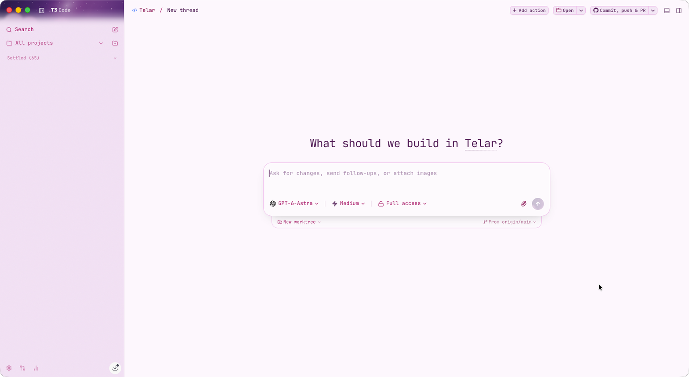

The whole app: a rail of threads grouped under a project picker, a centred composer at rest, and
three labelled header actions. Everything below is a closer look at those two surfaces.

---

## 1. What T3 does — Settings

### 1.1 Settings is a place, not a modal — and it takes over the rail

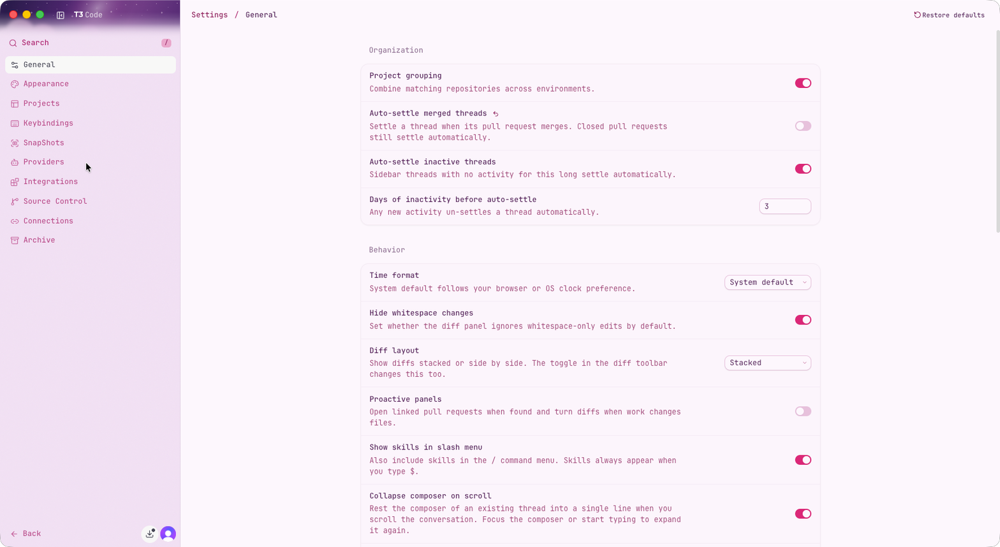

Settings replaces the app sidebar rather than standing beside it: nine destinations, each with a
Lucide icon, and **`← Back` pinned at the floor of the nav**. The decision is that the way out lives
where the way in was (the app rail keeps Settings in *its* footer), so the hand already knows where
to reach. The top of the nav is window decoration and carries no navigation at all.

The content pane has a breadcrumb (`Settings / General`) and a single page-scoped
**`↺ Restore defaults`** at top-right.

### 1.2 One row anatomy, enforced by one component

`apps/web/src/components/settings/settingsLayout.tsx` — `SettingsRow` is the whole vocabulary:

| Slot | Renders as | Rule |
|---|---|---|
| `title` | 14 px medium, foreground | Always present |
| `description` | 13 px, muted, `max-w-xl` | One sentence; a second only for the edge case |
| `status` | 12 px, more muted | Live state, *not* explanation |
| `resetAction` | `↺` micro-button **beside the title** | 20×20 slot always reserved, so rows never shift |
| `control` | Right column, `minmax(10rem,auto)` | `sm` sizing |
| `children` | Full-width body under the row | Lists, previews, specimens |

Three control-size tiers are written into the file's doc comment, which is why nothing on any page
looks a size off: `sm`/`icon-sm` in the control slot; `xs`/`icon-xs` for section header actions and
buttons inside cards and list items; `icon-micro` for reset arrows and info tooltips.

Sections are the *quieter* element — `text-foreground/70`, `font-normal` — so row titles lead and
section headers recede. `variant="grouped"` draws one rounded card with hairline-separated rows.

**Why the wording works.** Descriptions state the *scope* or the *trade-off*, never restate the
label:

- *"Everything outside code blocks and the terminal."* (Interface font) — disambiguates against
  three sibling font settings.
- *"30 fps saves CPU and storage; 60 fps is smoother."* — tells you how to choose.
- *"Refresh provider status, versions, and models in the background. **Set to 0 to disable.**"* — the
  sentinel value is documented in the row, not in a doc.
- *"Hold ⌘ or Ctrl while clicking a link to open it in your default browser either way."* — teaches
  the escape hatch.

### 1.3 Settings search, with a live table of contents

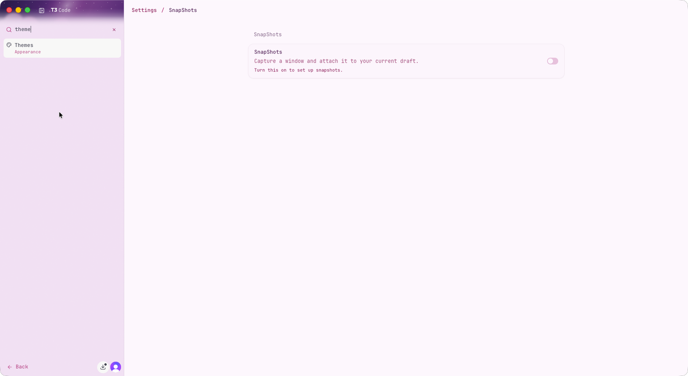

`/` focuses the search field from anywhere (a `Kbd` chip shows the key while idle; an `✕` replaces it
while searching). Results replace the nav; each is **icon + row title + the page it lives on**.
Choosing one navigates, scrolls the row to centre, focuses it and **pulses it** — `settings-search-target-pulse`
in `settingsLayout.tsx`. Empty state is one line: *"No settings found."* Full combobox a11y —
↑/↓/Enter, `aria-activedescendant`.

`SettingsSidebarNav.tsx` also carries a second nav level that this nightly does not render: per-page
section sub-items driven by `observeSettingsSectionVisibility`, bolding whichever sections are
actually in the viewport — a scroll-spy table of contents. Worth knowing it exists in source
(`SETTINGS_PAGE_SECTIONS`) even though I could not photograph it.

### 1.4 Confirmations are a section, not a scattering

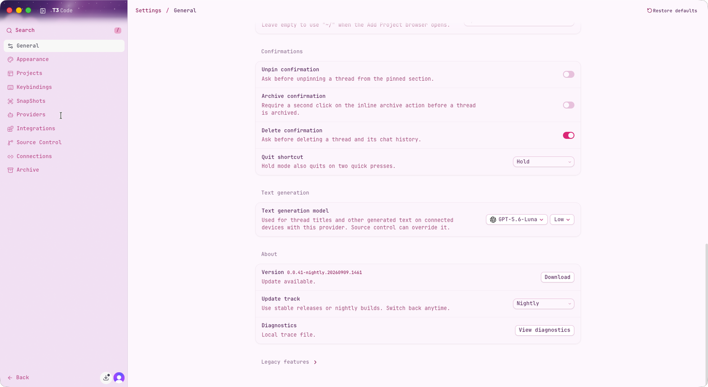

Every "ask before X" toggle lives in one **Confirmations** group: unpin, archive, delete. The
decision is that a person hunting "stop asking me this" has exactly one place to look, instead of
finding each confirmation next to the feature it guards.

Also here: `Quit shortcut` as a select (not a toggle) for a 2–3 value choice; `Version` as title +
inline mono value with the description doubling as status (*"Update available."*) and `Download` as
the control; and a collapsed **`Legacy features ›`** disclosure at the very bottom — deprecated
settings are folded away rather than deleted out from under people.

### 1.5 A row can hand off to another page

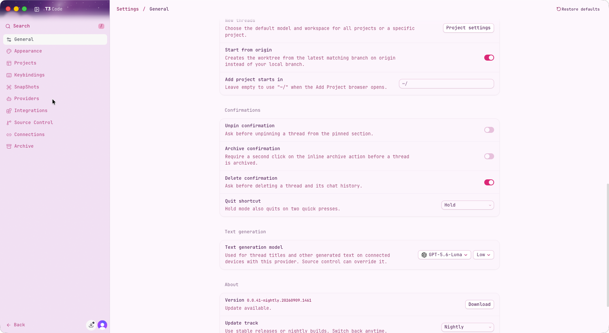

`New threads` has no control of its own; its control is a **`Project settings` button**. Same on
`Agent browser access` in Integrations. One consistent gesture for "this also has a per-project
override", instead of duplicating the row in two places.

### 1.6 Appearance: perceptual settings get visual controls

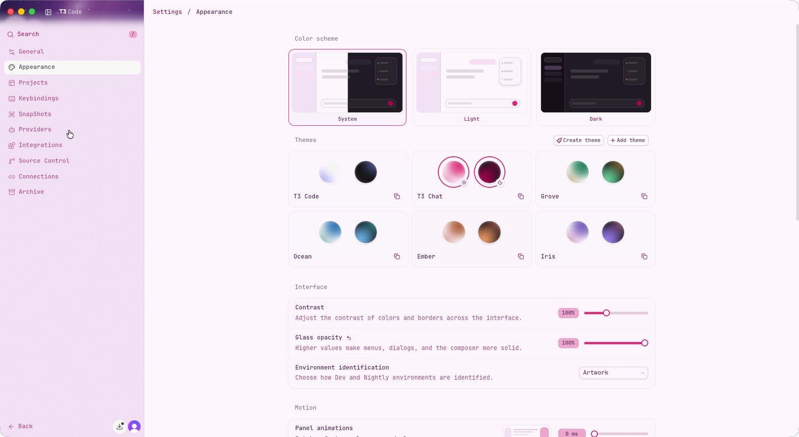

- **Colour scheme** is three miniature app wireframes (System / Light / Dark), not three words. The
  System thumbnail is split light/dark.
- **Themes** are cards with *two* gradient circles each — the light and dark variant — with sun/moon
  glyphs marking which is in use. Section header actions: `Create theme`, `Add theme`.
- **Contrast** and **Glass opacity** are sliders with a live numeric badge as part of the control
  cluster. `Glass opacity ↺` shows its reset arrow because it is off default.
- **Panel animations** carries an inline live preview beside its `0 ms` slider.

### 1.7 Typography: the setting shows you, in the context you'll use it

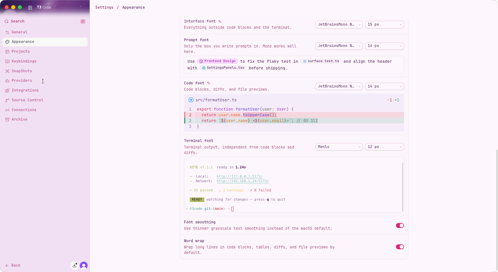

Four font rows (Interface / Prompt / Code / Terminal), each a family select + size select, each with
a **task-realistic specimen rendered in the row's `children`**:

- Prompt font → a mock prompt containing real agent/file chips.
- Code font → a real mini-diff with line numbers and `0O 1lI` planted in the added line, so
  ambiguous glyphs are visible at a glance.
- Terminal font → a Vite dev-server transcript with colour, a `READY` badge and a shell prompt.

This is the single most copyable idea on the page: a setting judged by eye is presented to the eye.

### 1.8 Projects: one page, a scope selector, and rows that explain their own inertness

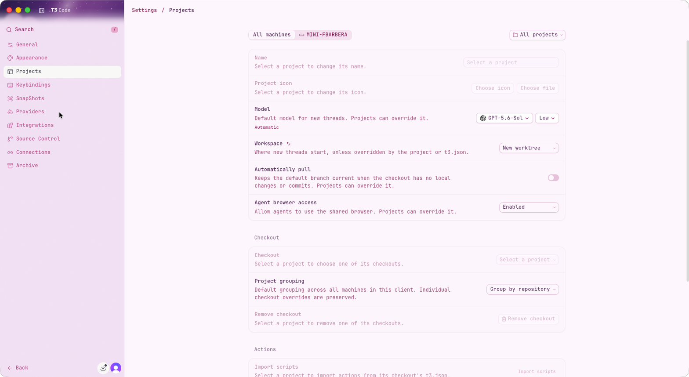

A machine segmented control (`All machines` | `MINI-FBARBERA`) and a project picker (`All projects ▾`)
sit above one body of rows. Narrow the scope and the same rows bind to a narrower target — there is
no separate "project settings page" duplicating the vocabulary.

Rows that need a narrower scope than the one selected **stay visible but go inert, with the
description replaced by the instruction**: *"Select a project to change its name."*, *"Select a
project to remove one of its checkouts."* You learn the setting exists and how to reach it, in the
row itself.

Override precedence is stated in the copy, consistently: *"Projects can override it."* /
*"Where new threads start, unless overridden by the project or t3.json."*

The same file has the multi-machine divergence state, which is the most directly relevant thing in
the survey for Telar (`ProjectDefaultActionsSettings.tsx:90`):

> **Different actions across machines** — *"Select a machine to edit its actions. Adding an action
> applies to all selected connected machines."*

### 1.9 Destructive actions: a named section, and copy that states the blast radius

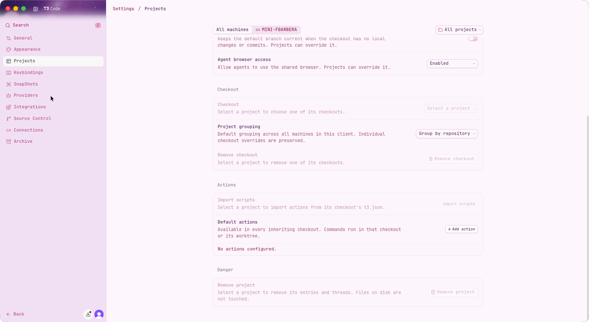

**Danger** is a section label at the bottom of the page. No red panel, no scary border — the
separation is structural. The safety comes from the wording:

> Remove project — *"…remove its entries and threads. **Files on disk are not touched.**"*

A destructive row's description says what it does **not** destroy. That is a cheaper and more
reliable safety device than colour.

Above it, **Actions** — the feature the user singled out. `Default actions` with `+ Add action` as
its control, *"Available in every inheriting checkout. Commands run in that checkout or its
worktree."*, and an empty state that is just another row in the same card: *"No actions configured."*

### 1.10 Keybindings: every binding is a row, and the when-clause is a control

Section header carries `49 bindings` as a plain count, plus search / add / import-export glyphs.
Each row is:

- **Title** = `Namespace: Command` (`Chat: New`, `Model Picker: Jump: 1`). Duplicate titles are fine —
  one command can hold several chords.
- **In place of a description**, `When` + a **context select** (`!terminalFocus`, `Always`,
  `modelPickerOpen`). The VS Code when-clause, surfaced as UI. `KeybindingsSettings.tsx` also has a
  structured condition builder (`Negate <identifier>`, `Negate group`) and a raw expression input
  with placeholder `Always`.
- **Control** = the chord as individual key-caps.
- **Conflicts** = a warning triangle before the chord whose tooltip *names the other commands*:
  `Conflicts with X.` / `Conflicts with A, B, C, and more.`

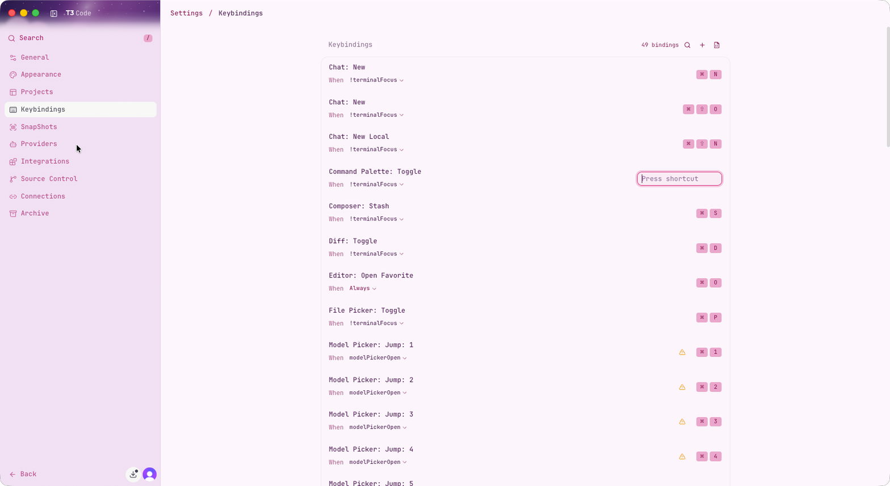

Clicking the chord swaps it for a recording input — primary border, placeholder **"Press shortcut"**,
`Unassigned` when empty. Focus starts recording, blur ends it.

### 1.11 Providers: master/detail inside the page, and disabled things stay visible

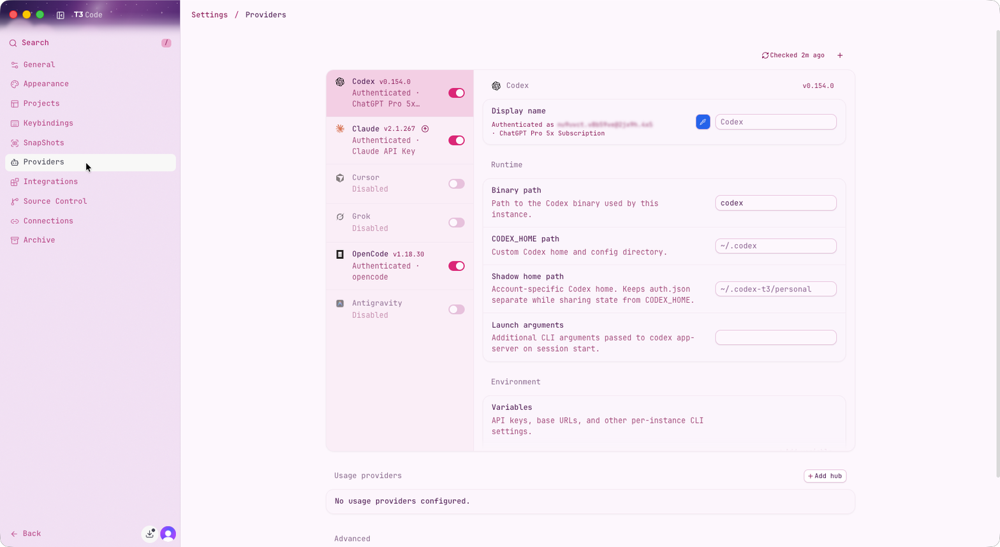

Left: every provider with logo, name, version, a two-line status (*"Authenticated · ChatGPT Pro 5x"* /
*"Disabled"*) and **the enable toggle on the list row itself** — you never open a provider to turn it
off. Disabled providers stay in the list, greyed; nothing hides behind an "add provider" flow.

Right: the selected provider's config as ordinary `SettingsSection`s. Secrets are redacted with an
edit affordance beside them (`RedactedSensitiveText.tsx`). Page header carries a freshness stamp,
**`⟳ Checked 2m ago`**.

Obscure fields get a real explanation: *"Account-specific Codex home. Keeps auth.json separate while
sharing state from CODEX_HOME."*

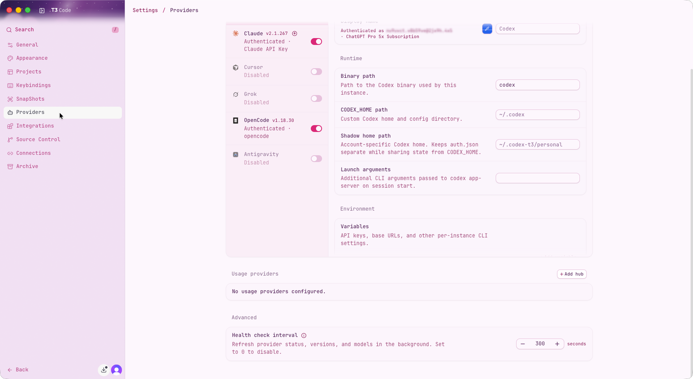

`Advanced` last, an `ⓘ` tooltip on the title, a stepper with the unit **"seconds" as a label outside
the field**.

### 1.12 Integrations: a list lives inside its row

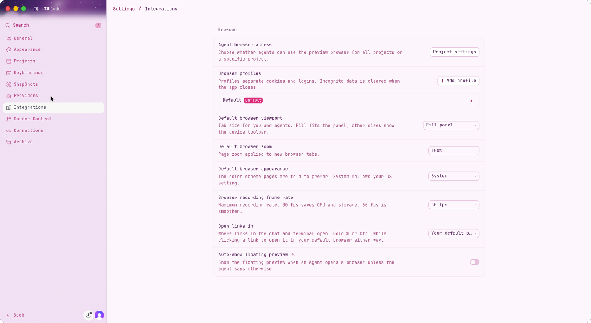

`Browser profiles` has `+ Add profile` as its control and renders its list in the row's `children` —
a `Default` item with a `Default` badge and a `⋮` overflow. Adding and listing are one row, not a row
plus a panel.

### 1.13 Source control: an unavailable integration's description *is* the fix

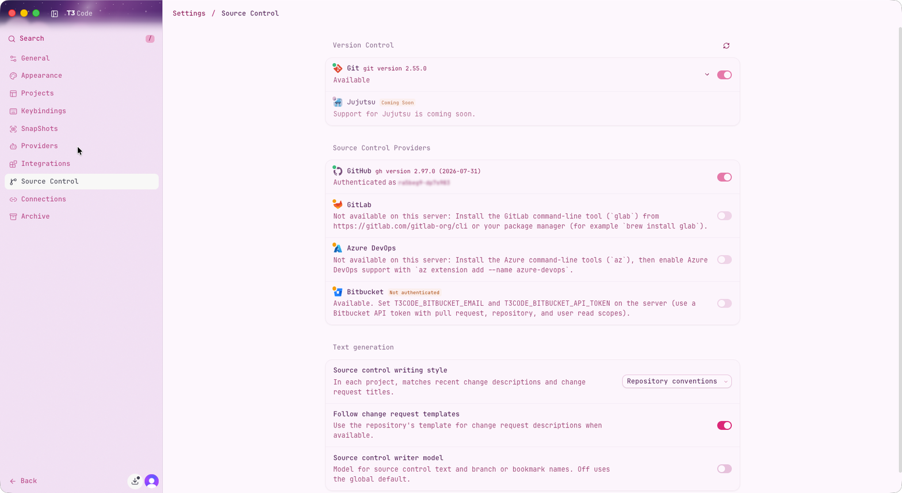

> GitLab — *"Not available on this server: Install the GitLab command-line tool (`glab`) from
> https://gitlab.com/gitlab-org/cli or your package manager (for example `brew install glab`)."*

The exact command, in the row. No "Learn more" link leaving the app. Status badges are inline next to
the name: `Coming Soon`, `Not authenticated`.

### 1.14 Connections: `·`-separated metadata, one filled button

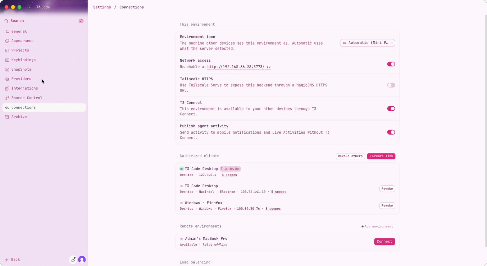

- `Network access` toggle whose **description carries the live value**: *"Reachable at
  http://192.168.86.28:3773/ **+2**"* — the `+2` expands the other addresses.
- Authorised clients: status dot, name, `This device` badge, then one compact fact line —
  `Desktop · MacIntel · Electron · 100.72.141.10 · 5 scopes`. No table.
- Exactly one filled button per section (`+ Create link`, `Connect`); everything else outline or
  ghost, so the primary action is unmistakable.

### 1.15 Empty states are rows; unused features are one toggle

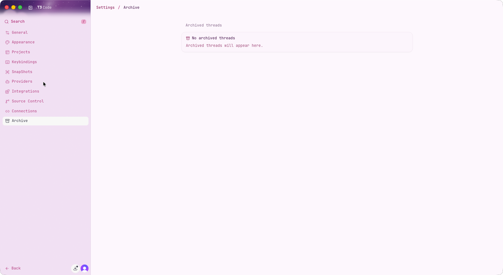
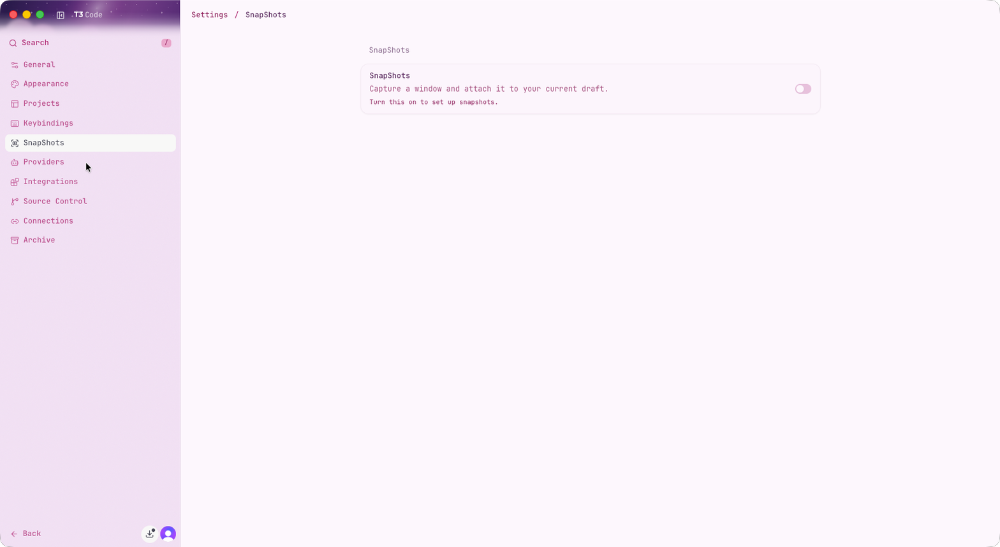

The empty state is an ordinary row inside the ordinary card — icon, title, one sentence. It occupies
the shape the populated state will. No illustration, no centred hero.

And a feature you have not enabled is **one row**: title, what it is, and `status` = *"Turn this on
to set up snapshots."* Zero configuration surface until you opt in.

---

## 2. What T3 does — Threads

### 2.1 The row is title, age, and nothing else

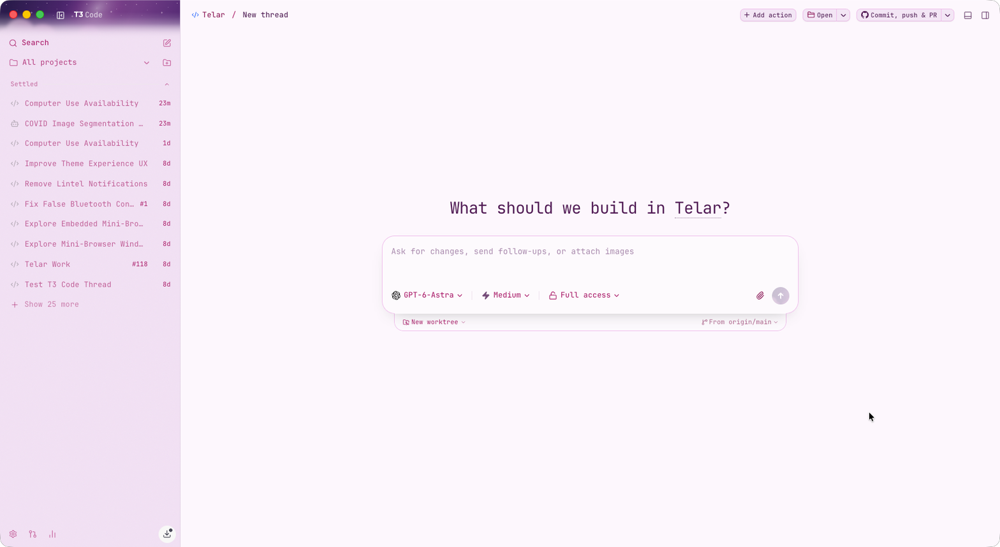

Agent glyph · title (truncated) · optional PR number · relative age. **No hover quick-actions** — I
checked; hovering yields only a background tint. The row is for reading the list; acting on a thread
is a right-click or an open. Progressive disclosure at the bottom: `+ Show 25 more`.

### 2.2 The project leads the header, and the crumb is a verb

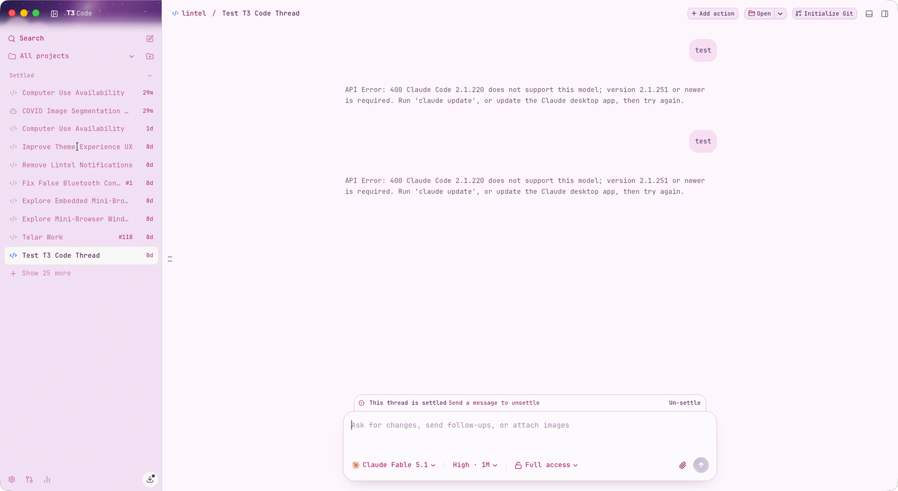

`ChatHeader.tsx:327` states it outright:

> *"The project always leads the header: knowing which project a thread lives in is priority zero,
> and the thread title alone doesn't answer it."*

The project crumb is a **button that starts a new thread in that project** (tooltip: *"New thread in
Telar"*). The ancestor crumb is not just navigation — it is "another one of these".

Right cluster, three controls: `+ Add action` (project scripts), `Open ▾`, and a git control whose
**label is the next git action** — `Commit, push & PR` on a repo, `Initialize Git` on a folder with
no git. The whole cluster is container-query responsive (`@3xl/header-actions`): labels collapse to
icons as the header narrows, rather than wrapping.

Above the composer, the settled banner states the state, the implicit way out and an explicit button:
*"⊙ This thread is settled · Send a message to unsettle"* + `Un-settle`.

### 2.3 The title is the menu, and one definition serves both surfaces

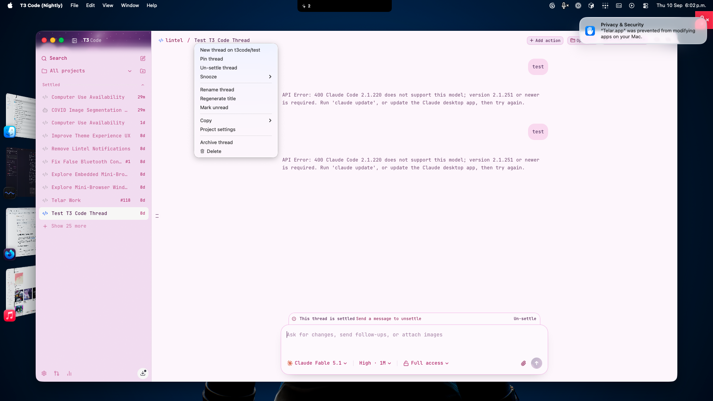

Click the title → menu. Double-click the title → inline rename. Right-click anywhere in the
breadcrumb → the same menu. A chevron fades in on hover to advertise it. No `⋮` button spending
permanent header space.

(The double-click/menu race is handled explicitly: the *native* menu waits 500 ms so a `dblclick` can
cancel it, while keyboard activation and an explicit chevron click open immediately.)

`threadActionMenu.logic.ts:48` — and this is the file to read before building Telar's:

> *"Single source for the per-thread action menu: the sidebar row's right-click menu and the chat
> header menu both render exactly this list, so labels, ordering, and capability gating cannot drift
> between the two surfaces."*

The menu, in five separator-delimited groups:

1. `New thread on <branch>` — names the branch, so you know where it will run
2. `Pin thread` / `Unpin thread` · `Settle` / `Un-settle` · `Snooze ›` (presets labelled
   `"<label> (<when>)"`) / `Wake thread`
3. `Rename thread` · `Regenerate title` · `Mark unread`
4. `Copy ›` (Path / Branch / Thread ID — Branch only when there is one) · `Project settings`
5. `Archive thread` · `Delete`

Five decisions worth naming:

- **Capability-gated.** Every group is conditional on `supports.{settlement,snooze,pinning,titleRegeneration}`,
  read per environment. A backend that cannot snooze simply has no Snooze item.
- **Toggles swap in place** — one row that knows the current state, never both.
- **Disabled with a reason beats failing later:** `archive` is disabled while a turn runs, because
  *"Archive rejects a thread with an active turn, so disable it here rather than let the action fail."*
- **The item is its own progress indicator:** `Regenerate title` becomes `Regenerating…`, disabled.
- **Only `delete` is `destructive: true`**, and it is the only item carrying an icon in the rendered
  menu — the eye lands on it last and on purpose.

### 2.4 "Open" is a split button that learns

`OpenInPicker.tsx`. The primary half opens the **preferred** editor in one click and wears that
editor's brand icon; the chevron half lists every editor. `setPreferredEditor` is called on *every*
open, so the button becomes "Open in Zed" after you pick Zed once — no setting to configure.

- Only editors actually detected on `PATH` are listed. None → `No installed editors found`.
- The `editor.openFavorite` shortcut renders as a `MenuShortcut` **on the preferred entry only**, so
  the menu teaches the shortcut for the thing you actually use.
- Remote-aware in three modes: local exec, deep-links to the *viewing* machine's editors, or disabled
  with `No SSH route to <machine>`. A one-time education item — *"Opens over SSH. Needs your key on
  <machine>"* — shows until dismissed.
- `file-manager` is in the same list, so "reveal in Finder" is not a separate control.

---

## 3. Anything else deliberate

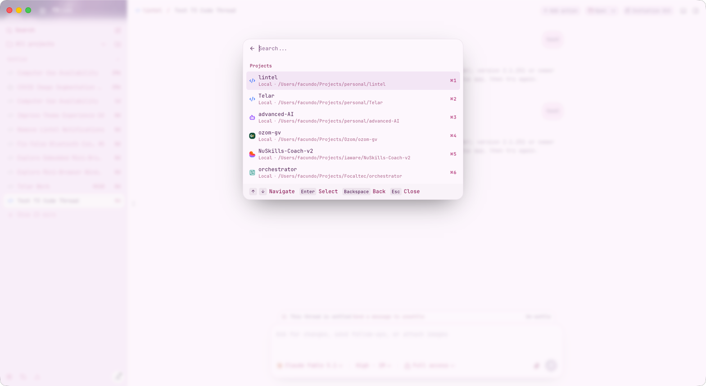

The project switcher is a command-palette modal: search field, grouped results, `Local · <full path>`
as the second line, `⌘1…⌘6` accelerators per row, and a **keyboard legend pinned to the footer** —
`↑ ↓ Navigate · Enter Select · Backspace Back · Esc Close`. That footer is the entire keyboard-
discoverability strategy, and it costs one row.

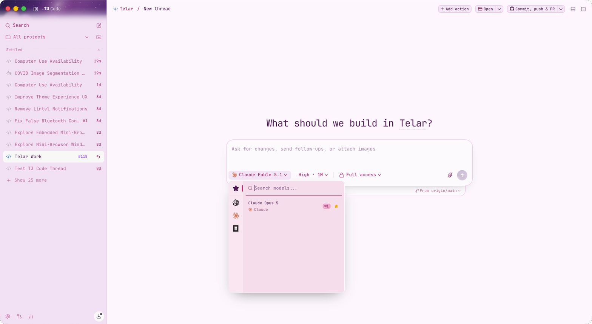

Model picker: a provider rail down the left (favourites star, then one glyph per provider) beside a
searchable list; rows carry `⌘N` jump accelerators and a star toggle for favourites.

---

## 4. Where Telar stands

### Settings

| Area | File | Gap |
|---|---|---|
| Row anatomy | `apps/web/components/settings/settings-shell.tsx` (`Row`) | Already has label / hint / control / `onRevert`. Missing a `status` slot and any "inert, and here's why" state; `onRevert`'s slot is not reserved, so rows shift when the arrow appears. |
| Group | same file (`SettingsGroup`) | Deliberately **not** a card (hairlines + space), with a good reason written down. Diverges from T3 — do not reverse blindly. |
| Prose | every `*-section.tsx` | `Row`'s own doc comment says a settings page that explains itself in a paragraph makes the reader hold it in their head. The paragraph then moved up to `SettingsGroup.description`: *"Another Telar's conversations, in this rail. On the other Mac, open Settings → Remote access, turn on pairing, and paste its pairing link here. That Mac then lists this one under its devices, where it can revoke the access."* Three sentences of instructions in a group header. Same in `browser-logins-section.tsx` and `plugins-page.tsx`. |
| Grammar adoption | `appearance-section.tsx` (29 K), `provider-instance-card.tsx` (27 K), `looks-section.tsx` (19 K), `provider-models-tab.tsx` (15 K), `packages-panel.tsx` (13 K), `theme-library.tsx` (11 K) | **Zero `Row`s and zero `SettingsGroup`s between them.** The shared grammar exists; the six largest surfaces bypass it. This is the actual "convoluted mess". |
| Nav | `settings-page.tsx` | Six panes in two groups (Cockpit / Runtime) with sound reasoning and route aliases. But General stacks six sections with no way to jump inside it, and there is **no search**. |
| Per-project | `project-settings-page.tsx` | A separate page with its own nav. Same shell (good), but the machine/project split is structural, so a row that exists at both scopes is written twice. |
| Save model | `settings-shell.tsx` | `dirty` + `Unsaved` badge + `Save changes`. T3 saves immediately with per-row reset. A real fork in the road — see Open questions. |
| Keybindings | `apps/desktop/command-keys.js`, `apps/web/lib/command-keys.ts` | A fixed table (⌘N, ⌘T, ⌘1–9, ⌘,) driven by the Electron menu. **No settings UI, no rebinding, no conflict reporting, no command palette.** |
| Confirmations | scattered | `window.confirm` twice inside `session-inbox-menu.tsx`; no central "stop asking me" surface. |
| Destructive | `remove-project-section.tsx` | Exists; not a consistently named Danger section across pages. |

### Threads

| Area | File | Gap |
|---|---|---|
| Row menu | `components/session/session-inbox-menu.tsx` | Good and well-argued: Rename · Pin / Unpin · Snooze-until presets with resolved times · Wake now · Delete (two confirms, second names the consequence). Missing: new-session-on-this-branch, Copy (path / branch / id), Regenerate title, Project settings. |
| Menu drift | same + `session-cockpit.tsx` | **The open session's header has no action menu at all.** The rail row's `⋯` is the only way to pin, snooze, settle or delete. T3's single-definition rule has no counterpart here. |
| Header | `session-cockpit.tsx:251–375` | Breadcrumb `Project / Title` (crumb → project canvas), rename via a hover pencil. Right cluster: `RunHeaderControl`, `OpenWorkspaceButton`, panel toggles. **No git action, no title menu, every button icon-only.** |
| Open | `components/session/open-workspace-button.tsx` | Strong in places T3 is not — it shows the path, has Reveal in Finder, and names the blocker for remote sessions. But: icon-only `ExternalLinkIcon` with no label, **no remembered preferred app** (every open costs two clicks), no shortcut, and one generic folder glyph for every opener. |
| Title regeneration | — | Telar's text-gen model writes session titles (`textgen-section.tsx`), and there is no way to ask for another one. |
| Right-click | `session-row.tsx` | The row menu is a `⋯` button only; no context menu on the row. |

---

## 5. Adopt

Ranked. Each is independently shippable.

| # | Change | Files | Scope | Size |
|---|---|---|---|---|
| 1 | **One session-action menu definition, rendered in both places.** Extract a `buildSessionActionMenuItems(state)` returning a typed item list with `separatorBefore` / `destructive` / `disabled` / `children`, gated on per-driver capability flags. Render it from the rail row **and** from a new title menu in the cockpit header (click = menu, double-click = rename, right-click anywhere in the breadcrumb = menu). | new `lib/session-action-menu.ts`; `components/session/session-inbox-menu.tsx`; `components/session-cockpit.tsx`; `components/session/session-row.tsx` | UI only — every verb already has an endpoint | **M** |
| 2 | **Make `Open` a split button that learns.** Primary half opens the last-used app in one click and wears its icon; chevron half keeps the current list. Persist the preference locally; keep Reveal in Finder, the path line, and the blocker copy. Add brand icons. | `components/session/open-workspace-button.tsx`; `apps/desktop/workspace-openers.js` (icon ids) | UI + a small shell change to report an icon id per opener | **S** |
| 3 | **Settings search.** Build a searchable index of every `Row` (title, hint, section, page), `/`-focused, results showing title + page, jumping to a `#row-id` anchor with scroll-into-view and a pulse. Requires giving `Row` an `id`. | `settings-shell.tsx` (`Row` id + anchor plumbing); new `settings-search.ts`; `settings-page.tsx`, `project-settings-page.tsx` | UI only | **M** |
| 4 | **Row anatomy v2.** Add `status` (live state, distinct from `hint`), reserve the revert slot so rows never shift, and add an `unavailable={{ reason }}` state that renders the control inert with a tooltip instead of a fake default. Then **port the six bypassing sections onto `Row`/`SettingsGroup`** — one section per PR. | `settings-shell.tsx`, then `appearance-section.tsx`, `provider-instance-card.tsx`, `looks-section.tsx`, `provider-models-tab.tsx`, `packages-panel.tsx`, `theme-library.tsx` | UI only | **L** (shell is S; each port is S) |
| 5 | **Copy discipline pass.** Move every `SettingsGroup.description` longer than one sentence down into the `hint` of the row it actually describes; where it is a procedure, make it the row's own instruction. Cap hints at one sentence plus one edge-case sentence. Document sentinel values and escape hatches in the row. | every `apps/web/components/settings/*-section.tsx` | UI only, copy | **M** |
| 6 | **A `Confirmations` group in General**, collecting the delete double-confirm and any future "ask before" into one place, each a toggle. | `settings-page.tsx`, new `confirmations-section.tsx`; `session-inbox-menu.tsx` reads the setting | Needs a settings-store key per confirmation | **S** |
| 7 | **Multi-host divergence state.** Where a setting exists on several paired Macs with different values, render *"Different <thing> across Macs — select a Mac to edit."* instead of silently showing the first host's value. | `other-macs-section.tsx`, `settings-shell.tsx` (a `<MixedValue>` row), any host-scoped section | Engine: needs per-host settings reads to be comparable | **M** |
| 8 | **Danger sections, and copy that states the blast radius.** One `Danger` group at the bottom of any page with a destructive row, and every destructive description saying what is *not* destroyed. | `remove-project-section.tsx`, `settings-shell.tsx` | UI only, copy | **S** |
| 9 | **Typography specimens.** Give Telar's font settings task-realistic live previews — a mini-diff with `0O 1lI`, a terminal transcript, a prompt with chips — in the row's children. | `appearance-section.tsx` (after #4) | UI only | **M** |
| 10 | **Keybindings page.** Surface the existing `command-keys.js` table as rows (`Namespace: Command`, chord as key-caps, click-to-record with "Press shortcut"), with conflicts named in a tooltip. Ship read-only first, rebinding second. | new `components/settings/keybindings-section.tsx`; `apps/desktop/command-keys.js`; `apps/web/lib/command-keys.ts` | Engine/shell: the Electron menu must rebuild from stored bindings | **L** |
| 11 | **`Regenerate title`** in the session menu, with a `Regenerating…` disabled state. | `lib/session-action-menu.ts` (after #1); engine text-gen endpoint | Engine: a re-title endpoint | **S** |
| 12 | **Keyboard legend footers** on Telar's own pickers and pluralised command surfaces. | picker components under `components/` | UI only | **S** |

---

## 6. Do not adopt

- **Archive as a separate lifecycle from Settle.** Telar removed it on purpose, and the reasoning in
  `session-inbox-menu.tsx:22` is better than T3's: archive was the irreversible one *and* the one
  that looked reversible. Keep settle + delete.
- **`Mark unread`.** Telar derives unread from what was actually shown (`markSessionRead`). A manual
  verb asks people to curate a second inbox by hand, which is exactly what deriving it avoids.
- **`SettingsGroup` as a raised card.** Telar dropped the card deliberately — a card inside a `Panel`
  is a card inside a card, and it makes a page of decisions read as an object to be handled. Take
  T3's *row* grammar, not its grouped-card chrome.
- **The scope-selector Projects page as a wholesale replacement.** T3 has one machine and a project
  list. Telar has paired Macs, remote iPhone/iPad clients, plugins that contribute their own
  sections, an inbox and warps. A single page with two scope selectors would collapse three
  axes into two. Take the *inert-row-explains-itself* pattern (#4) and the *divergence* pattern (#7);
  keep the separate project settings page.
- **T3's provider master/detail wholesale.** Telar's providers are accounts across hosts, not one
  local binary per provider; `provider-instance-card.tsx` already models more than T3's panel does.
  Take the list-row enable toggle and the "disabled stays visible" rule, not the layout.
- **Immediate-save everywhere.** T3 has no dirty state because nothing it edits is host-scoped and
  fallible. Telar writes through an engine that can be unreachable — the `Unsaved` badge is carrying
  real weight. See the open question.
- **Snooze via the thread menu only.** Telar's swipe actions and inline row presets are ahead here.

---

## 7. Open questions

1. **Save model.** Do we move to immediate-save with per-row revert (T3's model, and what makes its
   `↺` affordance meaningful), or keep `dirty` + `Save changes`? Adopt #4 differs in shape depending
   on the answer.
2. **Keybindings depth.** Read-only shortcut reference (small, useful, ships this week), or real
   rebinding with conflict detection (needs the Electron menu to rebuild from stored bindings)?
3. **Settings search scope.** Only Telar's own settings, or also project settings and
   plugin-contributed sections? The latter means plugins must declare searchable rows in their
   manifest.
4. **Where does the session action menu live in the header?** On the title (T3's answer, costs no
   space) or as an explicit `⋯` beside the panel toggles (more discoverable, one more glyph)?
5. **Multi-host settings.** When two paired Macs disagree, is the right answer "show the divergence
   and make them pick a Mac" (#7), or should Telar have a notion of settings that sync across paired
   Macs by default?

---

## Appendix — provenance

- App: T3 Code (Nightly) `0.0.41-nightly.20260909.1461`, pid 62413, window 16827, 1728×945.
- Source: `pingdotgg/t3code` @ `00d6109cbb1a13712d7347701969870aee83252d`, read from
  `/tmp/t3code-ref/.git/objects` via a scratch bare repo. Nothing there was modified.
- T3 Code was left on `Telar / New thread` with `Settled (65)` collapsed — the page it was on. One
  difference I could not put back: the unsent draft's model reads `Claude Fable 5.1 · High · 1M`
  where it read `GPT-6-Astra · Medium`, carried over by navigating through another project's thread.
  No T3 setting was changed; the one keybinding row opened for the screenshot was closed unmodified
  (⌘K verified restored).
