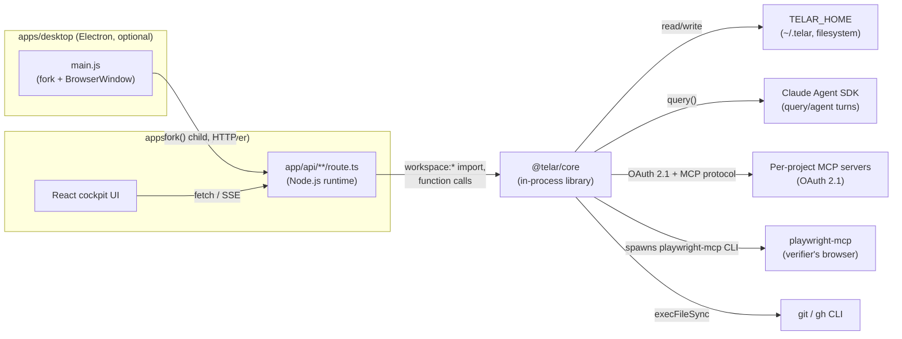

# Integration Architecture

*Generated by the BMad document-project workflow — deep scan, 2026-07-17.*
*Hand-updated 2026-08-06 (issue #10): the "no cloud backend" / "no CI/CD" claims below were
wrong — `workers/updates-proxy` (a Cloudflare Worker in front of a private R2 bucket) now
exists for desktop auto-update, and `.github/workflows/` now has three workflows. This file
is hand-maintained going forward; see [index.md](./index.md#generated-vs-hand-maintained).*

## Overview

Telar has three application parts and, as of this update, one small cloud
component. `packages/core` (`@telar/core`) is a pure TypeScript engine — no
server of its own — imported directly (`workspace:*`) into `apps/web`'s Next.js
App Router route handlers, which run it in-process on the Node.js runtime.
`apps/web` is the only HTTP server serving the cockpit itself: it serves the
cockpit UI and exposes ~56 `app/api/**/route.ts` files that call straight into
`@telar/core` functions. `apps/desktop` adds an Electron shell around that
server plus its own native surfaces (a `contextBridge`-exposed in-window browser,
auto-update) — it forks the built `apps/web` standalone server as a child
process and points a `BrowserWindow` at `http://127.0.0.1:<port>`. There is no
separate application database and no remote Telar service that any of the three
parts talk to for their own operation — all loom/project state is still files
under `TELAR_HOME` (default `~/.telar`). The one cloud component that does
exist, `workers/updates-proxy`, is infrastructure for shipping the desktop app
to itself (auto-update), not part of the cockpit's own request path — see
[Update Channel & R2 Topology](#update-channel--r2-topology) below. Beyond that,
the only external network calls are to the Claude Agent SDK (and optionally the
Codex app-server bridge), to per-project MCP servers over OAuth, and to `gh`/`git`
for GitHub operations.

The diagram above is the cockpit's own runtime request path and deliberately excludes the
desktop auto-update channel, which is not part of any user-facing request `apps/web` serves —
see [Update Channel & R2 Topology](#update-channel--r2-topology) for that separate, smaller
topology.

## Integration Points

| From | To | Type | Details |
|---|---|---|---|
| `apps/web` route handlers | `packages/core` (`@telar/core`) | In-process function calls via `workspace:*` import | `@telar/core` has no server/RPC boundary — it is a library. `apps/web/next.config.ts` sets `transpilePackages: ["@telar/core"]`, so core's TypeScript source is compiled alongside the app, not pre-built. Every one of the ~56 files under `apps/web/app/api/**/route.ts` imports named exports from `@telar/core` (e.g. `startLoom`, `getLoom`, `acceptLoom`, `listAccounts`) and calls them directly inside `GET`/`POST` handlers. No route sets `export const runtime = "edge"` — core depends on `node:fs`/`node:child_process`, so it requires the default Node.js runtime. Six server-side `lib/` modules also value-import `@telar/core`: `lib/server/doctor.ts`, `lib/server/git-tab.ts`, `lib/loom-mcp.ts`, `lib/ultra-mcp.ts`, `lib/titles.ts`, and `lib/mcp-oauth-pending.ts` (`lib/permissions.ts` and `lib/session-log.ts` import nothing from core — they resolve `TELAR_HOME` independently). `apps/web/instrumentation.ts` dynamically imports `@telar/core` in `register()`, guarded by `process.env.NEXT_RUNTIME !== "nodejs"`, specifically to keep it out of edge/client bundles. Beyond the `app/api/**/route.ts` handlers, `@telar/core` runs in-process in only two server components — `app/looms/plan/[project]/page.tsx` and `app/projects/[name]/sessions/[id]/page.tsx` (both call `getProject`/`listAccounts` directly) — a deep scan of `apps/web` counted 8 static runtime (value) import sites of `@telar/core` outside `app/api/**` and tests — the two server components above plus the six `lib/` modules listed earlier — plus `instrumentation.ts`'s guarded dynamic import, against roughly 40 type-only import sites across `"use client"` components/pages. This split is enforced by a repo convention, self-documented in ~10 files (e.g. `components/common/loom-notifications.tsx`, `components/looms/blocked-escalation.tsx`, `components/looms/utils.ts`, `components/projects/git-tab.tsx`, `components/session/session-view.tsx`) as the **"CLIENT-BUNDLE RULE"**: any `"use client"` file needing a `@telar/core` shape must `import type` only, never a value import, keeping core's Node-only internals (`fs`, `child_process`, the agent SDK) out of the browser bundle. |
| `apps/desktop` (`main.js`) | `apps/web` (standalone server) | Node `fork()` of a child process, plain HTTP polling for readiness | `startServer(port)` in [../apps/desktop/main.js](../apps/desktop/main.js) resolves `server.js` from the Next standalone build (`<resourcesPath>/standalone/apps/web/server.js` packaged, `apps/web/.next-desktop/standalone/apps/web/server.js` in a dev checkout) and `fork()`s it with `PORT`, `HOSTNAME=127.0.0.1`, `NODE_ENV=production` in its env, `execArgv: ["--require", server-preload.js]`, and an `"ipc"` stdio channel. Port is stabilized across launches via `<userData>/server-port.json` (falls back to a fresh free port if the persisted one is taken) so the renderer's `localStorage`-scoped UI state survives restarts. `waitForServer()` polls `GET http://127.0.0.1:<port>/` every 250ms up to a 30s timeout, accepting any `2xx`–`4xx` as "up". `server-preload.js` ([../apps/desktop/server-preload.js](../apps/desktop/server-preload.js)) is `--require`'d into the forked server (not the renderer) and registers `process.on("disconnect", () => process.exit(0))`, so if the Electron main process dies for any reason the child self-exits instead of orphaning its listen socket against `~/.telar`. |
| `scripts/telar` (repo-root launcher, not part of any app) | a *separate* checkout at `~/Projects/personal/telar-stable/apps/web` | Detached `spawn()` of `bun run start`, plus `open <url>` | [../scripts/telar](../scripts/telar) is a standalone Bun CLI (not built into either app) that manages a long-lived, detached copy of the *stable* cockpit at `~/Projects/personal/telar-stable` (configurable via `~/.telar/launcher/config.json`). `start()` ensures `bun install` and a fresh `bun run build` have run (tracked via `built-commit`), then `spawn("bun", ["run", "start"], { cwd: .../apps/web, env: { PORT: cfg.port } })` detached, writes a PID file under `~/.telar/launcher/`, and calls `open http://localhost:<port>`. This is a dev-convenience launcher for the *default-branch cockpit*, unrelated to the desktop app's build/packaging pipeline. |
| `scripts/build-desktop.sh` (repo-root) | `apps/desktop/build-web.sh`, `electron-builder`, `apps/desktop/install-app.sh` | Orchestrates a reproducible build from a pristine `git worktree` snapshot | [../scripts/build-desktop.sh](../scripts/build-desktop.sh) fetches `origin`, verifies the target ref is reachable from an `origin/*` branch, snapshots it into a fresh `git worktree add --detach` (so uncommitted local changes never leak into a shipped build), `bun install --frozen-lockfile`, runs `apps/desktop/build-web.sh` (which runs `next build` with `NEXT_OUTPUT=standalone NEXT_DIST_DIR=.next-desktop` and hand-copies `@playwright/mcp`'s and `@anthropic-ai/claude-agent-sdk`'s native binaries into the standalone tree, since Next's output tracing drops both), stamps `build-info.json`, packages via `bunx electron-builder --dir`, and smoke-tests the packaged `.app` (`Contents/MacOS/Telar --smoke`) before atomically swapping it into the output directory. |
| `packages/core` (`engine.ts`) | Claude Agent SDK (`@anthropic-ai/claude-agent-sdk`) | In-process SDK call: `query()` | `engine.ts`'s `agent()` is documented as "one `query()` forced through a typed result tool" — every LLM turn is schema-forced via a zod-typed `emit_result` tool built with `createSdkMcpServer`/`tool()`. Capability walls are enforced via `restrictTools` (hard-restricts the SDK's available built-in tools, required because `permissionMode: "bypassPermissions"` doesn't gate availability by itself) plus explicit `disallowedTools`. `apps/web/app/api/chat/route.ts` also calls the SDK directly for interactive chat turns (streaming ~17 named SSE event types), separately from core's `agent()` calls used inside loom execution. |
| `packages/core` (`mcp.ts`, `mcp-oauth.ts`) | Per-project MCP servers | MCP protocol over HTTP/SSE, gated by a from-scratch OAuth 2.1 client | `mcp-oauth.ts` ([../packages/core/src/mcp-oauth.ts](../packages/core/src/mcp-oauth.ts)) implements RFC 8707-aware discovery, a client-identity ladder (CIMD → DCR → manual), PKCE, and token/refresh handling; every network call takes an injectable `fetchImpl` (defaults to `globalThis.fetch`). Records persist as `McpOAuthRecord`s under `TELAR_HOME`. The default OAuth redirect origin is hardcoded to `http://localhost:3131` (`DEFAULT_REDIRECT_PATH = "/api/mcp/oauth/callback"`). `resolveProjectMcpServers`/`refreshProjectMcpAuth` (`mcp.ts`) merge a project's configured MCP servers into an `agent()` call's `extraMcpServers`, surfaced to the model as `mcp__<name>__*` tools. |
| `packages/core` (`verifier.ts`, `critic.ts`) | `playwright-mcp` (packaged into `apps/desktop`) | Spawns the `@playwright/mcp` CLI as an MCP server, merged into a **read-only, capability-walled** verifier `agent()` call | `resolvePlaywrightMcpBin()` ([../packages/core/src/verifier.ts](../packages/core/src/verifier.ts)) resolution order: explicit option → `TELAR_PLAYWRIGHT_MCP_BIN` env var → walk-up search from a start dir (`apps/web/node_modules/@playwright/mcp/cli.js`, `node_modules/@playwright/mcp/cli.js`, `node_modules/.bin/playwright-mcp`, bun's hoisted `.bun` store) → bare `"playwright-mcp"` on `PATH` as a last resort. `apps/desktop/main.js` sets `TELAR_PLAYWRIGHT_MCP_BIN` to the bundled `playwright-mcp/node_modules/@playwright/mcp/cli.js` in packaged builds (unless the user already set it) because a Finder-launched app has no usable `PATH`. `critic.ts`'s `runPanel` passes this resolved bin into the verifier's `extraMcpServers`. The verifier `agent()` call sets `restrictTools: true` so its read-only guarantee ("the verifier cannot edit code") is enforced by SDK-level tool unavailability, not just a denylist. |
| `apps/web` (`app/api/doctor/route.ts`, `lib/server/doctor.ts`) | Local machine binaries (`bun`, `git`, `gh`, `claude`, `codex`) and Playwright's Chromium cache | Read-only `execFile`/`fs.existsSync` probes | `runDoctor()` ([../apps/web/lib/server/doctor.ts](../apps/web/lib/server/doctor.ts)) never runs a real login/OAuth flow, never reads a credential file's contents, and never prints a token — it checks binary presence/version, `gh auth status` (account name only), each registered account's on-disk login liveness, Chromium's install state for the verifier, and which `TELAR_HOME` is active. |
| `apps/desktop` (`main.js`, `electron-updater`) | `workers/updates-proxy` (Cloudflare Worker) | HTTPS GET/HEAD, gated by a static shared-secret header | Auto-update feed checks and downloads — see [Update Channel & R2 Topology](#update-channel--r2-topology) immediately below for the full path from CI publish to installed update. |

## Update Channel & R2 Topology

Added since the 2026-07-17 scan; the previous version of this document said no cloud backend
existed at all, which this component contradicts. It exists solely to ship **the desktop app
to itself** — it is not in the cockpit's own request path and `apps/web` never talks to it.

**Components:**

- **`workers/updates-proxy`** ([../workers/updates-proxy/src/index.js](../workers/updates-proxy/src/index.js)) — a Cloudflare Worker (config: [../workers/updates-proxy/wrangler.toml](../workers/updates-proxy/wrangler.toml)). Its entire job is: reject anything but `GET`/`HEAD`; require an `X-Telar-Update-Key` header matching its own `UPDATE_KEY` binding (403 otherwise); resolve the request path to an object key in its bound R2 bucket (`TELAR_UPDATES`); serve it, honoring HTTP `Range` requests (translating R2's `{offset,length}`/`{suffix}` range shape into a `Content-Range` response) because `electron-updater`'s differential downloader requests only the byte ranges a `.blockmap` identifies changed — answering whole-file 200s instead would make every update re-download the entire app. It is **read-only** by construction: nothing in the Worker ever writes to the bucket.
- **The R2 bucket (`telar-updates`, bound as `TELAR_UPDATES`)** — written directly by CI via the `aws` S3-compatible CLI (`R2_ACCOUNT_ID`/`R2_ACCESS_KEY_ID`/`R2_SECRET_ACCESS_KEY`/`R2_BUCKET` secrets in `release-desktop.yml`/`nightly-desktop.yml`), never by the Worker and never by an end-user's app. This asymmetry (CI writes with real R2 credentials; the Worker + every installed app only ever reads, gated by one shared key) is the entire trust model — there is no write path reachable from a packaged app.
- **electron-updater (in `apps/desktop/main.js`)** — the only reader. Its `publish.url` (electron-builder config) is a placeholder in the committed `package.json`, overwritten at build time via `-c.publish.url=$UPDATE_PROXY_URL` (`scripts/build-desktop.sh --publish-r2`); the shared key travels as `-c.extraMetadata.updateProxyKey=$UPDATE_PROXY_KEY`, baked into the packaged `package.json` and read back out at runtime to set `autoUpdater.requestHeaders`. See [Architecture — Desktop § Auto-Update](./architecture-desktop.md#auto-update) for the full client-side behavior (channels, cadence, install-on-quit).

**Channel topology:** one bucket, one Worker, two channels distinguished only by the feed
filename electron-builder publishes and electron-updater fetches — `beta-mac.yml` (from
`release-desktop.yml`, signed *and* notarized, also cuts a GitHub Release for by-hand download)
and `nightly-mac.yml` (from `nightly-desktop.yml`, signed but not notarized, R2-only, no GitHub
Release). A packaged app's `autoUpdater.channel` (a user preference, see the desktop architecture
doc) picks which `<channel>-mac.yml` it polls against — both files live in the same bucket, so
switching channels needs no reinstall.

**Deploying the Worker itself:** not verified for this update — no GitHub Actions step invoking
`wrangler deploy` (or equivalent) was found in `.github/workflows/`, so the Worker's own
deployment currently appears to be a manual `wrangler` step outside CI; this is stated as an
open question, not a confirmed fact, since the Worker could also be deployed via the Cloudflare
dashboard's own git integration, which would not show up as a workflow file.

## Data Flow

Traced for the canonical path — create a loom → orchestrate/build → verify →
human accept — across layers:

1. **Create.** The cockpit UI `POST`s to `apps/web/app/api/looms/route.ts`
   ([../apps/web/app/api/looms/route.ts](../apps/web/app/api/looms/route.ts)),
   which validates the body (`kind`, `prompt`, optional `acceptanceCriteria`,
   `maxAttempts`, `target`) and calls `startLoom(input, { accounts, policy })`
   from `@telar/core`'s `dispatcher.ts` **synchronously in the same request**.
   `startLoom` creates and persists the `Loom` record, then — for the common
   "no scoping needed" fast path — kicks off `runWeaveWiring(...)` as a
   **fire-and-forget promise** (`.catch(onFailure).finally(...)`, never
   `await`ed by the route) before returning the queued loom to the client.
   The HTTP response therefore returns immediately; execution continues in the
   background inside the same Next.js server process.
2. **Orchestrate/build.** `dispatchExecution` in
   [../packages/core/src/dispatcher.ts](../packages/core/src/dispatcher.ts)
   routes every loom — single or multi-thread epic — through `runWeave`
   ("UNIVERSAL ROUTING": a non-woven loom gets a deterministic single-subgoal
   charter, weave-of-one). The weaver's tick loop (`tick.ts`) is pure control
   flow over injected state; each subgoal's actual work happens in
   `executor.ts`'s `executeLoom`, which isolates a thread's edits into a
   fresh `git worktree` under `<TELAR_HOME>/worktrees/` ([../packages/core/src/vcs.ts](../packages/core/src/vcs.ts))
   and drives one or more `agent()` calls (Claude Agent SDK `query()`) against
   it, gated by `runGates`/`runBuildFanout`.
3. **Verify.** After a build attempt, `executor.ts` runs the verifier/critic
   panel (`critic.ts`, `panel.ts`) — a `restrictTools: true` `agent()` call
   with the `playwright-mcp` server merged in for browser-driven checks — which
   judges the attempt read-only against acceptance criteria / the verification
   contract and never edits code. A failing-but-repairable verdict feeds the
   bounded auto-repair loop (`repair-guard.ts`, `decideRepairContinuation`);
   an unrepairable or exhausted verdict lands the loom in `needs-review` or
   `blocked`.
4. **Observe.** Throughout steps 2–3, `appendEvent`/`saveLoom` write to
   per-loom files under `<TELAR_HOME>/looms/<id>/` (state JSON + an append-only
   event log). `apps/web/app/api/looms/[id]/events/route.ts`
   ([../apps/web/app/api/looms/[id]/events/route.ts](../apps/web/app/api/looms/[id]/events/route.ts))
   serves this as SSE: on connect it sends the full `Loom` snapshot plus every
   event from line 0, then polls the event log every 400ms (`POLL_MS`),
   streaming new events (`ev`), state changes (`run`), and a terminal `end`
   once the loom reaches a terminal state (`done`, `needs-review`, `halted`,
   `failed`, `skipped`) and the log is drained. The cockpit UI holds this SSE
   connection open to render live loom progress ("god-view"). Outside that
   detail view there is no push channel between server-held state and client
   views: list/index pages (dashboard, looms index, project hub, sidebar)
   reconcile via plain `fetch()` polling (3–10s, gated on "anything in
   flight") plus a single global `window.dispatchEvent(new
   Event("telar:refresh"))` convention — every mutating action fires it, and
   every list/page listens via `window.addEventListener("telar:refresh",
   load)` — this is the app's de facto cache-invalidation bus (no SWR/React
   Query, no server actions).
5. **Accept.** A loom reaching `ready` (or another non-`done` state, as an
   audited override) is closed only by a human action:
   `apps/web/app/api/looms/[id]/accept/route.ts`
   ([../apps/web/app/api/looms/[id]/accept/route.ts](../apps/web/app/api/looms/[id]/accept/route.ts))
   calls `acceptLoom(id, "you", { override, missing })` — the acceptor
   identity `"you"` is server-fixed, never client-supplied. A clean accept of
   `ready` needs no body; accepting any other non-`done` state requires
   `{override: true, missing}` naming what's unmet, or `acceptLoom` throws
   (surfaced as a 400). There is no agent-callable accept anywhere in the
   codebase (see Failure Modes & Boundaries).

**State persistence.** Everything server-side is filesystem-backed under
`TELAR_HOME` (`process.env.TELAR_HOME ?? path.join(os.homedir(), ".telar")`,
resolved independently in `packages/core/src/manifest.ts`, `looms.ts`, and
mirrored in `apps/web/lib/permissions.ts`/`session-log.ts`): the project
registry, per-loom state/events/spec-bundles, accounts/secrets/MCP-OAuth
records, `~/.telar/launcher/` (the `scripts/telar` launcher's own PID/log/config,
a separate namespace), and `<TELAR_HOME>/worktrees/` (git worktrees minted per
thread attempt, never inside the user's actual repo). Two additional
higher-precedence per-project tiers exist for environment-lane config: a
human-accepted `<project-root>/.telar/servers.yaml` (gitignored, untracked, takes
precedence) over a committable `<project-root>/servers.yaml` ([../packages/core/src/servers.ts](../packages/core/src/servers.ts)).
The `TELAR_HOME` env var is how test suites, `apps/web`'s `dev` script
(defaults to `~/.telar-dev`), and desktop's `--smoke` mode (a throwaway
`mkdtempSync` dir) all avoid touching a real `~/.telar`.

## External Integrations

| Service | Used by | Purpose | Auth | Notes |
|---|---|---|---|---|
| Claude Agent SDK (`@anthropic-ai/claude-agent-sdk`) | `packages/core/src/engine.ts` (`agent()`), `apps/web/app/api/chat/route.ts` | All LLM-driven work: weaver/build/verify agent turns, interactive chat | Whatever the SDK/CLI's own login resolves (per-account, via `packages/core/src/accounts.ts`/`login.ts`) | Native binary is a runtime `createRequire(...).resolve(...)` dependency the desktop build must hand-copy into the standalone bundle (Next's static tracing drops it); `--smoke` in `apps/desktop/main.js` executes `claude --version` to prove the bundled binary works. |
| Codex app-server | `apps/web/lib/codex-app-server.ts`, `app/api/chat/route.ts` | Alternate agent backend bridged into the same chat SSE contract | External `codex` CLI binary on PATH | Probed (not required) by `apps/web/lib/server/doctor.ts`'s binary checks (`codex`, remedy `npm i -g @openai/codex`). |
| Per-project MCP servers | `packages/core/src/mcp.ts`, `mcp-oauth.ts` | Extra tools surfaced to agent runs (`mcp__<name>__*`) | Telar-owned OAuth 2.1 client (`mcp-oauth.ts`): discovery, CIMD/DCR/manual client-identity ladder, PKCE, token/refresh; redirect origin derives from the initiating request (fallback `http://localhost:3131`), path `/api/mcp/oauth/callback` | Records persisted under `TELAR_HOME`; every token/discovery call goes through an injectable `fetchImpl`, never a bare global `fetch`, for testability. |
| `@playwright/mcp` (Playwright MCP CLI) | `packages/core/src/verifier.ts`, `critic.ts` | Gives the read-only verifier a real browser to drive (snapshot-based judgment, since `verify_*` tools may not exist in the pinned `@playwright/mcp` version) | None (local subprocess, no external network beyond whatever the target app under test serves) | A `devDependency` of `apps/web` in the repo (so Next's output tracing drops it from `standalone`); `apps/desktop`'s build materializes it into `Resources/playwright-mcp/node_modules` via `extraResources`, and `main.js` points `TELAR_PLAYWRIGHT_MCP_BIN` at it in packaged builds. |
| GitHub (`gh` CLI, `git`) | `packages/core/src/vcs.ts`, `apps/web`'s git/GitHub API routes, `apps/web/lib/server/doctor.ts` | Worktree management, branch/PR operations, auth status | `gh auth status` (delegates to the user's existing `gh` login; Telar never handles a GitHub token directly — `doctor.ts` explicitly never reads credential file contents or prints a token) | `git`/`gh` are invoked via `execFile`/`execFileSync` against the resolved binary name on `PATH`, never through a shell, so no argument is shell-interpolated. |
| `open` (macOS) | `scripts/telar` | Opens the cockpit URL in the user's default browser | None | Local-only convenience; `execSync("open " + url)`. |
| `workers/updates-proxy` (Cloudflare Worker, fronting a private R2 bucket) | `apps/desktop/main.js` (`electron-updater`) | Desktop auto-update: feed checks + differential/full artifact downloads | Static shared-secret header (`X-Telar-Update-Key`), baked into the packaged app at build time; no user identity involved | Read-only from the app's perspective — the bucket is written only by CI, never by the Worker or any installed app. See [Update Channel & R2 Topology](#update-channel--r2-topology). |

**Corrected as of this update:** a cloud component (the Worker + R2 bucket above) and a CI/CD
pipeline (three GitHub Actions workflows — see [Deployment Guide § CI/CD](./deployment-guide.md#cicd))
both exist and did not at the 2026-07-17 scan. Neither is a "backend" for the cockpit's own
request path, though — `apps/web` still talks to no cloud service to serve a request, has no
telemetry endpoint and no analytics SaaS, and has no authentication/authorization layer of its
own (no `middleware.ts`, no session or API-key checks on any route) — the cockpit itself remains
a local single-user tool that trusts its caller by design.

## Failure Modes & Boundaries

**Trust boundaries.**

- **Verifier is structurally read-only.** The verifier/critic `agent()` call
  sets `restrictTools: true` (`engine.ts`), which hard-restricts the SDK's
  *available* built-in tools rather than merely denylisting them — necessary
  because under `permissionMode: "bypassPermissions"` an `allowedTools` filter
  alone does not gate availability. This is enforced by construction for the
  verifier specifically; the builder path opts out (keeps the full preset)
  because it needs write access.
- **Accept is human-only, and cannot be reached by an agent.** No route or
  MCP tool lets a model call `acceptLoom`. `apps/web/lib/loom-mcp.ts` (the
  in-process MCP server exposed to planning/steering chat sessions) documents
  this explicitly: "No tool here sets a loom's state/verdict/acceptance." Its
  one mutation, `start_loom`, is still gated by a `PreToolUse` hook in
  `apps/web/app/api/chat/route.ts` that force-routes `mcp__loom__start_loom`
  and `answer_blocked` back through an interactive permission card **in every
  `permissionMode`** (including `bypassPermissions`/`acceptEdits`) — the
  code's own comments call this the "moat guard." The acceptor identity
  passed to `acceptLoom` (`"you"`) is hardcoded server-side in
  `app/api/looms/[id]/accept/route.ts`, never read from the request body, so a
  model cannot forge who approved a commit.
- **No auth layer at the HTTP boundary.** `apps/web` has no middleware,
  session, or API-key check on any of its ~56 route files — the trust
  boundary is "whoever can reach this local HTTP server," which in the
  intended desktop deployment is `127.0.0.1` only, bound to the Electron
  shell's own child process.
- **Renderer privileges are narrow and explicit, not absent.** Corrected as of
  this update — the previous version of this document said the renderer had
  *no* preload and *no* `ipcMain`/`ipcRenderer` usage anywhere; both now exist.
  `apps/desktop`'s `BrowserWindow` is created with `contextIsolation: true`,
  `nodeIntegration: false`, `sandbox: true`, **and** a real preload
  (`apps/desktop/preload.js`) that exposes a deliberately small
  `window.telarDesktop` API via `contextBridge` — in-window browser control,
  auto-update status/controls, and command-key menu events, backed by
  `ipcMain.handle` channels in `main.js`. The renderer still cannot `require()`
  or reach `ipcRenderer` directly, and every bridged method is a narrow,
  purpose-built function, not a generic passthrough — see
  [Architecture — Desktop § IPC & contextBridge Surface](./architecture-desktop.md#ipc--contextbridge-surface)
  for the full surface. `server-preload.js` remains a separate thing entirely:
  it is `--require`'d into the *forked server child*, not the renderer, and
  carries no application API, only the `disconnect` lifecycle hook described below.

**What happens when the server dies.**

- **Mid-flight looms are never silently completed.** `apps/web/instrumentation.ts`'s
  `register()` hook runs `reconcileStuckLooms()` from `@telar/core` once, on
  every server boot (guarded to the Node.js runtime only), and logs the
  recovered count. The underlying pure reconciler (`packages/core/src/runner/recover.ts`)
  is exhaustive over `WorkUnitState` and its stated moat is: **no branch ever
  returns a terminal success** — a stranded `running`/`verifying` loom is
  marked `halted` (human-resumable) at worst, a `queued`/`preparing` loom is
  safely re-queued/resumed, and anything already awaiting a human
  (`blocked`, `needs-review`, `ready`, `charter-review`) is left alone.
- **The desktop server child dies with its parent.** `server-preload.js`
  registers `process.on("disconnect", () => process.exit(0))` on the forked
  Next server; since the fork uses an `"ipc"` stdio channel, any death of the
  Electron main process (including `SIGKILL` or a native crash) closes that
  channel and the server self-exits rather than orphaning its listen socket
  and holding a stale claim against `~/.telar`.
- **If the standalone server crashes unexpectedly while Electron is alive**,
  `main.js`'s child `"exit"` handler (for a non-smoke run that isn't already
  quitting) logs the failure and calls `app.quit()` — it does not attempt to
  respawn the server, so a crashed server currently ends the desktop session
  rather than self-healing.
- **Environment-lane service processes** (a project's own dev server, started
  via `servers.yaml`) are supervised separately by `packages/core/src/supervisor.ts`,
  which is careful to distinguish process death (restart, bounded by
  `RestartPolicy`, crash-loop-broken) from mere health-probe failure
  (never restarted — treated as tolerate-while-editing or escalate).
- **Server crash mid-agent-turn**: because `agent()` calls are plain SDK
  `query()` invocations with no independent persistence of partial output,
  a killed server process loses any turn that hadn't yet reached a
  `saveLoom`/`appendEvent` checkpoint; recovery on next boot falls back to
  `reconcileStuckLooms()`'s per-state table above, not to resuming
  mid-turn.
