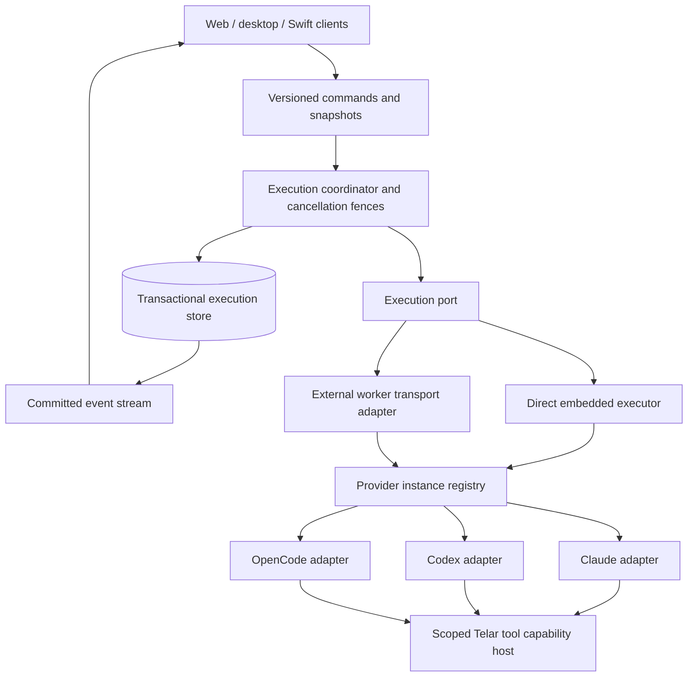

# Telar engine review and migration plan

Date: 2026-09-09. Status: migration direction approved; implementation started in an isolated branch. See the [lifecycle contract](engine-lifecycle-contract.md) for the first slice.

## Recommendation

Revise the execution core incrementally. Give the engine explicit ownership of local executors, consolidate Stop semantics, introduce a provider-neutral runtime contract, and make command acceptance and event persistence transactional. Add OpenCode behind that contract as an opt-in provider. Preserve Telar's product, session history, tool capabilities, and existing Claude/Codex integrations throughout.

Do not replace the application wholesale with current T3 Code. Its useful advances are ownership boundaries, provider adapters, committed command/event processing, and connection synchronization. Adopting its entire framework or transport would add migration work without establishing that it fixes this incident.

The immediate disconnect mitigation is separate: [draft PR #215](https://github.com/Facundo-Barbera/Telar/pull/215). It is tested locally but **not installed or released**. The user's main app must continue to update through nightlies only.

## Evidence and limits

Reviewed the pinned **Telar Tools and Fixtures** conversation, loading earlier turns and scrolling back through the transcript; read its persisted execution records; inspected the running installation and saved repair branches; reproduced lifecycle failures in an isolated worktree. Original dirty worktrees and the installed app were preserved.

Baselines:

| Subject | Reviewed version |
|---|---|
| Installed Telar / fetched main | `e35a993e` |
| Integrated immediate repair | `e5503329e47cd89efaa957f0121bde34f55a6bfa` |
| Current T3 source | `e16b8b059c9f5ff6dfed1addecffb831c6aee043` |
| OpenCode release | `v1.18.30`, `3104c1428ec91f809e5ab86631300de41eb6952e` |

The existing [OpenCode investigation #205](https://github.com/Facundo-Barbera/Telar/issues/205) is useful input, but its older Telar baseline and Pause/Resume recommendations are superseded by the user's current requirements. OpenCode's development branch has moved beyond the release pin; proposed compatibility must be tested against an exact CLI/SDK pair.

The running desktop and engine remained alive while multiple sessions recorded worker-loss failures. The installed worker could expire its own lease after 15 seconds of a shared event-loop stall, although the daemon exempted that embedded registration from pruning. Claims also shared scheduling with heartbeats. These are demonstrated defects; absent historical diagnostics, the exact trigger for every observed incident is **not proven**. Closing Dev as the trigger remains unproven.

Codex's separate “Reconnecting…2/5” messages are provider upstream retries. Some were followed by successful completion. They must not be presented as evidence that Telar's daemon died.

## User requirements and remaining gaps

| Pain point | Required behavior | Immediate repair / remaining work |
|---|---|---|
| Worker disappears while desktop stays open | Local executor survives shared stalls; actual failures have a precise owner and reason | Lease/scheduling mitigation and diagnostics in #215; remove unnecessary internal liveness protocol in revision |
| Stop demands Resume or starts old work again | Stop ends the selected session's active and pending work; next new message continues its history | Foreground and queued Stop improved; background ownership and legacy client paths still differ |
| Steering appears as a special control artifact | Every user message remains a separate ordinary message; subsequent activity follows its boundary | Saved web presentation integrated; provider-neutral message attribution still needs a contract |
| Streaming prefix disappears across surfaces | Snapshot plus cursor reconstruct the complete visible prefix | Regression-tested repair; shared client synchronization remains architectural work |
| Streaming feels abrupt | Smooth display without losing or duplicating authoritative text | Animation work remains unfinished and independent of transport correctness |
| Dev appears able to interrupt main | Each installation owns only its engine, homes, sockets, children, and shutdown | Existing isolation protections must be retained and exercised end to end |

## Findings

### 1. Embedded execution has a fictitious network failure boundary — high priority

The daemon creates an `EngineClient` for its own worker. Registration, claims, heartbeat cancellation delivery, and settlement travel through loopback HTTP. Worker and daemon share the event loop, but maintain separate liveness judgments and retirement paths. See [embedded startup](https://github.com/Facundo-Barbera/Telar/blob/e5503329e47cd89efaa957f0121bde34f55a6bfa/apps/engine/src/daemon.ts#L3529) and [worker connectivity handling](https://github.com/Facundo-Barbera/Telar/blob/e5503329e47cd89efaa957f0121bde34f55a6bfa/apps/engine/src/worker.ts#L897).

Introduce an execution port with direct in-process calls and explicit lifecycle cancellation for embedded execution. Keep an HTTP adapter, leases, and registration generations for genuinely external workers. Both adapters use the same command handlers and fencing rules. Provider processes remain separately supervised; a direct port does not make them immortal or eliminate event-loop stalls.

### 2. Stop still names different operations — high priority

`stopSession`, `stopTurn`, and `stopBackgroundTasks` implement different ownership rules. Session Stop explicitly excludes background tasks, while a no-active-turn path in `stopTurn` can sweep them. Legacy pause/held state also remains. See [the actual transitions](https://github.com/Facundo-Barbera/Telar/blob/e5503329e47cd89efaa957f0121bde34f55a6bfa/apps/engine/src/state.ts#L6710). Web and iOS do not yet share one complete Stop contract.

Define session Stop as cancellation of session-owned active work, pending messages, undelivered steering, approvals, and background tasks. A deliberately detached project Run service has separate ownership and an explicit stop action. Preserve already delivered user words in history. Store the cancellation fence before invoking provider abort; late completion cannot resurrect cancelled work. The next message needs no Resume gate.

This background ownership rule is a proposed correction, not a claim about #215's behavior. Replace competing entry points with commands whose scope is explicit. Migrate old pause/held records without automatically submitting them: retain their text and provenance as historical stopped work; new messages may proceed.

### 3. Provider abstraction exists, but orchestration still knows too much — high priority

The shared factory is a useful foundation. However, its registry is statically Claude/Codex, the driver contract lives beside Claude implementation, and the worker branches for provider-specific sockets and task control. See [factory](https://github.com/Facundo-Barbera/Telar/blob/e5503329e47cd89efaa957f0121bde34f55a6bfa/apps/engine/src/drivers.ts), [driver module](https://github.com/Facundo-Barbera/Telar/blob/e5503329e47cd89efaa957f0121bde34f55a6bfa/apps/engine/src/driver.ts), and [worker](https://github.com/Facundo-Barbera/Telar/blob/e5503329e47cd89efaa957f0121bde34f55a6bfa/apps/engine/src/worker.ts).

Extract a provider-neutral contract and registry keyed by driver kind and configured instance. Adapters own protocol details and upstream process/session handles. The execution coordinator owns commands, cancellation generations, durable state, and normalized events. Preserve early resume-cursor persistence, provider identity checks, and existing shared capability hosts.

T3 is a reference for the separation between [instance factories](https://github.com/pingdotgg/t3code/blob/e16b8b059c9f5ff6dfed1addecffb831c6aee043/apps/server/src/provider/ProviderDriver.ts) and [adapter operations](https://github.com/pingdotgg/t3code/blob/e16b8b059c9f5ff6dfed1addecffb831c6aee043/apps/server/src/provider/Services/ProviderAdapter.ts), not a requirement to adopt Effect.

### 4. Individual atomic files are not an atomic execution record — high priority

Queue, items, requests, session metadata, and journal updates cross separate writes. A serialized state lock prevents concurrent interleaving but cannot make those writes crash-atomic. See [queue persistence](https://github.com/Facundo-Barbera/Telar/blob/e5503329e47cd89efaa957f0121bde34f55a6bfa/apps/engine/src/state.ts#L7992) and [journal append](https://github.com/Facundo-Barbera/Telar/blob/e5503329e47cd89efaa957f0121bde34f55a6bfa/apps/engine/src/state.ts#L8544).

Introduce a storage boundary for execution commands, receipts, events, and projections. Commit them together and publish only committed events. Keep provider side effects outside transactions. A crash between provider admission and receipt still requires upstream reconciliation; a database cannot guarantee exactly-once external execution.

Preferred candidate: SQLite WAL for execution records, subject to a Bun/Electron packaging and crash-recovery spike. Keep attachments and unrelated Spool data outside this migration. T3's [serialized command and transactional commit path](https://github.com/pingdotgg/t3code/blob/e16b8b059c9f5ff6dfed1addecffb831c6aee043/apps/server/src/orchestration/Layers/OrchestrationEngine.ts#L248) demonstrates the invariant worth adopting.

### 5. Connection state and data freshness need separate owners — medium priority

The web cockpit and native iOS synchronize independently. Separate UI↔engine transport, executor health, and provider upstream status. One web/desktop connection owner should manage subscriptions, retries, cache, and cursor application. Swift should implement the same versioned protocol and conformance fixtures; it cannot simply import a TypeScript runtime.

Retain applied state and its cursor atomically. Reconnection refreshes state; it does not resubmit user commands. T3 documents these [connection invariants](https://github.com/pingdotgg/t3code/blob/e16b8b059c9f5ff6dfed1addecffb831c6aee043/docs/internals/connection-runtime.md). Keep Telar's existing transport initially; changing HTTP/SSE to WebSocket is not a prerequisite.

## Target boundaries

The provider contract should cover session open/attach, submit with command and message IDs, interrupt, close, authoritative snapshot, permission response, and user-question response. Optional capabilities include live steering, per-task cancellation, attachments, compaction, and model variants. Unsupported features are explicit, not simulated by silently starting a new turn.

Keep `messageId`, Telar `runId`, execution generation, and upstream session/turn IDs distinct. Normalized events carry attribution and stable deduplication identity. Permission requests and questions remain different event types. Usage snapshots distinguish cumulative totals from increments and leave unavailable values absent.

## OpenCode integration decision

Use the official HTTP server and `@opencode-ai/sdk/v2` event interface, not a subprocess parser around `opencode run`. See [server API](https://opencode.ai/docs/server/) and [SDK](https://opencode.ai/docs/sdk/).

Start with one Telar-owned OpenCode server per Telar session, reused across turns and explicitly disposed when that runtime closes. This isolates session-bound MCP credentials where upstream registrations are directory-scoped. T3 uses this [per-thread ownership approach](https://github.com/pingdotgg/t3code/blob/e16b8b059c9f5ff6dfed1addecffb831c6aee043/docs/internals/providers.md). Defer externally owned servers and shared chat-server pooling.

| Area | First supported behavior / gate |
|---|---|
| Installation and models | User-installed CLI, exact tested CLI/SDK versions, qualified provider/model IDs; actionable unavailable/auth errors |
| Submission | Persist command and upstream session identity before sending; reconcile lost admission acknowledgments using IDs; never blindly replay prompts |
| Streaming | Subscribe, then reconcile status/messages/pending requests with deduplication; test disconnect during every lifecycle stage |
| Stop | Call session abort and fence late events; cancelling the HTTP fetch is insufficient; verify child/process cleanup |
| Permissions and questions | Telar mediates actual tool arguments; upstream grants use `once`; never auto-answer questions because full access is enabled |
| Tools | Session-scoped browser/session MCP capability host; preserve plugin authorization gate and test two sessions in the same directory |
| Continuation | Persist upstream cursor early; next new message continues history after Stop; transient errors never erase the cursor |
| Steering / background agents | Advertise only demonstrated capabilities; queue-only steering is explicit until live steering passes conformance; advanced background task parity comes later |
| Usage and presentation | Text, reasoning, tools, requests, and truthful deduplicated usage; no fabricated tokens or native variant mappings |

The pinned OpenCode [event handler](https://github.com/anomalyco/opencode/blob/3104c1428ec91f809e5ab86631300de41eb6952e/packages/opencode/src/server/routes/instance/httpapi/handlers/event.ts#L15) includes IDs in event payloads but leaves the SSE frame ID undefined. Do not assume resumable `Last-Event-ID` replay. Its [abort handler](https://github.com/anomalyco/opencode/blob/3104c1428ec91f809e5ab86631300de41eb6952e/packages/opencode/src/server/routes/instance/httpapi/handlers/session.ts#L232) invokes session cancellation; transport cancellation is a separate operation. Verify these contracts against the selected release in adapter tests.

## Migration sequence and release gates

Each phase is a reviewable change with its own exit gate. Work estimates should follow the storage spike and adapter contract review, not precede them.

| Phase | Deliverable | Exit gate / rollback |
|---|---|---|
| 0 — Stabilize | Review #215; retain diagnostics; release through the normal nightly workflow when approved | CI and packaged smoke green; nightly dogfood shows no stall-induced worker replacement. Roll back through nightly; preserve histories and diagnostic evidence |
| 1 — Specify lifecycle | Written transition table, ownership matrix, cancellation/message IDs, protocol fixtures; align web and iOS Stop | Stop/steer/approval/background races pass fixtures; no Resume requirement or automatic replay. Compatibility API maps old callers explicitly |
| 2 — Extract execution | Direct embedded port, common command handlers, external-worker adapter; provider-neutral types and registry; migrate Claude/Codex unchanged | Both existing providers pass adapter parity and isolation tests; switchable executor implementation supports rollback without data conversion |
| 3 — Make persistence transactional | Storage spike, schema/version policy, import/check tools, committed event publication | Fault injection proves command/event/projection consistency. Backup before one-time cutover; one authoritative writer; old binaries refuse unsupported schema |
| 4 — Add OpenCode opt-in | Supervised per-session server adapter and first-slice capabilities above | Same conformance suite plus lost-ack, SSE reconciliation, same-directory MCP isolation, and native abort tests; disable provider without altering existing sessions |
| 5 — Unify clients and retire compatibility | Shared web/desktop synchronization, Swift fixtures, smoother presentation, remove legacy pause/recovery controls after migration | Cross-surface continuity and old-session migration pass; new protocol serves retained history; remove compatibility only after supported clients migrate |

Phases 2 and 3 establish seams, not a wholesale rewrite of `state.ts`. An OpenCode adapter spike can run after phase 2 using recorded fixtures, but production rollout waits for durable command receipts and cancellation reconciliation in phase 3. Keep feature work in the original dirty plugin/Run branches out of these changes; integrate their capability and process-ownership contracts explicitly later.

For schema rollback, restoring a pre-upgrade backup discards post-upgrade writes unless exported first. Do not promise downgrade safety by dual-writing old and new stores. Prefer a forward repair or an explicit export/restore procedure with a clear data boundary.

## Acceptance and observability

Validate behavior across Claude, Codex, and then OpenCode, not just unit-test counts:

- Stall the shared event loop beyond the old lease, sleep/wake the Mac, and delay claims/settlement. A healthy embedded generation stays owned; real child exit is diagnosed distinctly.
- Stop during admission, streaming, tool execution, approval, steering, and background work. No callback restarts stopped work; a new message continues without a recovery step.
- Switch desktop/web/iOS mid-stream, evict caches, disconnect subscriptions, and reconnect. Prefix, message order, and event cursor agree with the committed snapshot.
- Lose the prompt acknowledgment and kill the engine between each persistence boundary. No duplicate external submission; uncertain admission is reconciled or reported honestly without a forced replay.
- Run main and Dev together, close either, and use two sessions in the same directory. No cross-instance shutdown or MCP/permission leakage.
- Exercise large histories and repeated turns. Measure event-loop lag, snapshot latency, memory, process reuse, and Stop acknowledgment/provider-abort latency; establish baselines before setting release budgets.

Persist bounded structured diagnostics with engine instance, worker generation, session/run/command IDs, operation, duration, and reason. Keep prompt bodies, credentials, and tool secrets out. Separate `client_transport`, `executor_exit`, `provider_retry`, and `persistence_failure` categories so the UI reports the actual failing layer.

## Current readiness

Immediate repair validation at `e5503329`: engine **1,849 passed / 3 skipped**, web **1,512 passed**, engine client **68 passed**, desktop **188 passed / 2 skipped**; typecheck and lint passed with existing warnings. Final local production packaging and engine/worker/dependency smoke checks passed. GitHub [Verify run 34404319664](https://github.com/Facundo-Barbera/Telar/actions/runs/34404319664) also passed. These checks use fixtures and do not establish live-provider reliability or complete iOS/background Stop parity.

The review above records the pre-implementation baseline. The user subsequently approved starting the migration. The first slice aligns session Stop and documents its lifecycle contract; OpenCode and the remaining execution/storage migration are not yet implemented. The main installation remains on the nightly update path.
